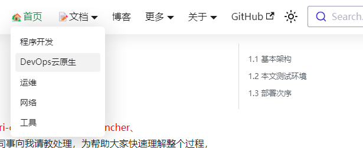
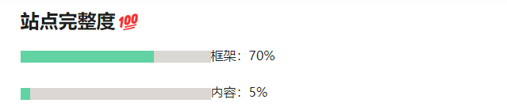
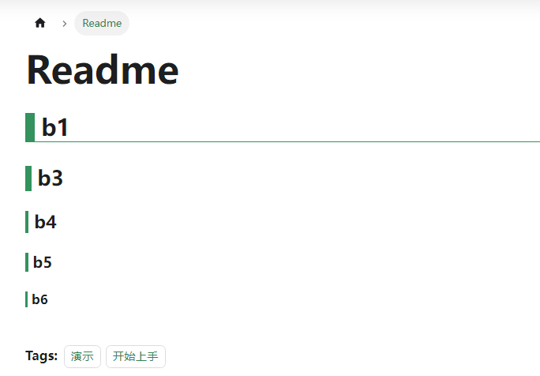

## about d8s(Docusaurus)
- Docusaurus 是 Facebook 专门为开源项目开发者提供的一款易于维护的静态网站创建工具，使用 Markdown 即可更新网站。构建一个带有主页、文档、API、帮助以及博客页面的静态网站，只需5分钟。

- Docusaurus 是一个静态站点生成器。它构建了一个具有快速客户端导航的单页应用程序，利用React的全部功能使您的站点具有交互性。它提供开箱即用的文档功能，但可用于创建任何类型的网站（个人网站、产品、博客、营销登录页面等）。

- 尽管 Docusaurus 主要关注帮助开发者正确地构建文档网站，但因为它是 React 应用，所以可以构建任何类型的网站。你可以使用所有的基本功能，像文档版本管理、文档搜索和翻译大多是预先配置的。

- 热加载。与hugo一样，可以实时显示对md的更改。

- Docusaurus 由 TypeScript 写成，并提供一流的 TypeScript 支持。

- 版本
  - Docusaurus 1 是纯粹的文档站点生成器。
  - Docusaurus 2 则是保留了 1 易于上手、文档版本化的优点，可用于快速创建常见的内容驱动型的网站，像文档、博客、产品落地页、营销页等。

:::tip  快速安装

```bash
git clone https://github.com/guofusheng007/guo.git
cd guo
yarn
yarn start
```
:::


## 基本配置
### 基本安装
```bash
npx create-docusaurus@latest docusaurus-myblog classic
```
更新
```bash
cnpm install
cnpm install -S react       # 更新到最新版
cnpm install -S react-dom   # 更新到最新版
```
### 目录结构设计
```bash
# tree myblog
myblog
│
├── blog						# 博客
│   └── 2023-09-22-changeblog.md
├── docs
│   ├── developers				# 对应二级菜单“程序开发”
│   ├── devops					# 对应二级菜单“DevOps云原生”
│   ├── showcase				# 对应二级菜单“showcase”，主要用于非网页类项目介绍md文件
│   │   ├── k8sdevops
│   │   └── readme.md
│   ├── tools					# 对应二级菜单“工具”
│   └── yunwei					# 对应二级菜单“运维”
├── src
│   ├── components
│   │   └── HomepageFeatures	# 首页中的模块“博主Tags”
│   ├── css
│   │   ├── custom.css
│   │   └── custom.scss
│   └── pages
│       ├── about-site.md		# 关于“站点”
│       ├── about-us.md			# 关于“博主”
│       ├── index.module.css
│       └── index.js			# 首页
├── static
│   ├── img
│   ├── lean-side-bussiness
│   │   └── docs				# 对应"精益副业"二级菜单
│   └── media
├── docusaurus.config.js		# 主配置文件，如顶部导航菜单配置
├── package.json
├── package-lock.json
├── README.md
├── sidebars.js					# 侧边树状导航配置
├── babel.config.js
└── yarn.lock
```
### 侧边菜单配置
```js title=sidebars.js 
/**
 * Creating a sidebar enables you to:
 - create an ordered group of docs
 - render a sidebar for each doc of that group
 - provide next/previous navigation

 The sidebars can be generated from the filesystem, or explicitly defined here.

 Create as many sidebars as you want.
 */

// @ts-check

/** @type {import('@docusaurus/plugin-content-docs').SidebarsConfig} */
const sidebars = {
  // By default, Docusaurus generates a sidebar from the docs folder structure

  //tutorialSidebar: [{type: 'autogenerated', dirName: '.'}],


  devSidebar: [
    {type: 'autogenerated', dirName: 'developers'}
  ],

  devopsSidebar: [
    {type: 'autogenerated', dirName: 'devops'}
  ],

  netSidebar: [
    {type: 'autogenerated', dirName: 'network'}
  ],

  yunSidebar: [
    {type: 'autogenerated', dirName: 'yunwei'}
  ],

  toolsSidebar: [
    {type: 'autogenerated', dirName: 'tools'}
  ],

  caseSidebar: [
    {type: 'autogenerated', dirName: 'showcase'}
  ],


  // But you can create a sidebar manually
  /*
  tutorialSidebar: [
    'intro',
    'hello',
    {
      type: 'category',
      label: 'Tutorial',
      items: ['tutorial-basics/create-a-document'],
    },
  ],
   */

};

module.exports = sidebars;
```
### 顶部菜单设计、页脚配置
```js title=docusaurus.config.js

  themeConfig:
    /** @type {import('@docusaurus/preset-classic').ThemeConfig} */
    ({
      // 顶部导航菜单
      navbar: {        
        hideOnScroll: false,
        title: '蝈蝈',
        logo: {
          alt: 'test Logo',
          src: 'img/favicon.png',
        },
        //页眉配置，即顶部横向导航menu。配置次序就是显示次序。
        items: [
          //多语言下拉菜单
          /*
          {
            type: 'localeDropdown',
          },
          */
          //版本下拉菜单
          /*
          {
            type: 'docsVersionDropdown',
            position: 'left',
            dropdownActiveClassDisabled: false
          },
          */
          {
            label: '🏡首页',
            to: '/',
            position: 'right',
          },
          //顶部菜单及其二级菜单
          {
            label: '📝文档',
            position: 'right',
            type: 'dropdown',
            items:
            [
              //关联树状菜单样例
              {
                type: 'docSidebar',
                sidebarId: 'devSidebar',
                label: '程序开发',
              },
              {
                type: 'docSidebar',
                sidebarId: 'devopsSidebar',
                label: 'DevOps云原生',
              },
              {
                type: 'docSidebar',
                sidebarId: 'netSidebar',
                label: '运维',
              },
              {
                type: 'docSidebar',
                sidebarId: 'yunSidebar',
                label: '网络',
              },
              {
                type: 'docSidebar',
                sidebarId: 'toolsSidebar',
                label: '工具',
              },
            ],
          },
          // 普通顶部菜单: page方式
          {
            to: '/blog', 
            label: '博客', 
            position: 'right',
          },
          //更多
          {
            label: '更多',
            position: 'right',
            type: 'dropdown',
            items:
            [
              {
                type: 'docSidebar',
                sidebarId: 'caseSidebar',
                label: 'ShowCase',
              },
              {
                label: '项目',
                to: '/project',
              },
              {
                label: '资源',
                to: '/resource',
              },
              {
                label: '友情链接',
                to: '/friends',
              },
              {
                label: '精益副业❤️',
                href: 'https://guo-fs.com/lean-side-bussiness/docs/',
              },
            ],
          },
          {
            label: '关于',
            position: 'right',
            type: 'dropdown',
            items:
            [
              {
                label: '站点',
                to: '/about-site',
              },
              {
                label: '博主',
                to: '/about-us',
              },
            ],
          },
          {
            href: 'https://github.com/guofusheng007',
            label: 'GitHub',
            position: 'right',
          },
        ],
      },
      footer: {
        style: 'dark',
        links: [
          {
            title: 'Docs',
            items: [
              {
                label: '程序开发❤️',
                to: '/docs/developers',
              },
              {
                label: 'DevOps云原生',
                to: '/docs/devops',
              },
            ],
          },
          {
            title: 'Community',
            items: [
              {
                label: 'GitHub',
                href: 'https://github.com/facebook/docusaurus',
              },
              {
                label: 'Stack Overflow',
                href: 'https://stackoverflow.com/questions/tagged/docusaurus',
              },
            ],
          },
          {
            title: '☎️Contact',
            items: [
              {
                html: `邮箱： <a href="mailto:guofs@139.com">guofs@139.com</a>`,
              },
              {
                html: `微信： goldphenix`,
              },
            ],
          },
        ],
        //copyright: `Copyright © ${new Date().getFullYear()} My Project, Inc. Built with Docusaurus.`,
        copyright: `<a href="http://beian.miit.gov.cn/" >备案号(示例)：深ICP备2020017848号-8</a></br>Copyright © 2023 - ${new Date().getFullYear()} 蝈蝈 built with Docusaurus, deploy with Vercel`,
      },
      prism: {
        theme: darkCodeTheme,
        darkTheme: darkCodeTheme,
      },
    }),
};

module.exports = config;

```
效果


### 插件配置
d8s提供了丰富的插件。
```bash
npm install @cmfcmf/docusaurus-search-local
cnpm install --save  docusaurus-plugin-image-zoom
cnpm install --save @docusaurus/plugin-ideal-image
yarn add docusaurus-plugin-sass sass
npm install --save-dev @iconify/react
```
配置插件
```js title=docusaurus.config.js
  plugins: [
    require.resolve("@cmfcmf/docusaurus-search-local"),
    'docusaurus-plugin-image-zoom',
    'docusaurus-plugin-sass',
    [
      '@docusaurus/plugin-ideal-image', 
      {
        quality: 100,
        //max: 1030, // 最大缩放图片尺寸。
        //min: 640, // 最小缩放图片尺寸。 如果原始值比这还低，会使用原图尺寸。
        //steps: 2, // 在 min 和 max 之间最多生成的图片数量（包含两端点）
        disableInDev: true,
      }
    ],
  ],

  themeConfig:
    /** @type {import('@docusaurus/preset-classic').ThemeConfig} */
    ({
      zoom: {
        selector: '.markdown :not(em) > img',
        background: {
          light: 'rgb(255, 255, 255)',
          dark: 'rgb(50, 50, 50)'
        },
        config: {}
      },
```

### 样式方式修改
可参kuizuo的样式文件，又添加新样式。
```css title=src/css/custom.scss
:root {
  --ifm-color-primary: #2e8555;
  --ifm-color-primary-dark: #29784c;
  --ifm-color-primary-darker: #277148;
  --ifm-color-primary-darkest: #205d3b;
  --ifm-color-primary-light: #33925d;
  --ifm-color-primary-lighter: #359962;
  --ifm-color-primary-lightest: #3cad6e;
  --docusaurus-highlighted-code-line-bg: rgba(185, 176, 179, 0)

  --ifm-font-family-base: 'Inter', ui-sans-serif, system-ui, -apple-system, 'Segoe UI', 'Helvetica Neue', 'Noto Sans', sans-serif, 'Apple Color Emoji', 'Segoe UI Emoji', 'Segoe UI Symbol', 'Noto Color Emoji', consolas, sfmono-regular, menlo, monaco, 'Liberation Mono', monospace;
  --ifm-heading-font-family: var(--ifm-font-family-base);


  //侧边菜单
  --ifm-menu-color: #0d203a;    //字体颜色

  //代码块
  --ifm-code-font-size: 90%;   //代码块中的字体大小


  //test


}

/* For readability concerns, you should choose a lighter palette in dark mode. */
[data-theme='dark'] {
  --ifm-color-primary: #25c2a0;
  --ifm-color-primary-dark: #21af90;
  --ifm-color-primary-darker: #1fa588;
  --ifm-color-primary-darkest: #1a8870;
  --ifm-color-primary-light: #29d5b0;
  --ifm-color-primary-lighter: #32d8b4;
  --ifm-color-primary-lightest: #4fddbf;
  --docusaurus-highlighted-code-line-bg: rgba(0, 0, 0, 0.3);
}

/* 进度条配置 */
.mypro{
  background:rgb(255, 255, 255);
  border:0px solid rgb(139, 10, 245);
  border:0px solid #000;
  width:240px;
  height:15px;
  -webkit-appearance: none;
}
::-ms-fill{
  background:deeppink;
}
::-moz-progress-bar{
  background:deeppink;
}
::-webkit-progress-bar{
  background:rgb(219, 216, 211);
}
::-webkit-progress-value{
  background:rgb(97, 211, 163);
}

//页脚配置
.footer--dark {
  //--ifm-footer-background-color: var(--ifm-navbar-background-color);
  //--ifm-footer-color: var(---ifm-color-primary-dark);
  //--ifm-footer-link-color: var(--ifm-color-primary-dark);
  //--ifm-footer-title-color: var(--ifm-color-primary-dark);
}


//导航菜单配置
.navbar {
  //background-color: transparent;
  //background-color: var(--ifm-color-primary-darker);   //导航颜色
  //background-color: var(--ifm-navbar-background-color);
  box-shadow: 0 4px 28px rgb(0 0 0 / 10%);   //导航下面的阴影条配置
  //box-shadow: var(--ifm-navbar-shadow);

  // background-image: radial-gradient(transparent 1px, #fff 1px);
  // background-size: 3px 3px;
  // backdrop-filter: saturate(50%) blur(4px);

  .navbar__title {
    margin-left: 12px;
    color: var(--ifm-color-primary);
    //color:hsl(214deg 100% 60%);
    font-family: var(--ifm-font-family-name);
  }
}

// 菜单字体大小(各类菜单方式)
.navbar__link,
.dropdown,
.navbar__title,
.menu {
  font-weight: 400;
}

//md文件渲燃配置
.markdown {
  a {
    transition: all 0.1s;
    display: inline-block;

    &:focus,
    &:hover {
      text-decoration: none;
    }
  }

  code {
    border: 0.1rem solid transparent;
  }

  .alert {
    border: 2px solid var(--ifm-alert-border-color);
  }

  img {
    border-radius: 10px;    //图片的4个角为圆角
    box-shadow: 0 0 20px rgba(59, 58, 59, 0.473);  //图像阴影
    display: flex;
    margin: 0 auto;
  }


  > h2 {
    font-size: 1.8em;
    border-bottom: 1px solid var(--ifm-color-primary-light);
    margin-top: 1rem;

    &::before {
      margin-right: 0.3em;
      width: 0.4em;
      display: inline-block;
      background: var(--ifm-color-primary-light);
      color: transparent;
      content: '.';
    }
  }

  > h3 {
    font-size: 1.6em;

    &::before {
      margin-right: 0.3em;
      width: 0.3em;
      display: inline-block;
      background: var(--ifm-color-primary-light);
      color: transparent;
      content: '.';
    }
  }

  > h4 {
    font-size: 1.4em;

    &::before {
      margin-right: 0.3em;
      width: 0.2em;
      display: inline-block;
      background: var(--ifm-color-primary-light);
      color: transparent;
      content: '.';
    }
  }

  > h5 {
    font-size: 1.2em;

    &::before {
      margin-right: 0.3em;
      width: 0.2em;
      display: inline-block;
      background: var(--ifm-color-primary-light);
      color: transparent;
      content: '.';
    }
  }

  > h6 {
    font-size: 1.0em;

    &::before {
      margin-right: 0.3em;
      width: 0.2em;
      display: inline-block;
      background: var(--ifm-color-primary-light);
      color: transparent;
      content: '.';
    }
  }

  .markdown-body a:hover::before {
    width: 100%;
  }


}

```
效果
进度表


标题栏



## 第三方模块移植
:::tip 
kuizuo对d8s的"魔改"很漂亮，可以直接拿来使用。
:::
以移植kuizuo博客中的“项目、资源、友链”及首页中的“项目”轮博模块为例。

git源码
```bash
git clone https://github.com/kuizuo/blog.git kuizuo
```
### 项目、资源、友链模块复制
项目新增如下目录来源于kuizuo的源码对应目录。
```bash
# tree -d -L 4 myblog
myblog
├── blog
├── data							# 项目、资源、友链等三项的数据配置目录
├── docs
│   ├── developers
│   ├── devops
│   ├── network
│   ├── showcase
│   ├── tools
│   └── yunwei
├── src
│   ├── components
│   │   ├── HomepageFeatures
│   │   ├── Svg/					# kuizuo自定义模块
│   │   └── svgIcons/				# kuizuo自定义模块
│   ├── css
│   ├── pages
│   │   ├── _components
│   │   │   ├── HomepageProject/	# 首页"项目"轮播模块
│   │   │   └── SectionTitle/	    # 首页"项目"轮播模块中的标题配置
│   │   ├── friends/				# 顶部导航菜单“友链”page
│   │   ├── project/				# 顶部导航菜单“项目”page
│   │   └── resource/				# 顶部导航菜单“资源”page
│   └── utils                       # kuizuo自定义模块
└── static
    ├── img
    │   ├── friend/				    # “友链”的img资源
    │   ├── project/				# “项目”的img资源
    │   └── resource/				# “资源”的img资源
    ├── lean-side-bussiness
    │   └── docs
    └── media
```

安装如下模块
```bash
yarn add framer-motion
yarn add react-popper
yarn add loadsh
yarn add @popperjs/core
```

### 首页配置
```js tile=src/pages/index.js
# cat index.js 
import React from 'react';
import clsx from 'clsx';
import Link from '@docusaurus/Link';
import useDocusaurusContext from '@docusaurus/useDocusaurusContext';
import Layout from '@theme/Layout';
import HomepageFeatures from '@site/src/components/HomepageFeatures';
import styles from './index.module.css';
import HomepageProject from './_components/HomepageProject'    //新增,首页中轮播模块

//首页头部信息显示
function HomepageHeader() {
  const {siteConfig} = useDocusaurusContext();
  return (
    <header className={clsx('hero hero--primary', styles.heroBanner)}>
      <div className="container">
        <h1 className="hero__title">{siteConfig.title}</h1> 
        <p className="hero__subtitle">{siteConfig.tagline}</p>
        <div className={styles.buttons}>
          <Link className="button button--secondary button--lg" to="/docs/category/devops" title="快速集成DevOps CI/CD、k8s/istio、ceph、prometheus/grafana">
          👉敏捷开发DevOps快速搭建 - 5min ⏰
          </Link>
        </div>
        <div>
          <br></br>
                   
        </div>
      </div>
    </header>
  );
}

//自己定义显示
function HomepageTest() {
  const {siteConfig} = useDocusaurusContext();
  return (  
    <test className={styles.features} >
      <div className="container">
        <div className="text--center padding-horiz--md" >
          <marquee behavior="alternate">{siteConfig.customFields.bannerString}</marquee>
        </div> 
      </div>
    </test>
    );
}

//主页内容输出，其中“<HomepageProject /> ”为新增
export default function Home() {
  const {siteConfig} = useDocusaurusContext();
  return (
    <Layout
      title={`Hello from ${siteConfig.title}`}
      description="Description will go into a meta tag in <head />">
      <HomepageHeader />
      <main>
        <HomepageProject />
        <HomepageFeatures />
        <HomepageTest />
      </main>      
    </Layout>
  );
}
```

## 测试
首页等其它部分可以自行微调。
```bash
cnpm run start -- --port 8080 --host 0.0.0.0
```

:::caution

若提示有哪个模块没有安装，可以直接`yarn add packag_name`即可。

:::

## deploy网站
本站采用github+Vercel方式deploy，即将build后的文件upload到github，再由Vercel读取github后发布。

采用ssh方式上传build后文件，配置方式如下

import Tabs from '@theme/Tabs';
import TabItem from '@theme/TabItem';

<Tabs>
  <TabItem value="windows" label="windows 🍑" default>
    set USE_SSH=true
  </TabItem>
  <TabItem value="linux" label="linux 🍒">
    USE_SSH=true
  </TabItem>
</Tabs>

<br/>

```js title=docusaurus.config.js

const config = {
  // 分发到github公有仓库,将build产生的网站deploy到如下指定地位置
  // GitHub pages deployment config.
  // If you aren't using GitHub pages, you don't need these.
  organizationName: 'guofusheng007', //github用户名称.
  projectName: 'test',              //github项目名称
  deploymentBranch: 'main'          //项目分支名称

```

deploy操作
```bash
yarn build
yarn deploy --skip-build
```

访问方式<br/>
http://guo-fs.com


## 快速安装
```sh
git clone https://github.com/guofusheng007/guo.git
cd guo
yarn
yarn start


