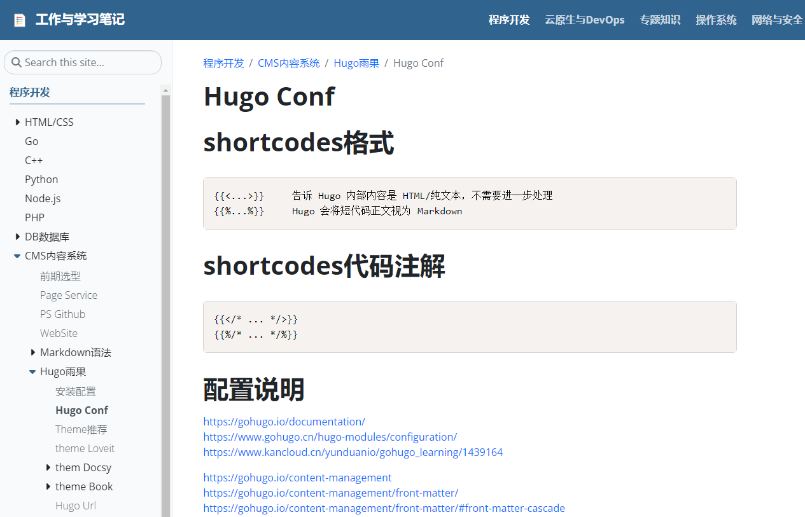

# about hugo
- https://gohugo.io/
- https://github.com/gohugoio/hugo
- https://themes.gohugo.io/
- https://gohugo.io/installation/

Hugo是由前Docker的重量级员工(2015年8月末从Docker离职)：Steve Francia实现的一个开源静态站点生成工具框架，类似于Jekyll、Octopress或Hexo，都是将特定格式(最常见的是Markdown格式)的文本文件转换为静态html文件而生成一个静态站点，多用于个人Blog站点、项目文档(Docker的官方manual Site就是用Hugo生成的)、初创公司站点等。这类工具越来越多的受到程序员等颇具“极客”精神的群体的欢迎，结合github.com等版本控制服务，采用具有简单语法格式但强大表达力的Markdown标记语言，人们可以在很短时间内就构建出一个符合自己需求的静态Web站点。在这些工具中，Hugo算是后起之秀了，它最大的优点就是Fast! 一个中等规模的站点在几分之一秒内就可以生成出来。其次是良好的跨平台特性、配置简单、使用方便等。
# hugo install
安装hugo(extended版，有些主题需要在该版本下运行)
```bash
# wget https://github.com/gohugoio/hugo/releases/download/v0.115.0/hugo_extended_0.115.0_linux-amd64.tar.gz
# tar zxvf hugo_extended_0.115.0_linux-amd64.tar.gz
# hugo version
```

# theme docsy
- https://www.docsy.dev
- https://example.docsy.dev

Docsy主题，出自google的开源主题，很多流行项目使用此主题作为官方站点，有k8s、kubeflow、grpc、knative、Selenium等，主要功能包含：支持树形目录、国际化、搜索、移动友好、标签分类、全站打印、文档版本化、用户反馈等。

Docsy是一个文件式的网站，提供了使用者一些样板以及文件指南，能良好的支援技术文件发布。Docsy是由Hugo等开源工具打造而成，结合Google的开源文件创建经验，提供方便的工具，帮助使用者快速建立开源专案文件网站。

安装docsy-example
新手使用docsy-example会更容易上手。
```bash
git clone --depth 1 https://github.com/google/docsy-example.git
cd docsy-example
cnpm install --save-dev autoprefixer postcss-cli postcss
hugo server --bind 0.0.0.0 --port 3100 --buildDrafts --watch -F --cleanDestinationDir
```
访问
http://x.x.x.x:3100


如下是我目前在使用的docsy



