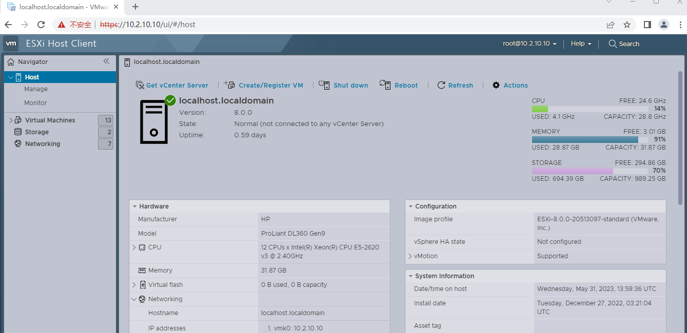

针对DevOps CI/CD、Gitlab/Runner、k8s/istio、cri-o、ceph、harbor、rancher、prometheus/grafana集成问题，在工作中曾有多个同事向我请教处理，为帮助大家快速理解整个过程，特写本贴给大家一点点帮助，通过本贴指引，每个人都能快速搭建。

涉及到多个开源软件，知识点较多。由于篇幅有限，针对每一个知识点，讲述了其基本操作，对于某单一开源软件，若需更详细配置说明，可点赞收藏，并留言，大家一起探讨。

如果本文有错误的地方，欢迎指出！

类似架构在工作中曾配置很多次，每一次配置都能学习到新知识点，知识需持续更新。

在实际工作中，有较多镜像从需Internet下载，建议先pull镜像，转存私仓。

:::info

这篇文章最早发布在csdn上面，后转移到个人hexo博客，再到目前转入个人d8s博客，以后来不转了，就在d8s上安家了，能要学会满足，知足常乐，哈~。

:::

## 1.1 基本架构

在实际工作中，有较多项目的需求中重要诉求是为开发人员创建敏捷开发环境、或对企业进行类似敏捷开发培训。

> 通过合理的架构设计，可以让开发和运维各自更专注自己职责业务工作和业务功能实现，同时又能高效配合，共同保证整个系统运营性的高性能、高可用。构架搭建后，软件项目从开发到交付，全流程自动化。

基本架构如下图所示。

**本文基于开源软件建立demo环境。**

|项目     | 简述 |
|:--------:| :-------------|
|开发层  | 开发人员组成，c++/java/go/python/node.js。在此以go为例(主要原因go是我主要使用的开发语言)|
|CI/CD层  | Gitlab CI/CD、Gitlab-Runner|
|业务运营层 | 组网设计要求：冗余架构、避免单点故障、业务流量独享网络 计算层：由PaaS层(k8s/istio组成)和镜像仓库(harbor)两部分组成 存储层：由ceph分布式存储组成|
|运维层 | 基础支撑层：由DNS、os-w、DHCP、CA、web下载等服务组成 平台运维层：监，控采用promethues/grafana，日志ELK、Dashbord/rancher等 业务运维层：业务应用的后台基础管理，如mysql管理等 硬件运维层：主要是对硬件设备的管理，如服务器、网络设备、IaaS设备等等|

:::info 提示
- 在测试环境，在网络设计方面，只做功能性测试，不做冗余设计。
- 生产环境中需全链路冗余设计。
- 在生产中，设备选型时考虑到项目实际需求而进行架构设计。
- 所有节点时钟保持一致。
:::

## 1.2 本文测试环境

本文测试环境
- 网络192.168.3.1/24，电信300Mb。
- cisco三层交换机一台，vlan3(192.168.3.1)、vlan20(10.2.20.20)、vlan10(10.2.20.10)。
- HP DL360 Gen9一台， Xeon E5-2620。安装ESXi-8.0.0-20513097。
- 服务器nic1与交换机G0/1(Trunk模式)连接。

## 1.3 部署次序

| 项目 | 简述      |
|:--------:| :-------------|
| 基础支撑层| os-w服务、管理节点、DNS服务、CA服务、DHCP服务、web下载服务 |
| CI/CD层 及镜像私仓| 1。安装Gitlab CI/CD、Gitlab Runner   2。安装harbor|
| 存储层 | ceph安装 |
| 计算层 | k8s/istio安装 |
| 运维层 | 监控采用promethues/grafana，日志ELK、Dashbord/rancher等 |
| 联调 | CI/CD测试、istio流量治理测试 |

