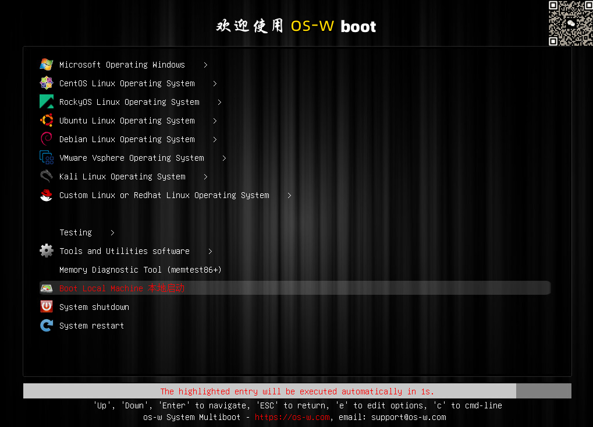
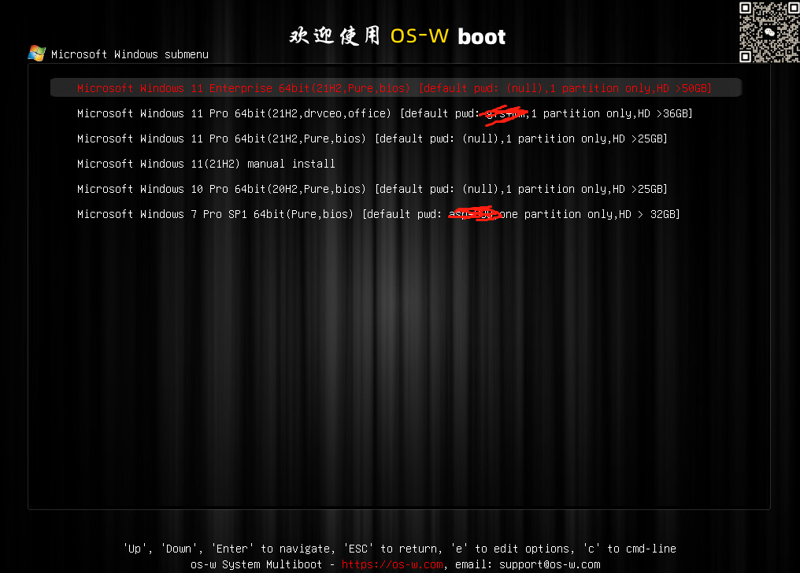

## 2.1 os-w服务

本文涉及到较多台服务器，都是基于os-w提供安装服务。

os-w是基于pxe协议而集成的系统，配合自开发的后台(go语言开发)，可以完成企业内部的标准化系统管理，基于网络环境完成各类操作，可以有效减少IT运维人员的日常工作。拒绝本地操作、拒绝本地USB接口。

:::tip 功能简述

- 标准化批量部署各类主流系统Redhat/Centos/Rocky/Ubuntu/Debian/ESXi/Windows等，支持主流X86服务器和PC。
- 针对windows安装，自动安装各类主流硬件驱动、支持预装应用软件(如office、outlook等)、自动加入域。
- 支持自定义模板。
- 一键备份（某个分区或整个系统）到远程存储、从远程存储一键还原到本地。
- EFI/BIOS双模式自动切换。
- 集成各类运维工具，满足linux/windows常规运维需求。

:::


| 安装模式| 适应人员     | 场景| 
|:--------| :-------------|:-------------|
| 单台安装 | 无IT技能人员(新员工/普通员工)，<br/>有引导菜单 | 普通中大型企业、公司、事业单位等，<br/>员工自己安装系统，喝水一样简单 |
| 批量安装 | IT运维人员(低IT技能)，<br/>dhcp配置支持	 | 机房/IaaS环境中集群部署。<br/>如30分钟快速安装500台机器 |






**提示:**
本文不对os-w安装做详细介绍，如有需要，可直接联系我，大家共同学习。

## 2.2 管理节点

管理节点，主要用途是对系统中各类节点进行管理。
1. ceph各节点管理
2. k8s各节点管理
3. 其它节点管理
采用密钥对ssh免密方式进行。

基本工具包

```bash
yum -y install epel-release
yum -y install bash-completion net-tools gcc wget curl telnet tree lrzsz iproute bind-utils
```

安装ansible

```bash
yum -y install ansible
```

ssh密钥对配置

```bash
ssh-keygen
```

产生/root/.ssh/id_rsa.(私钥)和/root/.ssh/id_rsa.pub.(公钥)两个文件。
采用ssh-copy-id命令将公钥复制到目标机器。

**提示:**
后续配置中会对管理节点进行相关配置。

## 2.3 DNS服务配置

linux系统中开源的DNS服务器有很多，常用的有bind/powerdns/coredns/dnsmasq等。

其中bind是传统bind服务器，也支持windows [32位](https://ftp.isc.org/isc/bind9/9.15.5/BIND9.15.5.x86.zip) 和 [64位](https://ftp.isc.org/isc/bind9/9.17.5/BIND9.17.5.x64.zip)

在实际项目生产环境中都是采用linux安装DNS。

由于是demo，今天我们采用windows安装bind，感受一下bind9在windows环境下的情况。
[下载](https://ftp.isc.org/isc/bind9/9.15.5/BIND9.15.5.x86.zip) 解压后直接运行BINDInstall.exe即可完成安装。

下面配置样例中配置了demo.io、demo.com、test.com三个域名用来测试。

配置named.conf

```css
options {
    directory "C:\Program Files\ISC BIND 9\etc";
    forwarders {
        8.8.8.8;
        223.6.6.6;  
    };   
    allow-query { any; };
};
zone "." IN {
             type hint;
             file "named.ca";
};

zone "localhost" IN {
             type hint;
             file "localhost.zone";
};

zone "0.0.127.in-addr.arpa" IN {
             type master;
             file "127.0.0.addr.arpa";
             allow-update { none;};
};

zone "demo.com" IN {
             type master;
             file "demo.com.zone";
             allow-update { none;};
};

zone "demo.io" IN {
             type master;
             file "demo.io.zone";
             allow-update { none;};
};

zone "test.com" IN {
             type master;
             file "test.com.zone";
             allow-update { none;};
};
```

配置localhost.zone

```css
$TTL 1D
@       IN      SOA     localhost.      root.localhost. (        2007091701          ; Serial
        30800               ; Refresh
        7200                ; Retry
        604800              ; Expire
        300 )               ; Minimum
        IN      NS      localhost.
localhost.        IN      A       127.0.0.1
```

配置demo.com.zone

```css
demo.com.    IN  SOA   ns1.demo.com.  root.demo.com. (        2007091701         ; Serial
        30800              ; Refresh
        7200               ; Retry
        604800             ; Expire
        300 )              ; Minimum
        IN    NS        ns1.demo.com.
*       IN    A         192.168.110.10
test	IN	A	192.168.3.110
master1.k8s	IN	A	10.2.20.60
harbor	IN	A	10.2.20.70
git	IN	A	10.2.20.71
rancher	IN	A	10.2.20.151
grafana	IN	A	192.168.3.180
prometheus	IN	A	192.168.3.180
alert	IN	A	192.168.3.180
kiali	IN	A	192.168.3.182
prometheus-istio	IN	A	192.168.3.180
dashboard	IN	A	192.168.3.181
```

配置demo.io.zone

```css
demo.io.    IN  SOA   ns1.demo.io.  root.demo.io. (        2007091701         ; Serial
        30800              ; Refresh
        7200               ; Retry
        604800             ; Expire
        300 )              ; Minimum
        IN    NS        ns1.demo.io.
*       IN    A         192.168.3.180
www	IN	A	192.168.3.180
master1.k8s	IN	A	10.2.20.60
harbor	IN	A	10.2.20.70
git	IN	A	10.2.20.71
rancher	IN	A	10.2.20.151
grafana	IN	A	192.168.3.180
prometheus	IN	A	192.168.3.180
alert	IN	A	192.168.3.180
kiali	IN	A	192.168.3.182
prometheus-istio	IN	A	192.168.3.180
dashboard	IN	A	192.168.3.181
```

配置test.com.zone

```css
test.com.    IN  SOA   ns1.test.com.  root.test.com. (        2007091701         ; Serial
        30800              ; Refresh
        7200               ; Retry
        604800             ; Expire
        300 )              ; Minimum
        IN    NS        ns1.test.com.
*       IN    A         192.168.3.180
www	IN	A	192.168.3.180
master1.k8s	IN	A	10.2.20.60
harbor	IN	A	10.2.20.70
git	IN	A	10.2.20.71
rancher	IN	A	10.2.20.151
grafana	IN	A	192.168.3.180
prometheus	IN	A	192.168.3.180
alert	IN	A	192.168.3.180
kiali	IN	A	192.168.3.182
prometheus-istio	IN	A	192.168.3.180
dashboard	IN	A	192.168.3.181
```

启动服务

```css
C:\>net start named
ISC BIND 服务正在启动 .
ISC BIND 服务已经启动成功。
```

测试

```css
C:\>nslookup -q  www.demo.io 192.168.3.250
服务器:  UnKnown
Address:  192.168.3.250

名称:    www.demo.io
Address:  192.168.3.180


C:\>nslookup -q  www.demo.com 192.168.3.250
服务器:  UnKnown
Address:  192.168.3.250

名称:    www.demo.com
Address:  192.168.110.10
```

**提示:**
DNS是基础设施，后续会调整相应记录解析。

## 2.4 CA证书配置

在实际生产中，SSL证书是必不可少的。
例如：在配置harbor时，使用了SSL证书。

我们需要配置相应的证书，测试时我们采用cfssl工具制作私有CA证书及签发证书。

官网地址： [https://pkg.cfssl.org](https://pkg.cfssl.org)

Github 地址： https://github.com/cloudflare/cfssl

### 2.4.1 cfssl工具安装

二进制安装

```bash
curl -s -L -o /bin/cfssl https://github.com/cloudflare/cfssl/releases/download/v1.6.4/cfssl_1.6.4_linux_amd64
curl -s -L -o /bin/cfssljson https://github.com/cloudflare/cfssl/releases/download/v1.6.4/cfssljson_1.6.4_linux_amd64
curl -s -L -o /bin/cfssl-certinfo https://github.com/cloudflare/cfssl/releases/download/v1.6.0/cfssl-certinfo_1.6.4_linux_amd64
chmod +x /bin/cfssl*
```

### 2.4.2 证书产生过程

**第一步：产生根ca证书和私钥**
配置根ca证书签名请求文件模板

```css
# cat > ca-csr.json <<EOF
{
    "CN":"Root-CA",
    "key":{
        "algo":"rsa",
        "size":2048
    },
    "names":[
        {
            "C":"CN",
            "L":"Gudong",
            "ST":"shenzhen",
            "O":"k8s",
            "OU":"System"
        }
    ]
}
EOF
```

使用根ca证书签名请求文件生成证书和私钥

```bash
cfssl gencert -initca ca-csr.json | cfssljson -bare ca 
```

输出三个文件

```bash
    ca.csr        //根证书请求文件
    ca-key.pem    //根证书私钥
    ca.pem        //根证书
```

第二步：产生用户证书
证书配置文件，有效期配置比较长为100年。

```css
# cat ca-config.json
{
    "signing":{
        "default":{
            "expiry":"876000h"
        },
        "profiles":{
            "web-auth":{
                "expiry":"876000h",
                "usages":[
                    "signing",
                    "key encipherment",
                    "server auth",
                    "client auth"
                ]
            }
        }
    }
}
```

证书签发列表配置

```css
# cat server-csr.json
{
    "CN":"domain-ssl-test",
    "hosts":[
        "127.0.0.1",
        "localhost",
        "*.test.com",
        "*.test.io",
        "*.demo.com",
        "*.demo.io",
        "*.gfs.com"
    ],
    "key":{
        "algo":"rsa",
        "size":2048
    },
    "names":[
        {
            "C":"CN",
            "L":"HeNan",
            "ST":"ZhuMaDian",
            "O":"k8s",
            "OU":"System"
        }
    ]
}
```

签发证书

```css
cfssl gencert \
-ca=ca.pem \
-ca-key=ca-key.pem \
-config=ca-config.json \
-profile=web-auth \
server-csr.json | cfssljson -bare web
```

产生的文件说明如下

```css
# tree /root/cfssl
/root/cfssl
├── ca.csr            根ca证书签名请求文件
├── ca-csr.json       根ca证书签名请求文件模板
├── ca-key.pem        根证书私钥
├── ca.pem            根证书
├── ca-config.json    用户证书模板
├── server-csr.json   用户证书签发列表配置
├── web.csr           用户证书签发申请书
├── web-key.pem       用户证书私钥
└── web.pem           用户证书
```

实验配置中主要使用到ca.pem、web.pem、web-key.pem三个文件。
把它们放在web下载服务器上，供其它节点下载。

第三步：查验证书信息

```css
# openssl x509 -noout -text -in  web.pem 
Certificate:
    Data:
        Version: 3 (0x2)
        Serial Number:
            16:e7:8c:e8:f5:3a:a4:bb:3d:6c:90:04:ac:d4:d9:50:03:ea:21:52
        Signature Algorithm: sha256WithRSAEncryption
        Issuer: C = CN, ST = shenzhen, L = Gudong, O = k8s, OU = System, CN = Root-CA-gfs
        Validity
            Not Before: May 22 05:59:00 2023 GMT
            Not After : Apr 28 05:59:00 2123 GMT
        Subject: C = CN, ST = ZhuMaDian, L = HeNan, O = k8s, OU = System, CN = domain-ssl-test
        Subject Public Key Info:
            Public Key Algorithm: rsaEncryption
                Public-Key: (2048 bit)
                Modulus:
                    00:c6:a9:45:9b:f2:e4:a1:43:b6:a8:5d:01:31:d9:
                    13:d0:f3:e3:c6:a6:38:8f:bc:2b:6c:bc:8c:84:32:
                    b5:16:22:85:dd:a1:a4:d6:87:a3:f3:91:66:4c:9b:
                    3f:45:1d:6c:97:98:6e:fb:c5:a9:00:95:d5:5f:7d:
                    86:de:26:34:bf:66:92:a8:57:39:c0:36:fb:12:b1:
                    f8:c9:3b:3a:0c:7d:79:d7:10:5f:3d:ba:0e:3c:17:
                    e7:08:45:23:58:cc:6f:d7:f3:3a:fb:4d:61:eb:92:
                    e7:2b:d4:21:ce:7e:a7:32:00:e9:d5:58:f2:94:e6:
                    ea:79:d9:7a:19:92:95:40:5c:f2:80:3c:57:b0:52:
                    f2:ab:9c:d6:d7:9e:1b:fd:d6:d5:66:8d:27:d1:8d:
                    b7:10:dc:a6:4d:ec:fb:21:71:e3:27:d2:b1:fb:f4:
                    63:4d:86:ba:35:fb:7a:40:b2:b1:6d:c7:c5:e9:98:
                    ac:8d:ab:36:2b:8e:79:9d:4a:fa:3a:c3:11:8f:2c:
                    69:04:28:ac:ac:93:c7:bf:6c:a3:b7:32:b1:d0:a4:
                    90:6f:63:2c:37:0e:94:43:d0:ed:9a:b3:e0:f9:ba:
                    2d:18:86:7f:72:44:b3:1c:b0:8c:cb:b4:d1:9d:19:
                    21:c3:48:8f:c9:6a:38:b8:c8:07:07:56:0a:49:e5:
                    a4:5f
                Exponent: 65537 (0x10001)
        X509v3 extensions:
            X509v3 Key Usage: critical
                Digital Signature, Key Encipherment
            X509v3 Extended Key Usage: 
                TLS Web Server Authentication, TLS Web Client Authentication
            X509v3 Basic Constraints: critical
                CA:FALSE
            X509v3 Subject Key Identifier: 
                CF:E0:D0:A9:3A:20:5C:B0:CD:AF:4C:C6:5B:51:E7:C4:CB:5F:E3:64
            X509v3 Authority Key Identifier: 
                78:69:9C:18:47:D1:D3:44:05:1F:20:A7:B2:FF:6A:E6:68:85:D3:48
            X509v3 Subject Alternative Name: 
                localhost, DNS:*.test.com, DNS:*.demo.com, DNS:*.test.io, DNS:*.demo.io, DNS:*.gfs.com, IP Address:127.0.0.1
    Signature Algorithm: sha256WithRSAEncryption
    Signature Value:
        5e:59:bc:88:39:1b:12:f6:13:5e:8e:d4:4a:78:1a:42:21:70:
        c4:1e:61:80:c1:64:01:6b:9e:06:55:3f:bd:f2:89:5c:7b:6b:
        2c:ff:9a:5a:79:45:61:a3:25:09:3f:9f:4f:45:ce:bd:8e:b6:
        8e:2c:1e:5b:9e:37:6e:26:83:59:1f:2f:42:04:36:d6:29:59:
        df:e2:17:e8:2e:3c:f1:12:bf:dd:d8:68:e9:3f:26:10:2d:10:
        2e:51:05:a8:b9:6b:e1:f4:08:06:ec:67:2f:91:b4:3c:c5:15:
        c2:10:21:a1:81:af:ce:4f:64:6b:46:b2:6a:6f:01:44:11:c6:
        91:67:f2:33:94:d3:76:a7:b9:29:ff:05:6c:8c:de:64:27:6e:
        dd:c6:17:51:1b:50:00:b4:5f:5e:54:52:31:92:84:53:92:3c:
        8c:58:c8:60:8a:28:89:dd:59:62:42:ff:1b:5f:82:7e:1d:39:
        e3:bd:22:d8:c5:d2:b8:82:73:89:66:43:a8:5a:0a:c1:6f:58:
        2c:a0:6e:c6:e2:6e:b5:d8:0e:30:28:b1:34:bf:e1:0d:bf:ee:
        b2:13:98:27:3f:09:43:f9:0f:87:d1:f4:a2:30:c1:de:71:31:
        cc:b1:10:cc:ff:7e:14:3a:ff:08:40:9a:fe:08:b6:83:89:e0:
        1e:ba:05:d9
```

可以查看到证书签发给localhost、*.test.com、*.test.io、*.demo.com、*.demo.io、*.gfs.com、127.0.0.1且有效期到2123年。

## 2.5 DHCP服务

在DHCP中需指定DNS和网关。
dhcp服务器安装

```bash
yum -y install dhcp-server
systemctl enable dhcpd.service
```

注意事项：
需在cisco三层交换机中配置dhcp relpy.
例如：

```bash
interface Vlan20
 ip address 10.2.20.254 255.255.255.0
 ip helper-address 192.168.3.246
 ip dhcp relay information trusted
```

## 2.6 web下载服务

在配置中，若有较多文件需在多个机器中配置，如证书文件，此时配置一个web下载服务会更方便一点。

```bash
yum -y install httpd
systemctl enable httpd.service
systemctl start httpd.service 
mkdir /var/www/html/ssl
cp {ca.pem,ca-key.pem,web-key.pem,web.pem} /var/www/html/ssl/
```

