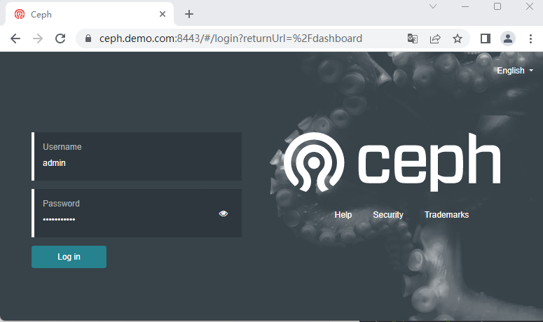
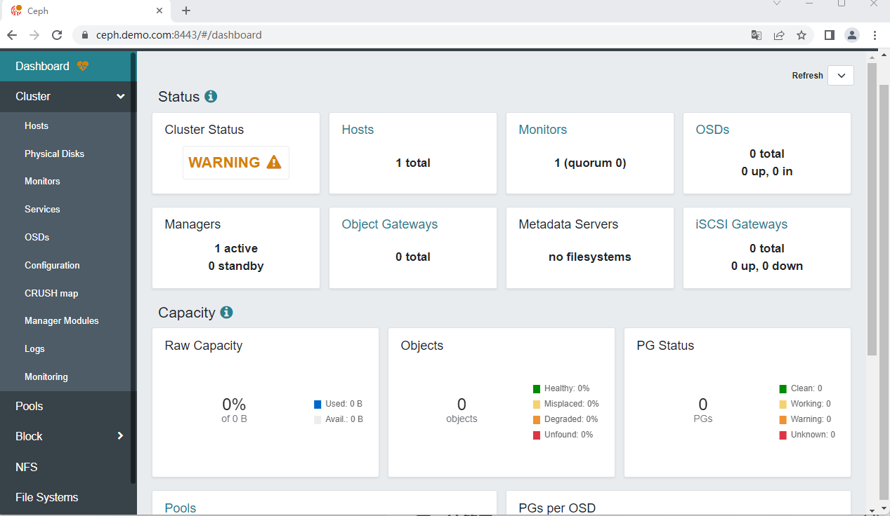

## 节点

存储层采用ceph分布式存储，可提供块存储、对像存储、文件存储等多种方式。
并给k8s提供后端sc支持。

ceph测试环境如下，若是生产环境，需每个进程角色配置主备方式。

| 节点       | os             | 配置                       | ip                     | 角色                      |
| :--------- | :------------- | :------------------------- | :--------------------- | :------------------------ |
| mgm        | Rocky9.1       | 2vCPU,RAM2GB,HD:8GB        | 10.2.20.59/192.168.3.x | 管理节点，ssh免密         |
| ceph-mon1  | centos8.5.2111 | 2vCPU,RAM2GB,HD:8GB        | 10.2.20.90/192.168.3.x | mon,mgr,mds,dashboard,rgw |
| ceph-node1 | centos8.5.2111 | 2vCPU,RAM2GB,HD:8GB+10GBx2 | 10.2.20.91/192.168.3.x | osd                       |
| ceph-node2 | centos8.5.2111 | 2vCPU,RAM2GB,HD:8GB+10GBx2 | 10.2.20.92/192.168.3.x | osd                       |
| ceph-node3 | centos8.5.2111 | 2vCPU,RAM2GB,HD:8GB+10GBx2 | 10.2.20.93/192.168.3.x | osd                       |

ceph采用version 17.2.6  quincy (stable)。

采用os-w安装上述5台主机。

## 4.1 基本配置

#### 4.1.1 所有节点基本配置

```css
#配置hosts文件
cat >> /etc/hosts << 'EOF'
10.2.20.90      ceph-mon1
10.2.20.91      ceph-node1
10.2.20.92      ceph-node2
10.2.20.93      ceph-node3
EOF

#安装基础软件
cd /etc/yum.repos.d/
sed -i 's/mirrorlist/#mirrorlist/g' /etc/yum.repos.d/CentOS-*
sed -i 's|#baseurl=http://mirror.centos.org|baseurl=http://vault.centos.org|g' /etc/yum.repos.d/CentOS-*
rm -fr Centos8-2111*
wget -O /etc/yum.repos.d/CentOS-Base.repo https://mirrors.aliyun.com/repo/Centos-vault-8.5.2111.repo
yum clean all 
yum makecache
yum install -y epel-release
yum -y install net-tools wget bash-completion lrzsz unzip zip tree

#关闭防火墙和selinux
systemctl disable --now firewalld
systemctl stop firewalld
setenforce 0
sed -i 's/^SELINUX=.*/SELINUX=disabled/' /etc/selinux/config
```

ceph-17.2.6安装源

```css
cat> /etc/yum.repos.d/ceph.repo << 'EOF'
[ceph]
name=Ceph packages for $basearch
baseurl=https://download.ceph.com/rpm-17.2.6/el8/$basearch
enabled=1
priority=2
gpgcheck=1
gpgkey=https://download.ceph.com/keys/release.asc

[ceph-noarch]
name=Ceph noarch packages
baseurl=https://download.ceph.com/rpm-17.2.6/el8/noarch
enabled=1
priority=2
gpgcheck=1
gpgkey=https://download.ceph.com/keys/release.asc

[ceph-source]
name=Ceph source packages
baseurl=https://download.ceph.com/rpm-17.2.6/el8/SRPMS
enabled=0
priority=2
gpgcheck=1
gpgkey=https://download.ceph.com/keys/release.asc
EOF
```

查看ceph安装包

```css
# yum list Ceph*
Repository extras is listed more than once in the configuration
Last metadata expiration check: 0:01:01 ago on Mon 24 Apr 2023 10:22:10 PM CST.
Installed Packages
ceph-release.noarch                                  1-1.el8                @System  
Available Packages
ceph.x86_64                                          2:17.2.6-0.el8         ceph     
ceph-base.x86_64                                     2:17.2.6-0.el8         ceph     
ceph-base-debuginfo.x86_64                           2:17.2.6-0.el8         ceph     
ceph-common.x86_64                                   2:17.2.6-0.el8         ceph     
ceph-common-debuginfo.x86_64                         2:17.2.6-0.el8         ceph     
ceph-debuginfo.x86_64                                2:17.2.6-0.el8         ceph     
ceph-debugsource.x86_64                              2:17.2.6-0.el8         ceph     
ceph-exporter.x86_64                                 2:17.2.6-0.el8         ceph     
ceph-exporter-debuginfo.x86_64                       2:17.2.6-0.el8         ceph     
ceph-fuse.x86_64                                     2:17.2.6-0.el8         ceph     
ceph-fuse-debuginfo.x86_64                           2:17.2.6-0.el8         ceph     
ceph-grafana-dashboards.noarch                       2:17.2.6-0.el8         ceph-noarch
ceph-immutable-object-cache.x86_64                   2:17.2.6-0.el8         ceph     
ceph-immutable-object-cache-debuginfo.x86_64         2:17.2.6-0.el8         ceph     
ceph-mds.x86_64                                      2:17.2.6-0.el8         ceph     
ceph-mds-debuginfo.x86_64                            2:17.2.6-0.el8         ceph     
ceph-mgr.x86_64                                      2:17.2.6-0.el8         ceph     
ceph-mgr-cephadm.noarch                              2:17.2.6-0.el8         ceph-noarch
ceph-mgr-dashboard.noarch                            2:17.2.6-0.el8         ceph-noarch
ceph-mgr-debuginfo.x86_64                            2:17.2.6-0.el8         ceph     
ceph-mgr-diskprediction-local.noarch                 2:17.2.6-0.el8         ceph-noarch
ceph-mgr-k8sevents.noarch                            2:17.2.6-0.el8         ceph-noarch
ceph-mgr-modules-core.noarch                         2:17.2.6-0.el8         ceph-noarch
ceph-mgr-rook.noarch                                 2:17.2.6-0.el8         ceph-noarch
ceph-mon.x86_64                                      2:17.2.6-0.el8         ceph     
ceph-mon-debuginfo.x86_64                            2:17.2.6-0.el8         ceph     
ceph-osd.x86_64                                      2:17.2.6-0.el8         ceph     
ceph-osd-debuginfo.x86_64                            2:17.2.6-0.el8         ceph     
ceph-prometheus-alerts.noarch                        2:17.2.6-0.el8         ceph-noarch
ceph-radosgw.x86_64                                  2:17.2.6-0.el8         ceph     
ceph-radosgw-debuginfo.x86_64                        2:17.2.6-0.el8         ceph     
ceph-resource-agents.noarch                          2:17.2.6-0.el8         ceph-noarch
ceph-selinux.x86_64                                  2:17.2.6-0.el8         ceph     
ceph-test.x86_64                                     2:17.2.6-0.el8         ceph     
ceph-test-debuginfo.x86_64                           2:17.2.6-0.el8         ceph     
ceph-volume.noarch                                   2:17.2.6-0.el8         ceph-noarch
cephadm.noarch                                       2:17.2.6-0.el8         ceph-noarch
cephfs-mirror.x86_64                                 2:17.2.6-0.el8         ceph     
cephfs-mirror-debuginfo.x86_64                       2:17.2.6-0.el8         ceph     
cephfs-top.noarch                                    2:17.2.6-0.el8         ceph-noarch
```

#### 4.1.2 管理节点

免密配置

```css
ssh-keygen -t rsa
ssh-copy-id root@ceph-mon1
ssh-copy-id root@ceph-node1
ssh-copy-id root@ceph-node2
ssh-copy-id root@ceph-node3
```

配置ansible

```css
# yum -y install ansible
# vi /etc/ansible/hosts 
[ceph]
ceph-mon1
ceph-node1
ceph-node2
ceph-node3
# ansible ceph -m shell -a "date"
ceph-mon1 | CHANGED | rc=0 >>
Sat Jun  3 22:32:43 CST 2023
ceph-node3 | CHANGED | rc=0 >>
Sat Jun  3 22:32:43 CST 2023
ceph-node1 | CHANGED | rc=0 >>
Sat Jun  3 22:32:43 CST 2023
ceph-node2 | CHANGED | rc=0 >>
Sat Jun  3 22:32:43 CST 2023
```

安装ceph等客户端命令

```css
# yum -y install ceph-common ceph-base
# ceph -v
ceph version 17.2.6 (d7ff0d10654d2280e08f1ab989c7cdf3064446a5) quincy (stable)
```

#### 4.1.3 ceph集群节点

```css
# ansible ceph -m shell -a "yum -y install net-tools gdisk lvm2"
# ansible ceph -m shell -a "yum -y install ceph"

# ansible ceph -m shell -a "systemctl list-unit-files | grep ceph"
...
ceph-crash.service                         enabled  
ceph-mds@.service                          disabled 
ceph-mgr@.service                          disabled 
ceph-mon@.service                          disabled 
ceph-osd@.service                          disabled 
ceph-volume@.service                       disabled 
ceph-mds.target                            enabled  
ceph-mgr.target                            enabled  
ceph-mon.target                            enabled  
ceph-osd.target                            enabled  
ceph.target                                enabled  
# ansible ceph -m shell -a "ceph -v"
ceph-mon1 | CHANGED | rc=0 >>
ceph version 17.2.6 (d7ff0d10654d2280e08f1ab989c7cdf3064446a5) quincy (stable)
ceph-node1 | CHANGED | rc=0 >>
ceph version 17.2.6 (d7ff0d10654d2280e08f1ab989c7cdf3064446a5) quincy (stable)
ceph-node3 | CHANGED | rc=0 >>
ceph version 17.2.6 (d7ff0d10654d2280e08f1ab989c7cdf3064446a5) quincy (stable)
ceph-node2 | CHANGED | rc=0 >>
ceph version 17.2.6 (d7ff0d10654d2280e08f1ab989c7cdf3064446a5) quincy (stable)
```

每个节点 工作目录

```css
# tree /var/lib/ceph
/var/lib/ceph
├── bootstrap-mds
├── bootstrap-mgr
├── bootstrap-osd
├── bootstrap-rbd
├── bootstrap-rbd-mirror
├── bootstrap-rgw
├── crash
│   └── posted
├── mds
├── mgr
├── mon
├── osd
└── tmp
```

所有节点，ceph日志目录：/var/log/ceph

## 4.2 管理机点配置

管理节点主要功能是管理ceph集群，包括配置文件的产生、及使用ceph命令直接访问集群。

为方便配置，在管理节点上建立一个目录，用于存放ceph集群配置过程中产生的文件，默认在此目录中产生各类配置文件，并在需要时同步到ceph各节点。例如：

```css
# mkdir /root/ceph
# cd /root/ceph
```

### 4.2.1 ceph集群全局唯一性标识配置

```css
# uuidgen
9b7095ab-5193-420c-b2fb-2d343c57ef52
# ansible ceph -m shell -a "echo export cephuid=9b7095ab-5193-420c-b2fb-2d343c57ef52 >> /etc/profile"
# ansible ceph -m shell -a "source /etc/profile"
# ansible ceph -m shell -a "cat /etc/profile | grep cephuid"
ceph-node1 | CHANGED | rc=0 >>
export cephuid=9b7095ab-5193-420c-b2fb-2d343c57ef52
ceph-mon1 | CHANGED | rc=0 >>
export cephuid=9b7095ab-5193-420c-b2fb-2d343c57ef52
ceph-node3 | CHANGED | rc=0 >>
export cephuid=9b7095ab-5193-420c-b2fb-2d343c57ef52
ceph-node2 | CHANGED | rc=0 >>
export cephuid=9b7095ab-5193-420c-b2fb-2d343c57ef52
```

### 4.2.2 keyring配置

```css
ceph-authtool --create-keyring ./ceph.client.admin.keyring --gen-key -n client.admin --cap mon 'allow *' --cap osd 'allow *' --cap mds 'allow *' --cap mgr 'allow *'
ceph-authtool --create-keyring ./ceph.mon.keyring --gen-key -n mon. --cap mon 'allow *'
ceph-authtool --create-keyring ./ceph.keyring --gen-key -n client.bootstrap-osd --cap mon 'profile bootstrap-osd' --cap mgr 'allow r'
```

### 4.2.3 ceph.conf初始配置

```css
# cat > /root/ceph/ceph.conf <<EOF
[global]
fsid = 9b7095ab-5193-420c-b2fb-2d343c57ef52
public network = 10.2.20.0/24
auth cluster required = cephx
auth service required = cephx
auth client required = cephx
osd journal size = 1024
osd pool default size = 3
osd pool default min size = 2
osd pool default pg num = 32
osd pool default pgp num = 32
osd crush chooseleaf type = 0
mon_host = 10.2.20.90
mon_max_pg_per_osd = 1000

[client.admin]
#mon host = 10.2.20.90
keyring = /etc/ceph/ceph.client.admin.keyring
EOF
```

#### 4.2.4 客户端ceph命令配置

当ceph集群正常工作后，就可以使用ceph命令在管理节点上对集群进行管理。
建立在所有节点包括管理节点配置。
管理节点

```css
# cp ceph.client.admin.keyring /etc/ceph/
# cp ceph.conf /etc/ceph/
```

ceph工作节点

```css
ansible ceph -m copy -a "src=ceph.conf dest=/etc/ceph/"
ansible ceph -m copy -a "src=ceph.client.admin.keyring dest=/etc/ceph/"
```

在ceph集群建立后，可以在每个节点上使用ceph命令对ceph进行管理。

## 4.3 mon进程配置

在管理机上，在配置文件/root/ceph/ceph.conf中添加如下信息

```css
[mon]
mon initial members = mon1
mon allow pool delete = true
```

并更新到各个节点

```css
ansible ceph -m copy -a "src=ceph.conf dest=/etc/ceph/"
```

### 4.3.1 ceph.mon.keyring

把administrator keyring和bootstrap-osd keyring添加到中ceph.mon.keyring。

```css
ceph-authtool ./ceph.mon.keyring --import-keyring ./ceph.client.admin.keyring
ceph-authtool ./ceph.mon.keyring --import-keyring ./ceph.keyring
```

将mon.keyring文件复制到所有mon节点，并配置权限

```css
# scp ceph.mon.keyring ceph-mon1:/tmp/
# ssh ceph-mon1 "chown ceph:ceph /tmp/ceph.mon.keyring"
```

### 4.3.2 monitor map配置

```css
# monmaptool --create --add mon1 10.2.20.90 --fsid $cephuid /root/ceph/monmap
monmaptool: monmap file /root/ceph/monmap
setting min_mon_release = octopus
monmaptool: set fsid to 9b7095ab-5193-420c-b2fb-2d343c57ef52
monmaptool: writing epoch 0 to /root/ceph/monmap (1 monitors)
# scp monmap ceph-mon1:/tmp/
# ssh ceph-mon1 "chown ceph:ceph /tmp/monmap"
```

### 4.3.3  创建monitor数据目录

在ceph-mon1节点上操作

```css
# sudo -u ceph ceph-mon --mkfs -i mon1 --monmap /tmp/monmap --keyring /tmp/ceph.mon.keyring
# tree /var/lib/ceph/mon/ceph-mon1
/var/lib/ceph/mon/ceph-mon1
├── keyring
├── kv_backend
└── store.db
    ├── 000004.log
    ├── CURRENT
    ├── IDENTITY
    ├── LOCK
    ├── MANIFEST-000003
    └── OPTIONS-000006
```

### 4.3.4  启动monitor服务

在ceph-mon1上配置开机启动

```css
# systemctl enable ceph-mon@mon1
# systemctl start ceph-mon.target
# ss -lnt
State    Recv-Q   Send-Q     Local Address:Port       Peer Address:Port   Process   
LISTEN   0        128           10.2.20.90:6789            0.0.0.0:*              
LISTEN   0        128              0.0.0.0:22              0.0.0.0:*              
LISTEN   0        128                 [::]:22                 [::]:*              
# ceph config set mon auth_allow_insecure_global_id_reclaim false
# ps -ef | grep ceph-mon
ceph        1106       1  0 08:11 ?        00:00:02 /usr/bin/ceph-mon -f --cluster ceph --id mon1 --setuser ceph --setgroup ceph
```

查看

```css
# ceph mon stat
e2: 1 mons at {mon1=[v2:10.2.20.90:3300/0,v1:10.2.20.90:6789/0]} removed_ranks: {}, election epoch 7, leader 0 mon1, quorum 0 mon1
# ceph -s
  cluster:
    id:     9b7095ab-5193-420c-b2fb-2d343c57ef52
    health: HEALTH_WARN
            1 monitors have not enabled msgr2
 
  services:
    mon: 1 daemons, quorum mon1 (age 39m)
    mgr: no daemons active
    osd: 0 osds: 0 up, 0 in
 
  data:
    pools:   0 pools, 0 pgs
    objects: 0 objects, 0 B
    usage:   0 B used, 0 B / 0 B avail
    pgs:       
```

## 4.4 mgr进程配置

在ceph-mon1节点上操作。

### 4.4.1 配置mgr服务

```css
yum -y install ceph-mgr*
mgr_name='mgr1'
mkdir /var/lib/ceph/mgr/ceph-${mgr_name}
ceph auth get-or-create mgr.${mgr_name} mon 'allow profile mgr' osd 'allow *' mds 'allow *' > /var/lib/ceph/mgr/ceph-${mgr_name}/keyring
chown ceph:ceph -R /var/lib/ceph/mgr/ceph-${mgr_name}
ceph mon enable-msgr2
```

将如下内容添加到管理节点/root/ceph/ceph.conf文件

```css
[mgr.mgr1]
# mon host = 10.2.20.90
keyring =  /var/lib/ceph/mgr/ceph-mgr1/keyring 
```

更新配置文件

```css
ansible ceph -m copy -a "src=ceph.conf dest=/etc/ceph/"
```

启动ceph-mgr守护程序：

```css
# systemctl enable ceph-mgr@mgr1
# systemctl start ceph-mgr.target   
```

查看mgr是否启动

```css
# ps -ef | grep mgr
ceph        2059       1 78 09:16 ?        00:00:20 /usr/bin/ceph-mgr -f --cluster ceph --id mgr1 --setuser ceph --setgroup ceph
root        2205    1677  0 09:16 pts/0    00:00:00 grep --color=auto mgr
# ceph -s
  cluster:
    id:     9b7095ab-5193-420c-b2fb-2d343c57ef52
    health: HEALTH_OK
 
  services:
    mon: 1 daemons, quorum mon1 (age 7m)
    mgr: mgr1(active, since 9s)
    osd: 0 osds: 0 up, 0 in
 
  data:
    pools:   0 pools, 0 pgs
    objects: 0 objects, 0 B
    usage:   0 B used, 0 B / 0 B avail
    pgs:   
# ss -lntp
State   Recv-Q   Send-Q     Local Address:Port     Peer Address:Port  Process                             
LISTEN  0        128           10.2.20.90:6800          0.0.0.0:*      users:(("ceph-mgr",pid=2059,fd=30))  
LISTEN  0        128           10.2.20.90:6801          0.0.0.0:*      users:(("ceph-mgr",pid=2059,fd=31))  
LISTEN  0        128              0.0.0.0:22            0.0.0.0:*      users:(("sshd",pid=1024,fd=4))     
LISTEN  0        128           10.2.20.90:3300          0.0.0.0:*      users:(("ceph-mon",pid=1106,fd=27))  
LISTEN  0        128           10.2.20.90:6789          0.0.0.0:*      users:(("ceph-mon",pid=1106,fd=28))  
LISTEN  0        128                 [::]:22               [::]:*      users:(("sshd",pid=1024,fd=6))  
```

### 4.4.2 配置mgr模块

查看mgr模块

```css
# ceph mgr module ls
MODULE                            
balancer              on (always on)
crash                 on (always on)
devicehealth          on (always on)
orchestrator          on (always on)
pg_autoscaler         on (always on)
progress              on (always on)
rbd_support           on (always on)
status                on (always on)
telemetry             on (always on)
volumes               on (always on)
iostat                on          
nfs                   on          
restful               on          
alerts                -           
cephadm               -           
dashboard             -           
diskprediction_local  -           
influx                -           
insights              -           
k8sevents             -           
localpool             -           
mds_autoscaler        -           
mirroring             -           
osd_perf_query        -           
osd_support           -           
prometheus            -           
rook                  -           
selftest              -           
snap_schedule         -           
stats                 -           
telegraf              -           
test_orchestrator     -           
zabbix                -       
```

启用prometheus

```css
ceph mgr module enable prometheus
```

查看prometheus采集指标
http://10.2.20.90:9283/metrics

### 4.4.3 配置mgr模块dashbord

将域名证书复制到/etc/ceph/cert/目录

```css
ceph mgr module enable dashboard
ceph dashboard set-ssl-certificate -i /etc/ceph/cert/web.pem
ceph dashboard set-ssl-certificate-key -i /etc/ceph/cert/web-key.pem
echo "abc123xyz" > pwd.txt
ceph dashboard ac-user-create admin -i ./pwd.txt administrator
```

查看
https://ceph.demo.com:8443/




当ceph集群配置完成后，可以通过dashboard看到详细信息。

## 4.5 存储osd配置

### 4.5.1 ceph.conf配置

ceph.conf添加如下信息

```css
[client.bootstrap-osd]
# mon host = 10.2.20.90
keyring = /var/lib/ceph/bootstrap-osd/ceph.keyring
```

更新配置ceph.conf到各节点

```css
# ansible ceph -m copy -a "src=ceph.conf dest=/etc/ceph/"
```

将bootstrap-osd key复制到各节点

```css
ansible ceph -m copy -a "src=ceph.keyring dest=/var/lib/ceph/bootstrap-osd/"
ansible ceph -m shell -a "chown ceph:ceph -R /var/lib/ceph/bootstrap-osd"
```

### 4.5.2 添加ceph卷

在osd节点上操作，以ceph-node1为例。每个osd节点相同操作。
查看节点上的祼硬盘情况

```css
# lsblk
NAME        MAJ:MIN RM  SIZE RO TYPE MOUNTPOINT
sda           8:0    0    8G  0 disk 
├─sda1        8:1    0  600M  0 part /boot/efi
├─sda2        8:2    0    1G  0 part /boot
└─sda3        8:3    0  6.4G  0 part 
  ├─cl-root 253:0    0  5.6G  0 lvm  /
  └─cl-swap 253:1    0  820M  0 lvm  [SWAP]
sdb           8:16   0   10G  0 disk 
sdc           8:32   0   10G  0 disk 
sr0          11:0    1 1024M  0 rom  
```

将/dev/sdb和/dev/sdc挂入ceph，创建ceph卷，每一个osd都有独立的id.

```css
# ceph-volume lvm create --data /dev/sdb
...
Running command: /usr/bin/systemctl enable --runtime ceph-osd@0
 stderr: Created symlink /run/systemd/system/ceph-osd.target.wants/ceph-osd@0.service → /usr/lib/systemd/system/ceph-osd@.service.
Running command: /usr/bin/systemctl start ceph-osd@0
--> ceph-volume lvm activate successful for osd ID: 0
--> ceph-volume lvm create successful for: /dev/sdb

# ceph-volume lvm create --data /dev/sdc
Running command: /usr/bin/systemctl enable --runtime ceph-osd@1
 stderr: Created symlink /run/systemd/system/ceph-osd.target.wants/ceph-osd@1.service → /usr/lib/systemd/system/ceph-osd@.service.
Running command: /usr/bin/systemctl start ceph-osd@1
--> ceph-volume lvm activate successful for osd ID: 1
--> ceph-volume lvm create successful for: /dev/sdc
```

启动服务，每一个osd都有独立的id，启动osd服务时需指定osd id。

```css
# systemctl enable ceph-osd@0
# systemctl enable ceph-osd@1
# systemctl start ceph-osd.target

# ps -ef | grep osd
ceph        3492       1  0 10:38 ?        00:00:01 /usr/bin/ceph-osd -f --cluster ceph --id 0 --setuser ceph --setgroup ceph
ceph        4993       1  1 10:39 ?        00:00:01 /usr/bin/ceph-osd -f --cluster ceph --id 1 --setuser ceph --setgroup ceph
```

其它两个osd节点做相同操作，完成后可查看osd状态。

```css
# ceph osd status
ID  HOST         USED  AVAIL  WR OPS  WR DATA  RD OPS  RD DATA  STATE    
 0  ceph-node1  20.6M  9.97G      0        0       0        0   exists,up  
 1  ceph-node1  20.6M  9.97G      0        0       0        0   exists,up  
 2  ceph-node2  21.0M  9.97G      0        0       0        0   exists,up  
 3  ceph-node2  20.3M  9.97G      0        0       0        0   exists,up  
 4  ceph-node3  19.7M  9.97G      0        0       0        0   exists,up  
 5  ceph-node3  20.2M  9.97G      0        0       0        0   exists,up  

# ceph osd df
ID  CLASS  WEIGHT   REWEIGHT  SIZE    RAW USE  DATA     OMAP  META     AVAIL   %USE  VAR   PGS  STATUS
 0    hdd  0.00980   1.00000  10 GiB   21 MiB  496 KiB   0 B   21 MiB  10 GiB  0.21  1.01   16      up
 1    hdd  0.00980   1.00000  10 GiB   21 MiB  500 KiB   0 B   21 MiB  10 GiB  0.21  1.02   24      up
 2    hdd  0.00980   1.00000  10 GiB   22 MiB  920 KiB   0 B   21 MiB  10 GiB  0.21  1.02   22      up
 3    hdd  0.00980   1.00000  10 GiB   21 MiB  928 KiB   0 B   20 MiB  10 GiB  0.20  0.99   24      up
 4    hdd  0.00980   1.00000  10 GiB   20 MiB  500 KiB   0 B   20 MiB  10 GiB  0.20  0.97   18      up
 5    hdd  0.00980   1.00000  10 GiB   21 MiB  908 KiB   0 B   20 MiB  10 GiB  0.20  0.98   19      up
                       TOTAL  60 GiB  127 MiB  4.2 MiB   0 B  122 MiB  60 GiB  0.21                 
MIN/MAX VAR: 0.97/1.02  STDDEV: 0.00

# ceph -s
  cluster:
    id:     9b7095ab-5193-420c-b2fb-2d343c57ef52
    health: HEALTH_OK
 
  services:
    mon: 1 daemons, quorum mon1 (age 103m)
    mgr: mgr1(active, since 77m)
    osd: 6 osds: 6 up (since 74s), 6 in (since 106s)
 
  data:
    pools:   1 pools, 1 pgs
    objects: 2 objects, 449 KiB
    usage:   123 MiB used, 60 GiB / 60 GiB avail
    pgs:     1 active+clean

# ceph osd pool ls
.mgr
```

## 4.6 mds进程配置

一个 Ceph 文件系统需要至少两个 RADOS 存储池，一个用于数据、一个用于元数据。
在生产中，配置这些存储池时需考虑：
- 为元数据存储池设置较高的副本水平，因为此存储池丢失任何数据都会导致整个文件系统失效。
- 为元数据存储池分配低延时存储器（像 SSD ），因为它会直接影响到客户端的操作延时。

将mds配置在ceph-mon1节点，在多个节点上可以配置多个mds服务。

### 4.6.1 配置mds服务

创建mds数据目录。

```css
sudo -u ceph mkdir -p /var/lib/ceph/mds/ceph-mon1
```

创建keyring，并配置权限。

```css
ceph-authtool --create-keyring /var/lib/ceph/mds/ceph-mon1/keyring --gen-key -n mds.mon1
ceph auth add mds.mon1 osd "allow rwx" mds "allow" mon "allow profile mds" -i /var/lib/ceph/mds/ceph-mon1/keyring
chown ceph:ceph -R /var/lib/ceph/mds/ceph-mon1
```

ceph.conf添加如下信息

```css
[mds.mon1]
host = ceph-mon1
#mon host = 10.2.20.90
keyring = /var/lib/ceph/mds/ceph-mon1/keyring
```

更新配置ceph.conf到各节点

```css
ansible ceph -m copy -a "src=ceph.conf dest=/etc/ceph/"
```

运行服务

```css
# systemctl enable ceph-mds@mon1
# systemctl start ceph-mds.target
```

查看ceph状态

```css
# ps -ef | grep mds
ceph        3617       1  1 11:16 ?        00:00:00 /usr/bin/ceph-mds -f --cluster ceph --id mon1 --setuser ceph --setgroup ceph
# ceph -s
  cluster:
    id:     9b7095ab-5193-420c-b2fb-2d343c57ef52
    health: HEALTH_OK
 
  services:
    mon: 1 daemons, quorum mon1 (age 2h)
    mgr: mgr1(active, since 2h)
    osd: 6 osds: 6 up (since 49m), 6 in (since 49m)
 
  data:
    pools:   1 pools, 1 pgs
    objects: 2 objects, 449 KiB
    usage:   123 MiB used, 60 GiB / 60 GiB avail
    pgs:     1 active+clean
# ceph mds stat
 1 up:standby
```

### 4.6.2 创建fs卷

1. 一个cephfs最多占用2个mds进程，一主一副。
2. 若有多个cephfs，需配置多个mds进程。
3. 一个mds服务进程只负责一个fs卷。
4. 当需要多个fs卷，可采用子卷方式。

```css
ceph osd pool create guo-metadata 8
ceph osd pool create guo-data 8
ceph fs new guo-fs guo-metadata guo-data
```

查看fs卷

```css
# ceph fs ls
name: guo-fs, metadata pool: guo-metadata, data pools: [guo-data ]

# ceph mds stat
guo-fs:1 {0=mon1=up:active}

# ceph -s
  cluster:
    id:     9b7095ab-5193-420c-b2fb-2d343c57ef52
    health: HEALTH_OK
 
  services:
    mon: 1 daemons, quorum mon1 (age 2h)
    mgr: mgr1(active, since 2h)
    mds: 1/1 daemons up
    osd: 6 osds: 6 up (since 57m), 6 in (since 57m)
 
  data:
    volumes: 1/1 healthy
    pools:   3 pools, 41 pgs
    objects: 24 objects, 451 KiB
    usage:   126 MiB used, 60 GiB / 60 GiB avail
    pgs:     41 active+clean

# ceph fs volume ls
[
    {
        "name": "guo-fs"
    }
]

# ceph fs status guo-fs
guo-fs - 0 clients
======
RANK  STATE   MDS      ACTIVITY     DNS    INOS   DIRS   CAPS  
 0    active  mon1  Reqs:    0 /s    10     13     12      0   
    POOL        TYPE     USED  AVAIL  
guo-metadata  metadata  96.0k  18.9G  
  guo-data      data       0   18.9G  
MDS version: ceph version 17.2.6 (d7ff0d10654d2280e08f1ab989c7cdf3064446a5) quincy (stable)

# ceph fs get guo-fs
Filesystem 'guo-fs' (1)
fs_name guo-fs
epoch   4
flags   12 joinable allow_snaps allow_multimds_snaps
created 2023-06-04T11:46:12.324425+0800
modified        2023-06-04T11:46:13.614449+0800
tableserver     0
root    0
session_timeout 60
session_autoclose       300
max_file_size   1099511627776
required_client_features        {}
last_failure    0
last_failure_osd_epoch  0
compat  compat={},rocompat={},incompat={1=base v0.20,2=client writeable ranges,3=default file layouts on dirs,4=dir inode in separate object,5=mds uses versioned encoding,6=dirfrag is stored in omap,7=mds uses inline data,8=no anchor table,9=file layout v2,10=snaprealm v2}
max_mds 1
in      0
up      {0=24251}
failed
damaged
stopped
data_pools      [3]
metadata_pool   2
inline_data     disabled
balancer
standby_count_wanted    0
[mds.mon1{0:24251} state up:active seq 454 addr [v2:10.2.20.90:6802/3326420411,v1:10.2.20.90:6803/3326420411] compat {c=[1],r=[1],i=[7ff]}]
```

查看fs使用情况

```css
# ceph fs volume info  guo-fs
{
    "mon_addrs": [
        "10.2.20.90:6789"
    ],
    "pools": {
        "data": [
            {
                "avail": 20347840512,
                "name": "guo-data",
                "used": 0
            }
        ],
        "metadata": [
            {
                "avail": 20347840512,
                "name": "guo-metadata",
                "used": 98304
            }
        ]
    }
}
```

### 4.6.3 cephfs mount测试

cephfs挂载的方式有多种，本文采用linux内核模块ceph方式，centos7.x或更高版本的内核默认安装ceph模块。
查验内核ceph模块

```css
modinfo ceph
```

在管理机上操作

```css
在cephfs卷上为使用创建子目录
# mount -t ceph -o mds_namespace=guo-fs,name=admin,secret=AQCwXntkCw+CGBAA/mdug0WT2jYDAFEN8tATOA== 10.2.20.90:6789:/ /root/cephfs
# mkdir -p /root/cephfs/{tp1,tp2}
# umount /root/cephfs

创建cephfs访问用户
# ceph fs authorize guo-fs client.guofs /tp1 rw
[client.guofs]
        key = AQAmFnxkwo4WAxAAPpMEpIOfTvgc6jAQBKlf8A==

查看
# ceph auth get client.guofs

删除
# ceph auth rm client.guofs
```

在用户机上操作

```css
# mount -t ceph -o mds_namespace=guo-fs,name=guofs,secret=AQAmFnxkwo4WAxAAPpMEpIOfTvgc6jAQBKlf8A== 10.2.20.90:6789:/tp1 /root/tp1
# df -Th | grep tp1
10.2.20.90:6789:/tp1 ceph       19G     0   19G   0% /root/tp1
```

## 4.7 rbd块存储配置

rbd块存储不需要特别的服务进程，通过mon进程可直接访问。

### 4.7.1 创建块设备

创建rbd设备使用的存储池

```css
# ceph osd pool create rbd01_pool 64 64
# ceph osd pool application enable rbd01_pool rbd
# rbd pool init rbd01_pool
# ceph osd pool application get rbd01_pool
# ceph osd pool get rbd01_pool all
```

创建rbd类的pool的命名空间
rbd类pool的命名空间的作用：
在pool存储池上划分多个逻辑区域，不同区域间的用户是隔离的，相同区域的多个用户是可以访问对方资源的。
rbd类pool默认没有命名空间。

```css
# rbd namespace create rbd01_pool/ns1
# rbd namespace create rbd01_pool/ns2
# rbd namespace ls rbd01_pool
NAME
ns1 
ns2
```

建立块设备对像

```css
rbd create --size 1024 --image-feature layering rbd01_pool/ns1/disk11
rbd create --size 1024 --image-feature layering rbd01_pool/ns1/disk21
rbd create --size 1024 --image-feature layering rbd01_pool/ns2/disk11
rbd create --size 1024 --image-feature layering rbd01_pool/ns2/disk21
```

查看块对像

```css
# rbd list  rbd01_pool/ns1  --long
NAME    SIZE   PARENT  FMT  PROT  LOCK
disk11  1 GiB            2          
disk21  1 GiB            2 
         
# rbd list  rbd01_pool/ns2  --long
NAME    SIZE   PARENT  FMT  PROT  LOCK
disk11  1 GiB            2          
disk21  1 GiB            2  

# rbd info rbd01_pool/ns1/disk11
rbd image 'disk11':
        size 1 GiB in 256 objects
        order 22 (4 MiB objects)
        snapshot_count: 0
        id: 5f57d0156264
        block_name_prefix: rbd_data.5f57d0156264
        format: 2
        features: layering
        op_features: 
        flags: 
        create_timestamp: Sun Jun  4 12:58:54 2023
        access_timestamp: Sun Jun  4 12:58:54 2023
        modify_timestamp: Sun Jun  4 12:58:54 2023
```

创建rbd设备用户

```css
# ceph auth get-or-create client.user01 mon 'profile rbd' osd 'profile rbd pool=rbd01_pool namespace=ns1'
# ceph auth get client.user01
[client.user01]
        key = AQAGL3xkXzJ8GxAAOOj9RmDe5jb96koJTYEpwA==
        caps mon = "profile rbd"
        caps osd = "profile rbd pool=rbd01_pool namespace=ns1"
```

### 4.7.2 用户使用块设备

在用户主机上操作.

低版本的ceph-common中的rbd命令不支持pool的命名空间配置，需采用高版本的ceph-common来安装rbd.

```css
# yum -y install ceph-common
```

认证配置

```css
# mkdir /etc/ceph   

# cat > /etc/ceph/ceph.conf << 'EOF'
[global]
mon_host = 10.2.20.90:6789
EOF

# cat > /etc/ceph/ceph.client.user01.keyring << 'EOF'
[client.user01]
        key = AQAGL3xkXzJ8GxAAOOj9RmDe5jb96koJTYEpwA==
EOF
```

查看rbc设备

```css
# rbd -n client.user01  -m 10.2.20.90 -k /etc/ceph/ceph.client.user01.keyring  ls rbd01_pool/ns1
disk11
disk21

# rbd -n client.user01  ls rbd01_pool/ns1
disk11
disk21
```

针对块设备执行写入性能测试

```css
# rbd bench --io-type write rbd01_pool/ns1/disk11 -n client.user01
bench  type write io_size 4096 io_threads 16 bytes 1073741824 pattern sequential
  SEC       OPS   OPS/SEC   BYTES/SEC
    1      6208   6066.31    24 MiB/s
    2      6672   3192.38    12 MiB/s
    3      6928   2173.41   8.5 MiB/s
    4      9712   2317.31   9.1 MiB/s
    5     11840   2363.65   9.2 MiB/s
    6     14832   1730.69   6.8 MiB/s
```

挂载块存储

```css
# rbd map rbd01_pool/ns1/disk11 -n client.user01
/dev/rbd0
```

查看已映射块设备

```css
# rbd showmapped
id  pool        namespace  image   snap  device   
0   rbd01_pool  ns1        disk11  -     /dev/rbd0
```

格式化

```css
# mkfs.xfs /dev/rbd0
# mkdir /tp2
# mount /dev/rbd0 /tp2
# df -h
...
/dev/rbd0           1014M   40M  975M   4% /tp2
```

取消块设备映射

```css
rbd unmap rbd01_pool/ns1/disk11
```

## 4.8 rgw配置

### 4.8.1 存储池配置

对像存储池配置

```css
ceph osd pool create .rgw.root 16 16 replicated
ceph osd pool create zone-test.rgw.control 16 16 replicated
ceph osd pool create zone-test.rgw.meta 16 16 replicated
ceph osd pool create zone-test.rgw.log 16 16 replicated
ceph osd pool create zone-test.rgw.buckets.index 16 16 replicated
ceph osd pool create zone-test.rgw.buckets.data 16 16 replicated
ceph osd pool create zone-test.rgw.buckets.non-ect 16 16 replicated

ceph osd pool application enable  .rgw.root rgw
ceph osd pool application enable  zone-test.rgw.control rgw
ceph osd pool application enable  zone-test.rgw.meta rgw
ceph osd pool application enable  zone-test.rgw.log rgw
ceph osd pool application enable  zone-test.rgw.buckets.index rgw
ceph osd pool application enable  zone-test.rgw.buckets.data rgw
ceph osd pool application enable  zone-test.rgw.buckets.non-ect rgw
```

realm配置

```css
radosgw-admin realm create --rgw-realm=realm-test --default
```

zonegroup配置

```css
radosgw-admin zonegroup create --rgw-zonegroup=zonegroup-test --endpoints=10.2.20.90:80 --default --master
```

zone配置

```css
radosgw-admin zone create --rgw-zone=zone-test --rgw-zonegroup=zonegroup-test  --endpoints=10.2.20.90:80 --default --master
```

period更新

```css
radosgw-admin period update --commit
```

### 4.8.2 rgw进程配置

在ceph-mon1节点上面操作

#### 4.8.2.1 keyring配置

```css
配置实例名称变量
# instance_name=rgw1

新增keyring存放目录
# mkdir -p /var/lib/ceph/radosgw/ceph-radosgw.${instance_name}

创建rgw服务需要的keyring
# ceph auth get-or-create client.radosgw.${instance_name} osd 'allow rwx' mon 'allow rw' -o /var/lib/ceph/radosgw/ceph-radosgw.${instance_name}/keyring

配置权限
# chown -R ceph:ceph /var/lib/ceph/radosgw

查看cephx
# ceph auth get client.radosgw.${instance_name}
[client.radosgw.rgw1]
        key = AQAwQ3xkHy6/EBAAKQlW/7WXpt7HyxiOdcIv8w==
        caps mon = "allow rw"
        caps osd = "allow rwx"
```

#### 4.8.2.2 rgw服务配置

ceph.conf添加如下信息

```css
[client.radosgw.rgw1]
host = ceph-mon1
rgw_frontends = "beast port=80"
rgw_enable_usage_log = true
keyring = /var/lib/ceph/radosgw/ceph-radosgw.rgw1/keyring
rgw_realm = "realm-test"
rgw_zonegroup = "zonegroup-test"
rgw_zone = "zone-test"
rgw_verify_ssl = false
```

更新配置ceph.conf到各节点

```css
ansible ceph -m copy -a "src=ceph.conf dest=/etc/ceph/"
```

安装rgw服务

```css
yum -y install ceph-radosgw
```

启动服务

```css
# systemctl enable ceph-radosgw@radosgw.${instance_name}
# systemctl start ceph-radosgw.target
```

查看进程

```css
# ps -ef | grep radosgw
ceph       12853       1  5 00:32 ?        00:00:00 /usr/bin/radosgw -f --cluster ceph --name client.radosgw.sr1 --setuser ceph --setgroup ceph

```

### 4.8.3 rgw测试

在管理机上建立rgw用户

```css
# radosgw-admin user create --uid="guofs" --display-name="test"
# radosgw-admin user info --uid="guofs" | grep access_key -A1
            "access_key": "LLOGCYL0FAVR2K4YFZB8",
            "secret_key": "FbkyDqNGumDob5n54NRMtaYskvrVQgRrddHRivcS"
```

在用户主机上配置.
测试工具
https://github.com/peak/s5cmd

外部主机上操作如下

```css
export AWS_ENDPOINT=10.2.20.90:80
export AWS_ACCESS_KEY_ID=LLOGCYL0FAVR2K4YFZB8
export AWS_SECRET_ACCESS_KEY=FbkyDqNGumDob5n54NRMtaYskvrVQgRrddHRivcS
```

在上传文件前，需先建立存储桶。

```css
# s5cmd --endpoint-url http://$AWS_ENDPOINT mb s3://test01
# s5cmd --endpoint-url http://$AWS_ENDPOINT mb s3://test02
```

查看存储桶

```css
# s5cmd --endpoint-url http://$AWS_ENDPOINT ls
2023/06/04 10:36:59  s3://test01
2023/06/04 10:37:08  s3://test02
```

上传

```css
# echo "hello rgw" > /tmp/test.txt
# s5cmd --endpoint-url http://$AWS_ENDPOINT cp /tmp/test.txt s3://test01
```

查看文件列表

```css
# s5cmd --endpoint-url http://$AWS_ENDPOINT ls s3://test01
2023/06/04 10:37:44                10 test.txt
```

下载

```css
# s5cmd --endpoint-url http://$AWS_ENDPOINT cp s3://test01/test.txt ./
cp s3://test01/test.txt test.txt
# ll
total 4
-rw-r--r-- 1 root root 10 Jun  4 18:45 test.txt
```

