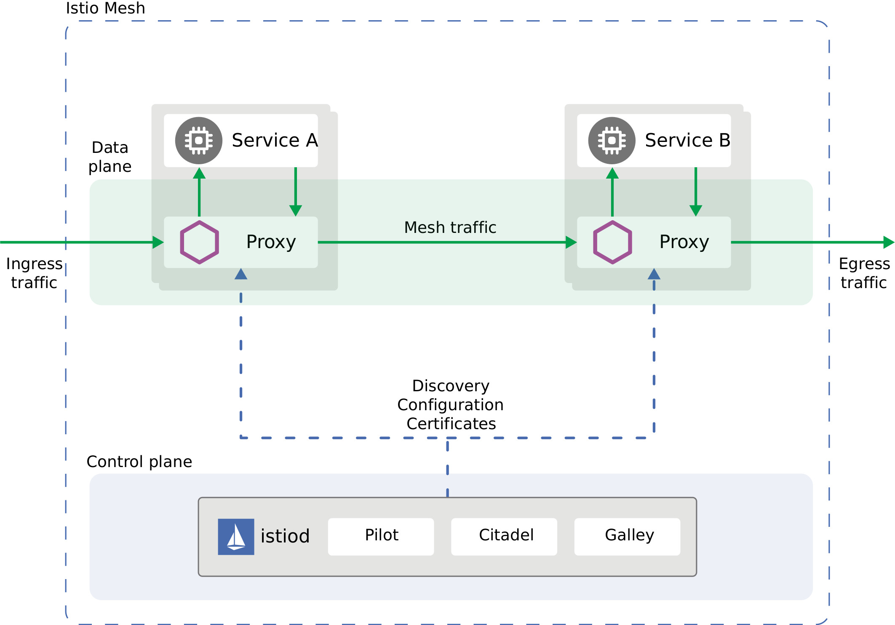
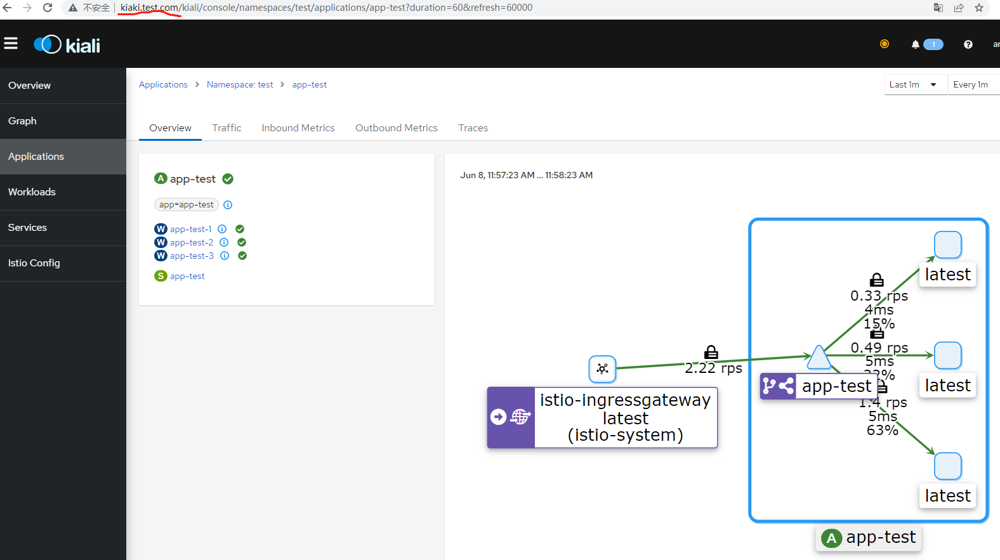
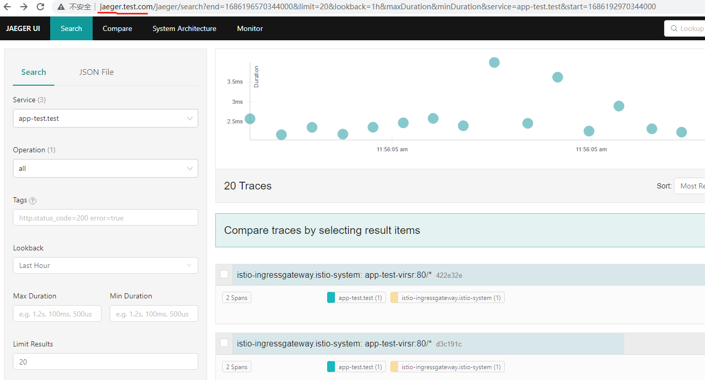
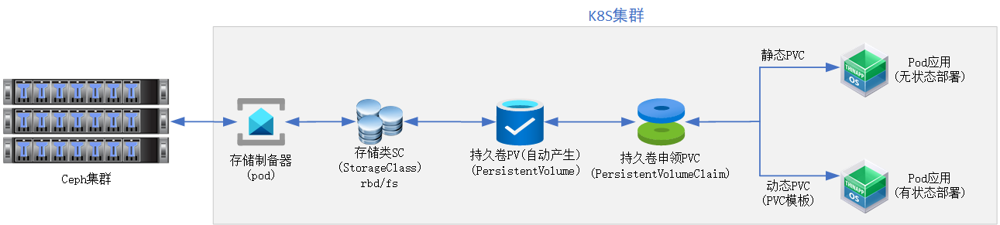
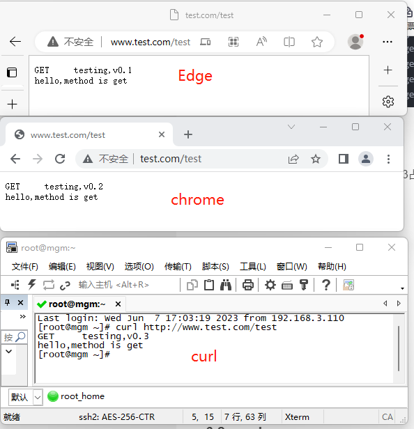

## 节点

节点说明

|节点|os|配置|ip|角色|
|:--------|:-------------|:-------------|:-------------|:-------------|
|mgm|Rocky9.1|2vCPU,RAM4GB,HD:8GB|10.2.20.59/192.168.3.x|管理节点，ssh免密|
|k8s-master1|Rocky9.1|4vCPU,RAM4GB,HD:32GB|10.2.20.110/192.168.3.x|主控|
|k8s-node1|Rocky9.1|4vCPU,RAM4GB,HD:32GB|10.2.20.111/192.168.3.x|worker|
|k8s-node2|Rocky9.1|4vCPU,RAM4GB,HD:32GB|10.2.20.112/192.168.3.x|worker|


K8S版本：v1.27.2

## 5.1 K8S节点配置

### 5.1.1 基础配置

k8s所有节点配置此部分

#### 5.1.1.1 基础包和内核参数

配置hosts文件

```css
cat >> /etc/hosts << 'EOF'
10.2.20.110     k8s-master1
10.2.20.111     k8s-node1
10.2.20.112     k8s-node2
EOF
```

基础配置及软件包

```css
swapoff -a
sed -i '/swap/s/^/#/' /etc/fstab
free -m
systemctl stop firewalld && systemctl disable firewalld
setenforce 0
sed -i 's/^SELINUX=enforcing$/SELINUX=disabled/' /etc/selinux/config
cat <<EOF | sudo tee /etc/modules-load.d/k8s.conf
br_netfilter
ip_tables
iptable_filter
overlay
EOF
cat <<EOF | sudo tee /etc/sysctl.d/k8s.conf
net.bridge.bridge-nf-call-ip6tables = 1
net.bridge.bridge-nf-call-iptables = 1
net.ipv4.ip_forward = 1
EOF
sysctl --system
yum -y install epel-release
yum -y install bash-completion net-tools gcc wget curl telnet tree lrzsz iproute zip
```

#### 5.1.1.2 容器运行时配置

容器运行时有docker和cri-o两种常用。
本文采用[cri-o](https://github.com/cri-o/cri-o)

安装cri-o

```css
yum -y install curl jq tar
curl https://raw.githubusercontent.com/cri-o/cri-o/main/scripts/get | bash -s -- -a amd64
systemctl enable --now crio.service
systemctl start crio
```

配置cri-o

```css
# cat /etc/crictl.yaml
runtime-endpoint: unix:///var/run/crio/crio.sock
image-endpoint: unix:///var/run/crio/crio.sock
timeout: 10
debug: false

# vi /etc/crio/crio.conf
[crio.image]
pause_image = "registry.aliyuncs.com/google_containers/pause:3.9"

# systemctl restart crio
```

测试

```css
# crictl --runtime-endpoint unix:///run/crio/crio.sock version
Version:  0.1.0
RuntimeName:  cri-o
RuntimeVersion:  1.27.0
RuntimeApiVersion:  v1

# crio --version
crio version 1.27.0
Version:        1.27.0
GitCommit:      844b43be4337b72a54b53518667451c975515d0b
GitCommitDate:  2023-06-03T07:36:19Z
GitTreeState:   dirty
BuildDate:      1980-01-01T00:00:00Z
GoVersion:      go1.20.4
Compiler:       gc
Platform:       linux/amd64
Linkmode:       static
BuildTags:    
  static
  netgo
  osusergo
  exclude_graphdriver_btrfs
  exclude_graphdriver_devicemapper
  seccomp
  apparmor
  selinux
LDFlags:          unknown
SeccompEnabled:   true
AppArmorEnabled:  false
```

#### 5.1.1.3 kubectl kubelet kubeadm安装

配置阿里kubernetes源

```css
# cat <<EOF > /etc/yum.repos.d/kubernetes.repo
[kubernetes]
name=Kubernetes
baseurl=https://mirrors.aliyun.com/kubernetes/yum/repos/kubernetes-el7-x86_64/  
enabled=1
gpgcheck=1
repo_gpgcheck=1
gpgkey=https://mirrors.aliyun.com/kubernetes/yum/doc/yum-key.gpg https://mirrors.aliyun.com/kubernetes/yum/doc/rpm-package-key.gpg
EOF
```

版本查看

```css
# yum -y makecache
# yum list kubelet --showduplicates | sort -r
...
kubelet.x86_64                       1.27.2-0                        kubernetes 
kubelet.x86_64                       1.27.2-0                        @kubernetes
kubelet.x86_64                       1.27.1-0                        kubernetes 
kubelet.x86_64                       1.27.0-0                        kubernetes 
...
```

安装kubectl kubelet kubeadm ,默认安装最新版

```css
# yum -y install kubectl kubelet kubeadm
```

提示：
在各节点安装k8s成功后再“systemctl enable kubelet”

#### 5.1.1.4 k8s系统镜像准备

 在配置master和worker节点时，会从公网拉取k8s系统镜像。
 可将这些镜像提前pull到节点本地。
 查看k8s系统镜像列表

```css
# kubeadm config images list --kubernetes-version=1.27.2  --image-repository="registry.aliyuncs.com/google_containers" 
W0604 23:32:32.215609   11292 images.go:80] could not find officially supported version of etcd for Kubernetes v1.27.2, falling back to the nearest etcd version (3.5.7-0)
registry.aliyuncs.com/google_containers/kube-apiserver:v1.27.2
registry.aliyuncs.com/google_containers/kube-controller-manager:v1.27.2
registry.aliyuncs.com/google_containers/kube-scheduler:v1.27.2
registry.aliyuncs.com/google_containers/kube-proxy:v1.27.2
registry.aliyuncs.com/google_containers/pause:3.9
registry.aliyuncs.com/google_containers/etcd:3.5.7-0
registry.aliyuncs.com/google_containers/coredns:v1.10.1
```

pull镜像

```css
kubeadm config images pull --kubernetes-version=1.27.2 --image-repository="registry.aliyuncs.com/google_containers"
```

查看

```css
# crictl images
IMAGE                                                             TAG                 IMAGE ID            SIZE
registry.aliyuncs.com/google_containers/coredns                   v1.10.1             ead0a4a53df89       53.6MB
registry.aliyuncs.com/google_containers/etcd                      3.5.7-0             86b6af7dd652c       297MB
registry.aliyuncs.com/google_containers/kube-apiserver            v1.27.2             c5b13e4f7806d       122MB
registry.aliyuncs.com/google_containers/kube-controller-manager   v1.27.2             ac2b7465ebba9       114MB
registry.aliyuncs.com/google_containers/kube-proxy                v1.27.2             b8aa50768fd67       72.7MB
registry.aliyuncs.com/google_containers/kube-scheduler            v1.27.2             89e70da428d29       59.8MB
registry.aliyuncs.com/google_containers/pause                     3.9                 e6f1816883972       750kB
```

### 5.1.2 master节点配置

安装第一台master节点

```css
# kubeadm init \
--kubernetes-version="1.27.2" \
--cri-socket="/var/run/crio/crio.sock" \
--control-plane-endpoint="10.2.20.110" \
--apiserver-advertise-address=10.2.20.110 \
--image-repository="registry.aliyuncs.com/google_containers" \
--service-cidr=10.10.0.0/16 \
--pod-network-cidr="10.244.0.0/16" \
--ignore-preflight-errors=Swap \
--upload-certs
输出
...
[addons] Applied essential addon: kube-proxy

Your Kubernetes control-plane has initialized successfully!

To start using your cluster, you need to run the following as a regular user:

  mkdir -p $HOME/.kube
  sudo cp -i /etc/kubernetes/admin.conf $HOME/.kube/config
  sudo chown $(id -u):$(id -g) $HOME/.kube/config

Alternatively, if you are the root user, you can run:

  export KUBECONFIG=/etc/kubernetes/admin.conf

You should now deploy a pod network to the cluster.
Run "kubectl apply -f [podnetwork].yaml" with one of the options listed at:
  https://kubernetes.io/docs/concepts/cluster-administration/addons/

You can now join any number of the control-plane node running the following command on each as root:
第二台master安装
  kubeadm join 10.2.20.110:6443 --token y1dzd6.rmojednvdy1ukevo \
        --discovery-token-ca-cert-hash sha256:4fc878964ab80032ee47e17cdf8a67700f1cc58a72af69d7ffa3b7e0ac0b2b09 \
        --control-plane --certificate-key 45d54477eeb7228c6728cbc343c1bb59cce539f3f65e83e6136a724a43b45ac9

Please note that the certificate-key gives access to cluster sensitive data, keep it secret!
As a safeguard, uploaded-certs will be deleted in two hours; If necessary, you can use
"kubeadm init phase upload-certs --upload-certs" to reload certs afterward.

Then you can join any number of worker nodes by running the following on each as root:
worker节点安装
kubeadm join 10.2.20.110:6443 --token y1dzd6.rmojednvdy1ukevo \
        --discovery-token-ca-cert-hash sha256:4fc878964ab80032ee47e17cdf8a67700f1cc58a72af69d7ffa3b7e0ac0b2b09 
```

配置kubelet开机引导

```css
systemctl enable kubelet.service
```

配置kubectl

```css
创建kubectl环境变量
# mkdir -p $HOME/.kube
# sudo cp -i /etc/kubernetes/admin.conf $HOME/.kube/config
# sudo chown $(id -u):$(id -g) $HOME/.kube/config
# echo "export KUBECONFIG=/etc/kubernetes/admin.conf" >> /etc/profile
# source /etc/profile
执行下面命令，使kubectl可以自动补充
# echo "source <(kubectl completion bash)" >> ~/.bash_profile
# source .bash_profile
```

测试

```css
# kubectl version --short
Flag --short has been deprecated, and will be removed in the future. The --short output will become the default.
Client Version: v1.27.2
Kustomize Version: v5.0.1
Server Version: v1.27.2

# kubectl get node
NAME          STATUS   ROLES           AGE     VERSION
k8s-master1   Ready    control-plane   8m45s   v1.27.2
```

### 5.1.3 worker节点配置

所有结节运行如下命令

```css
# kubeadm join 10.2.20.110:6443 --token y1dzd6.rmojednvdy1ukevo \
        --discovery-token-ca-cert-hash sha256:4fc878964ab80032ee47e17cdf8a67700f1cc58a72af69d7ffa3b7e0ac0b2b09 
输出
...
This node has joined the cluster:
* Certificate signing request was sent to apiserver and a response was received.
* The Kubelet was informed of the new secure connection details.

Run 'kubectl get nodes' on the control-plane to see this node join the cluster.
```

配置开机启动

```css
systemctl enable kubelet.service
```

### 5.1.4 管理机mgm配置kubectl

在k8集群外安装k8s客户端命令kubectl.
创建kubectl环境变量

```css
scp k8s-master1:/usr/bin/kubectl /usr/bin/
mkdir -p $HOME/.kube
scp k8s-master1:/etc/kubernetes/admin.conf $HOME/.kube/config
chown $(id -u):$(id -g) $HOME/.kube/config
mkdir /etc/kubernetes
scp k8s-master1:/etc/kubernetes/admin.conf /etc/kubernetes/
echo "export KUBECONFIG=/etc/kubernetes/admin.conf" >> /etc/profile
source /etc/profile
```

kubectl可以自动补充

```css
echo "source <(kubectl completion bash)" >> ~/.bash_profile
source .bash_profile
```

测试

```css
# kubectl get cs
Warning: v1 ComponentStatus is deprecated in v1.19+
NAME                 STATUS    MESSAGE                         ERROR
controller-manager   Healthy   ok                            
scheduler            Healthy   ok                            
etcd-0               Healthy   {"health":"true","reason":""}   

# kubectl get node
NAME          STATUS   ROLES           AGE   VERSION
k8s-master1   Ready    control-plane   33m   v1.27.2
k8s-node1     Ready    <none>          20m   v1.27.2
k8s-node2     Ready    <none>          19m   v1.27.2

# kubectl get pod -A
NAMESPACE     NAME                                  READY   STATUS    RESTARTS   AGE
kube-system   coredns-7bdc4cb885-hcl6t              1/1     Running   0          16m
kube-system   coredns-7bdc4cb885-hvmgs              1/1     Running   0          16m
kube-system   etcd-k8s-master1                      1/1     Running   0          17m
kube-system   kube-apiserver-k8s-master1            1/1     Running   0          16m
kube-system   kube-controller-manager-k8s-master1   1/1     Running   0          16m
kube-system   kube-proxy-464dg                      1/1     Running   0          16m
kube-system   kube-proxy-7vtxg                      1/1     Running   0          2m53s
kube-system   kube-proxy-crfkg                      1/1     Running   0          3m52s
kube-system   kube-scheduler-k8s-master1            1/1     Running   0          16m
```

### 5.1.5 访问私有仓库harbor配置

 在管理机上操作。
 k8s各节点安装成功后再配置此项

#### 5.1.5.1 k8s/crictl访问私有仓库配置

私有CA根证书添加到k8s所有节点的根证书链中

```css
ansible k8s -m shell -a "wget http://10.2.20.59/ssl/ca.pem -O /tmp/ca.pem"
ansible k8s -m shell -a "cat /tmp/ca.pem >> /etc/pki/tls/certs/ca-bundle.crt"
```

创建config.json用于存储私仓用户和密码。

```css
# cat > config.json << 'EOF'
{
        "auths": {
                "harbor.demo.com": {
                        "auth": "YWRtaW46MTIzNDU2NzgK"
                }
        }
}
EOF
# ansible k8s -m copy -a "src=config.json dest=/var/lib/kubelet/"
# ansible k8s -m shell -a "systemctl restart kubelet.service"
```

配置cri-o/crictl使用config.json

```css
# vi crio.conf
...
[crio.image]
global_auth_file = "/var/lib/kubelet/config.json"

# ansible k8s -m copy -a "src=crio.conf dest=/etc/crio/"
# ansible k8s -m shell -a "systemctl restart crio"
```

提示：
上述办法是将私仓的帐号存储在config.json，供所有命空间使用。

#### 5.1.5.2 测试

crictl拉取镜像(在k8s某节点上测试)

```css
# crictl pull harbor.demo.com/web/busybox:v2.1
Image is up to date for harbor.demo.com/web/busybox@sha256:0152995fd9b720acfc49ab88e48bc9f4509974fb17025896740ae02396e37388
```

k8s从私仓拉取镜像

```css
# kubectl create namespace test

# cat app-c19-1.yaml
apiVersion: apps/v1 
kind: Deployment 
metadata:
  name: app-test
  namespace: test
spec:
  selector:
    matchLabels:
      app: app-test
  replicas: 1
  template:
    metadata:
      name: app-test
      namespace: test
      labels:
        app: app-test
    spec:
      containers:
      - name: http
        image: harbor.demo.com/test/centos:v0.1.1
        imagePullPolicy: IfNotPresent
        ports:
        - name: port-test-01
          containerPort: 8080
          protocol: TCP

# kubectl -n test get all
NAME                            READY   STATUS    RESTARTS   AGE
pod/app-test-55f5b45c96-7fg8g   1/1     Running   0          17s

NAME                       READY   UP-TO-DATE   AVAILABLE   AGE
deployment.apps/app-test   1/1     1            1           17s

NAME                                  DESIRED   CURRENT   READY   AGE
replicaset.apps/app-test-55f5b45c96   1         1         1       17s
```

#### 5.1.5.3 secrets存储私仓帐号

"5.1.5.1"是将私仓的帐号存储在config.json，供所有命空间使用。
也可以使用secrets存储私仓的帐号。

```css
# kubectl create secret docker-registry harbor-test \
  --docker-server="harbor.demo.com" \
  --docker-username="admin" \
  --docker-password="12qwaszx+pp"

# cat app-c19-2.yaml
apiVersion: apps/v1 
kind: Deployment 
metadata:
  name: app-test
  namespace: test
spec:
  selector:
    matchLabels:
      app: app-test
  replicas: 1
  template:
    metadata:
      name: app-test
      namespace: test
      labels:
        app: app-test
    spec:
      imagePullSecrets:
        - name: harbor-test
      containers:
      - name: http
        image: harbor.demo.com/test/centos:v0.1.2
        imagePullPolicy: IfNotPresent
        ports:
        - name: port-test-01
          containerPort: 8080
          protocol: TCP

# kubectl apply -f app-c19-2.yaml

# kubectl -n test get pod
NAME                       READY   STATUS    RESTARTS   AGE
app-test-6644fb79b-g4njz   1/1     Running   0          18s
```

采有imagePullSecrets指定私仓secrets.

## 5.2 网络配置calico

Kubernetes通过CNI协议支持多种网络模型，如Calico、Flannel、Open vSwitch、Weave、Cilium等。

本文以calico为例。

### 5.2.1 Calico安装

https://github.com/projectcalico/cni-plugin

https://github.com/projectcalico/calico

https://docs.tigera.io/calico/latest/getting-started/kubernetes/quickstart

本文采用Calico插件，是一个纯三层的方案，不需要 Overlay，基于 Iptables 增加了策略配置。

Calico特点

安装

```css
# wget https://raw.githubusercontent.com/projectcalico/calico/v3.25.1/manifests/calico.yaml
# cat calico.yaml | grep "image:"
          image: docker.io/calico/cni:v3.26.0
          image: docker.io/calico/cni:v3.26.0
          image: docker.io/calico/node:v3.26.0
          image: docker.io/calico/node:v3.26.0
          image: docker.io/calico/kube-controllers:v3.26.0
这镜像转存到私仓，并修改calico.yaml中的镜像地址，将docker.io改为harbor.demo.com
# cat calico.yaml | grep "image: "
          image: harbor.demo.com/calico/cni:v3.26.0
          image: harbor.demo.com/calico/cni:v3.26.0
          image: harbor.demo.com/calico/node:v3.26.0
          image: harbor.demo.com/calico/node:v3.26.0
          image: harbor.demo.com/calico/kube-controllers:v3.26.0
安装
# kubectl apply -f  calico.yaml
```

查看

```css
# kubectl get pod --all-namespaces
NAMESPACE     NAME                                      READY   STATUS    RESTARTS   AGE
kube-system   calico-kube-controllers-868d576d4-7jrwh   1/1     Running   0          12m
kube-system   calico-node-ld8gv                         1/1     Running   0          17m
kube-system   calico-node-s5x7q                         1/1     Running   0          17m
kube-system   calico-node-zfr76                         1/1     Running   0          17m
kube-system   coredns-7bdc4cb885-hcl6t                  1/1     Running   0          4h20m
kube-system   coredns-7bdc4cb885-hvmgs                  1/1     Running   0          4h20m
kube-system   etcd-k8s-master1                          1/1     Running   0          4h20m
kube-system   kube-apiserver-k8s-master1                1/1     Running   0          4h20m
kube-system   kube-controller-manager-k8s-master1       1/1     Running   0          4h20m
kube-system   kube-proxy-464dg                          1/1     Running   0          4h20m
kube-system   kube-proxy-7vtxg                          1/1     Running   0          4h6m
kube-system   kube-proxy-crfkg                          1/1     Running   0          4h7m
kube-system   kube-scheduler-k8s-master1                1/1     Running   0          4h20m
```

配置cri-o采用cni插件

```css
# tree /etc/cni/net.d/
/etc/cni/net.d/
├── 10-calico.conflist
├── 11-crio-ipv4-bridge.conflist
└── calico-kubeconfig

# tree /opt/cni/bin/
/opt/cni/bin/
├── bandwidth
├── bridge
├── calico
├── calico-ipam
├── dhcp
├── dummy
├── firewall
├── flannel
├── host-device
├── host-local
├── install
├── ipvlan
├── loopback
├── macvlan
├── portmap
├── ptp
├── sbr
├── static
├── tap
├── tuning
├── vlan
└── vrf


可修改cri-o配置来识别calico网络
# vi /etc/crio/crio.conf
[crio.network]

# The default CNI network name to be selected. If not set or "", then
# CRI-O will pick-up the first one found in network_dir.
# cni_default_network = ""

# Path to the directory where CNI configuration files are located.
network_dir = "/etc/cni/net.d/"

# Paths to directories where CNI plugin binaries are located.
plugin_dirs = [
      "/opt/cni/bin/",
]

# ansible k8s -m copy -a "src=crio.conf dest=/etc/crio/"
# ansible k8s -m shell -a "systemctl restart crio"

```

### 5.2.2 Calicoctl工具

calicoctl 是 Calico 客户端管理工具。 可以方便的管理 calico 网络，配置和安全策略，calicoctl 命令行提供了许多资源管理命令，允许您创建，修改，删除和查看不同的 Calico 资源，网络资源包含：node，bgpPeer，hostEndpoint，workloadEndpoint，ipPool，policy，profile等。

**提示**
- calico版本与calicoctl版本要相同
- 在master节点安装此命令

安装

```css
# curl -L https://github.com/projectcalico/calico/releases/latest/download/calicoctl-linux-amd64 -o calicoctl
# mv calicoctl /sbin/
# chmod +x /sbin/calicoctl

# calicoctl version
Client Version:    v3.26.0
Git commit:        8b103f46f
Cluster Version:   v3.25.1
Cluster Type:      k8s,bgp,kubeadm,kdd

# mkdir /etc/calico

# vi /etc/calico/calicoctl.cfg 
apiVersion: projectcalico.org/v3
kind: CalicoAPIConfig
metadata:
spec:
  datastoreType: "kubernetes"
  kubeconfig: "/root/.kube/config"

# calicoctl node status
Calico process is running.

IPv4 BGP status
+--------------+-------------------+-------+----------+-------------+
| PEER ADDRESS |     PEER TYPE     | STATE |  SINCE   |    INFO     |
+--------------+-------------------+-------+----------+-------------+
| 192.168.3.13 | node-to-node mesh | up    | 08:19:18 | Established |
| 192.168.3.8  | node-to-node mesh | up    | 08:19:09 | Established |
+--------------+-------------------+-------+----------+-------------+

IPv6 BGP status
No IPv6 peers found.
```

## 5.3 metrics-server配置

https://github.com/kubernetes-sigs/metrics-server

https://github.com/kubernetes-sigs/metrics-server/releases

Metrics Server 是 Kubernetes 内置自动缩放管道的可扩展、高效的容器资源指标来源，K8S 资源指标监控，如pod的内存或cpu使用情况。

Metrics Server 从 Kubelets 收集资源指标，并通过Metrics API在 Kubernetes apiserver 中公开它们，以供 HPA（Horizontal Pod Autoscaler，水平自动缩放）
和VPA（Vertical Pod Autoscaler，垂直自动缩放）使用。Metrics API 也可以通过 访问kubectl top，从而更容易调试自动缩放管道。

kube-apiserver 必须启用聚合层,即在/etc/kubernetes/manifests/kube-apiserver.yaml添加“enable-aggregator-routing=true”，如下：

```css
# vi /etc/kubernetes/manifests/kube-apiserver.yaml
...
spec:
  containers:
  - command:
    - kube-apiserver
    - --advertise-address=10.2.20.110
    - --allow-privileged=true
    - --authorization-mode=Node,RBAC
    - --client-ca-file=/etc/kubernetes/pki/ca.crt
    - --enable-admission-plugins=NodeRestriction
    - --enable-bootstrap-token-auth=true
    - --etcd-cafile=/etc/kubernetes/pki/etcd/ca.crt
    - --etcd-certfile=/etc/kubernetes/pki/apiserver-etcd-client.crt
    - --etcd-keyfile=/etc/kubernetes/pki/apiserver-etcd-client.key
    - --etcd-servers=https://127.0.0.1:2379
    - --kubelet-client-certificate=/etc/kubernetes/pki/apiserver-kubelet-client.crt
    - --kubelet-client-key=/etc/kubernetes/pki/apiserver-kubelet-client.key
    - --kubelet-preferred-address-types=InternalIP,ExternalIP,Hostname
    - --proxy-client-cert-file=/etc/kubernetes/pki/front-proxy-client.crt
    - --proxy-client-key-file=/etc/kubernetes/pki/front-proxy-client.key
    - --requestheader-allowed-names=front-proxy-client
    - --requestheader-client-ca-file=/etc/kubernetes/pki/front-proxy-ca.crt
    - --requestheader-extra-headers-prefix=X-Remote-Extra-
    - --requestheader-group-headers=X-Remote-Group
    - --requestheader-username-headers=X-Remote-User
    - --secure-port=6443
    - --service-account-issuer=https://kubernetes.default.svc.cluster.local
    - --service-account-key-file=/etc/kubernetes/pki/sa.pub
    - --service-account-signing-key-file=/etc/kubernetes/pki/sa.key
    - --service-cluster-ip-range=10.10.0.0/16
    - --tls-cert-file=/etc/kubernetes/pki/apiserver.crt
    - --tls-private-key-file=/etc/kubernetes/pki/apiserver.key
    - --enable-aggregator-routing=true
    image: registry.aliyuncs.com/google_containers/kube-apiserver:v1.27.2
    imagePullPolicy: IfNotPresent
...
# systemctl restart kubelet.service
```

安装

```css
# wget github.com/kubernetes-sigs/metrics-server/releases/download/v0.6.3/components.yaml

添加kubelet-insecure-tls，如下：
# vi components.yaml 
...
    spec:
      containers:
      - args:
        - --cert-dir=/tmp
        - --secure-port=4443
        - --kubelet-preferred-address-types=InternalIP,ExternalIP,Hostname
        - --kubelet-use-node-status-port
        - --metric-resolution=15s
        - --kubelet-insecure-tls
        image: harbor.demo.com/metrics-server/metrics-server:v0.6.3
...

# kubectl apply -f components.yaml
```

测试

```css
# kubectl top node
NAME              CPU(cores)   CPU%   MEMORY(bytes)   MEMORY%   
c8-k8s-master01   242m         6%     1454Mi          40%     
c8-k8s-worker01   92m          2%     687Mi           18%     
c8-k8s-worker02   102m         2%     725Mi           19%   

# kubectl get --raw "/apis/metrics.k8s.io/v1beta1/nodes"
{"kind":"NodeMetricsList","apiVersion":"metrics.k8s.io/v1beta1","metadata":{},"items":[{"metadata":{"name":"k8s-master1","creationTimestamp":"2023-06-05T08:10:10Z","labels":{"beta.kubernetes.io/arch":"amd64","beta.kubernetes.io/os":"linux","kubernetes.io/arch":"amd64","kubernetes.io/hostname":"k8s-master1","kubernetes.io/os":"linux","node-role.kubernetes.io/control-plane":"","node.kubernetes.io/exclude-from-external-load-balancers":""}},"timestamp":"2023-06-05T08:09:56Z","window":"20.059s","usage":{"cpu":"283196769n","memory":"1611636Ki"}},{"metadata":{"name":"k8s-node1","creationTimestamp":"2023-06-05T08:10:10Z","labels":{"beta.kubernetes.io/arch":"amd64","beta.kubernetes.io/os":"linux","kubernetes.io/arch":"amd64","kubernetes.io/hostname":"k8s-node1","kubernetes.io/os":"linux"}},"timestamp":"2023-06-05T08:09:54Z","window":"20.042s","usage":{"cpu":"104153377n","memory":"1059760Ki"}},{"metadata":{"name":"k8s-node2","creationTimestamp":"2023-06-05T08:10:10Z","labels":{"beta.kubernetes.io/arch":"amd64","beta.kubernetes.io/os":"linux","kubernetes.io/arch":"amd64","kubernetes.io/hostname":"k8s-node2","kubernetes.io/os":"linux"}},"timestamp":"2023-06-05T08:09:55Z","window":"20.042s","usage":{"cpu":"104032381n","memory":"976512Ki"}}]}  
```

## 5.4 metallb配置

https://github.com/google/metallb

https://metallb.universe.tf/installation/

https://metallb.universe.tf/configuration

MetalLB 是一个负载均衡器，专门解决裸金属 Kubernetes 集群中无法使用 LoadBalancer 类型服务的痛点。MetalLB 使用标准化的路由协议，
以便裸金属 Kubernetes 集群上的外部服务也尽可能地工作。

在云厂商提供的 Kubernetes 集群中，Service 声明使用 LoadBalancer时，云平台会自动分配一个负载均衡器的IP地址给你，应用可以通过
这个地址来访问。

MetalLB 会在 Kubernetes 内运行，监控服务对象的变化，一旦监测到有新的 LoadBalancer 服务运行，并且没有可申请的负载均衡器之后，
就会完成地址分配和外部声明两部分的工作。

网络宣告方式

1。Layer 2 模式
ayer 2 模式下，每个 Service 会有集群中的一个 Node 来负责。服务的入口流量全部经由单个节点，然后该节点的 Kube-Proxy 会把流量再转
发给服务的 Pods。也就是说，该模式下 MetalLB 并没有真正提供负载均衡器。尽管如此，MetalLB 提供了故障转移功能，如果持有 IP 的节点
出现故障，则默认 10 秒后即发生故障转移，IP 会被分配给其它健康的节点。

优点：
    是它的通用性：它可以在任何以太网网络上运行，不需要特殊的硬件。

2。BGP 模式
BGP 模式下，集群中所有node都会跟上联路由器建立BGP连接，并且会告知路由器应该如何转发service的流量。

优点：
    BGP模式下才是一个真正的 LoadBalancer，通过BGP协议正确分布流量，不再需要一个Leader节点。

### 5.4.1 安装

```css
# wget https://raw.githubusercontent.com/metallb/metallb/v0.13.10/config/manifests/metallb-native.yaml 
# cat metallb-native.yaml | grep image:
        image: quay.io/metallb/controller:v0.13.10
        image: quay.io/metallb/speaker:v0.13.10
将镜像转存在私有仓库
# cat metallb-native.yaml | grep image:
        image: harbor.demo.com/metallb/controller:v0.13.10
        image: harbor.demo.com/metallb/speaker:v0.13.10

# kubectl apply -f ./metallb-native.yaml

# kubectl get all -n metallb-system
NAME                              READY   STATUS    RESTARTS   AGE
pod/controller-746c786cf9-hdcvp   0/1     Running   0          17s
pod/speaker-224m6                 0/1     Running   0          17s
pod/speaker-cqhnr                 0/1     Running   0          17s
pod/speaker-s2fq6                 0/1     Running   0          17s

NAME                      TYPE        CLUSTER-IP     EXTERNAL-IP   PORT(S)   AGE
service/webhook-service   ClusterIP   10.10.237.41   <none>        443/TCP   18s

NAME                     DESIRED   CURRENT   READY   UP-TO-DATE   AVAILABLE   NODE SELECTOR            AGE
daemonset.apps/speaker   3         3         0       3            0           kubernetes.io/os=linux   18s

NAME                         READY   UP-TO-DATE   AVAILABLE   AGE
deployment.apps/controller   0/1     1            0           18s

NAME                                    DESIRED   CURRENT   READY   AGE
replicaset.apps/controller-746c786cf9   1         1         0       17s
```

### 5.4.2 配置LB网络

```css
# cat metallb-cm.yaml
apiVersion: metallb.io/v1beta1
kind: IPAddressPool
metadata:
  name: first-pool
  namespace: metallb-system
spec:

  addresses:
  - 192.168.3.180-192.168.3.200


---

apiVersion: metallb.io/v1beta1
kind: L2Advertisement
metadata:
  name: example
  namespace: metallb-system
spec:
  ipAddressPools:
  - first-pool

# kubectl apply -f  metallb-cm.yaml

# kubectl get IPAddressPool,L2Advertisement -n metallb-system
NAME                                  AUTO ASSIGN   AVOID BUGGY IPS   ADDRESSES
ipaddresspool.metallb.io/first-pool   true          false             ["192.168.3.180-192.168.3.200"]

NAME                                 IPADDRESSPOOLS   IPADDRESSPOOL SELECTORS   INTERFACES
l2advertisement.metallb.io/example   ["first-pool"]                       
```

### 5.4.3 测试

pod/svc样例，配置为："type: LoadBalancer"

```css
# cat app-c19-3.yaml
apiVersion: apps/v1 
kind: Deployment 
metadata:
  name: app-test
  namespace: test
spec:
  selector:
    matchLabels:
      app: app-test
  replicas: 1
  template:
    metadata:
      name: app-test
      namespace: test
      labels:
        app: app-test
    spec:
      containers:
      - name: http
        image: harbor.demo.com/test/centos:v0.1.1
        imagePullPolicy: IfNotPresent
        ports:
        - name: port-test-01
          containerPort: 8080
          protocol: TCP

---

apiVersion: v1
kind: Service
metadata:
  labels:
    app: app-test
  name: app-test
  namespace: test
spec:
  sessionAffinity: ClientIP
  sessionAffinityConfig:
    clientIP:
      timeoutSeconds: 10800
  selector:
    app: app-test
  ports:
    - name: port01
      port: 7071
      targetPort: 8080
      protocol: TCP
  type: LoadBalancer
```

应用及查看

```css
# kubectl apply -f app-c19-3.yaml 

# kubectl -n test get svc
NAME       TYPE           CLUSTER-IP     EXTERNAL-IP     PORT(S)          AGE
app-test   LoadBalancer   10.10.39.255   192.168.3.180   7071:31874/TCP   95s
```

这样可以直接使用LB IP来访问

```css
# curl -X POST http://192.168.3.180:7071/test
POST    Hello,world-v10
hello,method is post
```

## 5.5 Ingress配置

pod对外提供服务。主要有如下两种方式。

其一：pod直接对外方式

| 类型             | 说明                                    |
| :--------------- | :-------------------------------------- |
| hostNetwork:true | pod直接使用物理节点的网络命名空间资源   |
| hostPort: 8088   | pod仅使用物理节点的节点自身IP和某个端口 |

其二：svc方式(svc转发pod端口流量,原理是基于iptables和ipvs)

| 类型         | 说明                                                                                                                                                                                   |
| :----------- | :------------------------------------------------------------------------------------------------------------------------------------------------------------------------------------- |
| ClusterIP    | 情况一：svc只供svc所在网络内部访问`<br/>` 情况二：通过代理方式(如kubectl proxy、kube proxy)将svc服务代理出去                                                                          |
| NodePort     | 使用节点ip和端口将svc服务暴露出去                                                                                                                                                      |
| LoadBalancer | 此时需需metalLB支持`<br/>`情况一：svc直接使用外部网络(非节点网络)将svc暴露出去`<br/>`情况二：采用Ingress Controller，将svc服务代理出去.此时svc采用ClusterIP方式，而Ingress采用LB方式 |

其中Ingress Controller是主要方式。

### 5.5.1 Ingress Controller

Service他的工作原理是基于iptables和ipvs的，iptables和ipvs是四层代理的，Layer4层代理有个缺陷就是他只是工作在tcp/ip协议栈，而无法处理Layer7流量，基于此需求背景而产生Ingress。

Ingress 提供了负载均衡器的典型特性：HTTP 路由、粘性会话、SSL 终止、SSL直通、TCP 和 UDP 负载平衡等。

Ingress 只是一个统称，其由 Ingress 和 Ingress Controller 两部分组成，如下。

| 类型               | 说明                                                                                                                  |
| :----------------- | :-------------------------------------------------------------------------------------------------------------------- |
| ingress resources  | ingress规则，这个就是一个类型为Ingress的k8s api对象                                                                   |
| ingress controller | 核心是一个deployment，实现方式有很多，比如nginx, Contour, Haproxy, trafik, Istio，其中service的类型用LoadBalancer方式 |

### 5.5.2 nginx ingress

参考

> http://github.com/nginxinc/kubernetes-ingress
> https://docs.nginx.com/nginx-ingress-controller/installation/installation-with-manifests/
> https://hub.docker.com/r/nginx/nginx-ingress
> https://docs.nginx.com/nginx-ingress-controller
> https://www.nginx.com/products/nginx-ingress-controller

这是 NGINX 公司开发的官方产品，它也有一个基于 NGINX Plus 的商业版。NGINX 的控制器具有很高的稳定性、持续的向后兼容性，且没有任何第三方模块。

#### 5.5.2.1 安装

下载

```css
# wget https://github.com/nginxinc/kubernetes-ingress/archive/refs/heads/main.zip
# unzip main.zip
# cd kubernetes-ingress-main/deployments
```

安装

```css
kubectl apply -f common/ns-and-sa.yaml
kubectl apply -f rbac/rbac.yaml
kubectl apply -f common/nginx-config.yaml
kubectl apply -f common/ingress-class.yaml
kubectl apply -f common/crds/k8s.nginx.org_virtualservers.yaml
kubectl apply -f common/crds/k8s.nginx.org_virtualserverroutes.yaml
kubectl apply -f common/crds/k8s.nginx.org_transportservers.yaml
kubectl apply -f common/crds/k8s.nginx.org_policies.yaml
kubectl apply -f common/crds/k8s.nginx.org_globalconfigurations.yaml
kubectl apply -f deployment/nginx-ingress.yaml
kubectl apply -f service/loadbalancer.yaml
```

查看

```css
# kubectl get ingressclass
NAME    CONTROLLER                     PARAMETERS   AGE
nginx   nginx.org/ingress-controller   <none>       25s

# kubectl get svc --namespace=nginx-ingress
NAME            TYPE           CLUSTER-IP     EXTERNAL-IP     PORT(S)                      AGE
nginx-ingress   LoadBalancer   10.10.122.65   192.168.3.180   80:31582/TCP,443:32381/TCP   23s

# kubectl get pods --namespace=nginx-ingress
NAME                             READY   STATUS    RESTARTS   AGE
nginx-ingress-6f6b89c69b-nxgq4   1/1     Running   0          39s
```

#### 5.5.2.2 测试

命名空间定义

```css
kubectl create namespace test
kubectl config set-context kubernetes-admin@kubernetes --namespace='test'
```

创建pod/svc

```css
# cat app-c24.yaml 
apiVersion: apps/v1 
kind: Deployment 
metadata:
  name: app-test
  namespace: test
spec:
  selector:
    matchLabels:
      app: app-test
  replicas: 1
  template:
    metadata:
      name: app-test
      namespace: test
      labels:
        app: app-test
    spec:
      containers:
      - name: http
        image: harbor.demo.com/test/centos:v0.1.1
        imagePullPolicy: IfNotPresent
        ports:
        - name: port-test-01
          containerPort: 8080
          protocol: TCP

---

apiVersion: v1
kind: Service
metadata:
  labels:
    app: app-test
  name: app-test
  namespace: test
spec:
  sessionAffinity: ClientIP
  sessionAffinityConfig:
    clientIP:
      timeoutSeconds: 10800
  selector:
    app: app-test
  ports:
    - name: port01
      port: 7071
      targetPort: 8080
      protocol: TCP
  type: ClusterIP

# kubectl apply -f app-c24.yaml
```

http测试

```css
# cat ingress-02.yaml
apiVersion: networking.k8s.io/v1
kind: Ingress
metadata:
  name: demo
  namespace: test
spec:
  ingressClassName: nginx
  rules:
  - host: www.test.com 
    http:
      paths:
      - backend:
          service:
            name: app-test
            port:
              number: 7071
        path: /
        pathType: Prefix

# kubectl apply -f ingress-02.yaml

# curl http://www.test.com/test
GET     Hello,world-v10
hello,method is get
```

https测试

```css
# kubectl delete -f ingress-02.yaml
# kubectl create secret tls web-ssl --cert=./web.pem --key=./web-key.pem

# cat ingress-01.yaml
apiVersion: networking.k8s.io/v1
kind: Ingress
metadata:
  name: demo
  namespace: test
spec:
  ingressClassName: nginx
  tls:
  - hosts:
      - www.demo.com
      - www.test.com
    secretName: web-ssl
  rules:
  - host: www.test.com 
    http:
      paths:
      - backend:
          service:
            name: app-test
            port:
              number: 7071
        path: /
        pathType: Prefix

# kubectl apply -f ingress-01.yaml

# curl -v -L https://www.test.com/test
*   Trying 192.168.3.180:443...
* Connected to www.test.com (192.168.3.180) port 443 (#0)
* ALPN, offering h2
* ALPN, offering http/1.1
*  CAfile: /etc/pki/tls/certs/ca-bundle.crt
* TLSv1.0 (OUT), TLS header, Certificate Status (22):
* TLSv1.3 (OUT), TLS handshake, Client hello (1):
* TLSv1.2 (IN), TLS header, Certificate Status (22):
* TLSv1.3 (IN), TLS handshake, Server hello (2):
* TLSv1.2 (IN), TLS header, Finished (20):
* TLSv1.2 (IN), TLS header, Unknown (23):
* TLSv1.3 (IN), TLS handshake, Encrypted Extensions (8):
* TLSv1.2 (IN), TLS header, Unknown (23):
* TLSv1.3 (IN), TLS handshake, Certificate (11):
* TLSv1.2 (IN), TLS header, Unknown (23):
* TLSv1.3 (IN), TLS handshake, CERT verify (15):
* TLSv1.2 (IN), TLS header, Unknown (23):
* TLSv1.3 (IN), TLS handshake, Finished (20):
* TLSv1.2 (OUT), TLS header, Finished (20):
* TLSv1.3 (OUT), TLS change cipher, Change cipher spec (1):
* TLSv1.2 (OUT), TLS header, Unknown (23):
* TLSv1.3 (OUT), TLS handshake, Finished (20):
* SSL connection using TLSv1.3 / TLS_AES_256_GCM_SHA384
* ALPN, server accepted to use http/1.1
* Server certificate:
*  subject: C=CN; ST=ZhuMaDian; L=HeNan; O=k8s; OU=System; CN=domain-ssl-test
*  start date: May 14 08:27:00 2023 GMT
*  expire date: Apr 20 08:27:00 2123 GMT
*  subjectAltName: host "www.test.com" matched cert's "*.test.com"
*  issuer: C=CN; ST=shenzhen; L=Gudong; O=k8s; OU=System; CN=Root-CA-gfs
*  SSL certificate verify ok.
* TLSv1.2 (OUT), TLS header, Unknown (23):
> GET /test HTTP/1.1
> Host: www.test.com
> User-Agent: curl/7.76.1
> Accept: */*
> 
* TLSv1.2 (IN), TLS header, Unknown (23):
* TLSv1.3 (IN), TLS handshake, Newsession Ticket (4):
* TLSv1.2 (IN), TLS header, Unknown (23):
* TLSv1.3 (IN), TLS handshake, Newsession Ticket (4):
* old SSL session ID is stale, removing
* TLSv1.2 (IN), TLS header, Unknown (23):
* Mark bundle as not supporting multiuse
< HTTP/1.1 200 OK
< Server: nginx/1.23.4
< Date: Mon, 05 Jun 2023 17:02:29 GMT
< Content-Type: text/plain; charset=utf-8
< Content-Length: 40
< Connection: keep-alive
< 
GET     Hello,world-v10
hello,method is get
* Connection #0 to host www.test.com left intact

http跳转https
# curl -L http://www.test.com/test
GET     Hello,world-v10
hello,method is get
```

### 5.5.3 istio ingress

https://istio.io/latest/zh 建议大家查阅istio官网。

在 Kubernetes 下，对网络流量的管理只能到 Pod 级别，更细粒度的控制，依然得靠应用代码层面来支撑。也就是说，与业务无关的网络控制逻辑依然夹杂在程序员开发的业务代码中。在此背景下，为让程序员更专注于业务代码，服务网格类软件出现，如istio，让运维工作和开发工作更加各自专业本职工作。从某种意上讲，istio是k8s的深度延申。

Istio 使用功能强大的 Envoy 服务代理扩展了 Kubernetes，以建立一个可编程的、可感知的应用程序网络。Istio 与 Kubernetes 和传统工作负载一起使用，为复杂的部署带来了标准的通用流量管理、遥测和安全性。

Istio 由以下组件组成
1。Envoy
每个微服务的 Sidecar 代理，用于处理集群中服务之间以及从服务到外部服务的入口/出口流量。这些代理形成了一个安全的微服务网格，提供了一组丰富的功能，如发现、丰富的第 7 层路由、断路器、策略实施和遥测记录/报告功能。
2。Istiod
Istio 控制平面。它提供服务发现、配置和证书管理。它由以下子组件组成：
	Pilot - 负责在运行时配置代理。
	Citadel - 负责证书的颁发和轮换。
	Galley - 负责在 Istio 中验证、摄取、聚合、转换和分发配置。
3。Operator
该组件提供用户友好的选项来操作 Istio 服务网格。


#### 5.5.3.1 安装istio(从私仓安装)

https://istio.io/latest/zh/docs/setup/getting-started/#download

下载 Istio 发行版

```css
# curl -L https://istio.io/downloadIstio | sh -
  % Total    % Received % Xferd  Average Speed   Time    Time     Time  Current
                                 Dload  Upload   Total   Spent    Left  Speed
100   101  100   101    0     0    168      0 --:--:-- --:--:-- --:--:--   168
100  4541  100  4541    0     0   3699      0  0:00:01  0:00:01 --:--:--  9914

Downloading istio-1.17.2 from https://github.com/istio/istio/releases/download/1.17.2/istio-1.17.2-linux-amd64.tar.gz ...

Istio 1.17.2 Download Complete!

Istio has been successfully downloaded into the istio-1.17.2 folder on your system.

Next Steps:
See https://istio.io/latest/docs/setup/install/ to add Istio to your Kubernetes cluster.

To configure the istioctl client tool for your workstation,
add the /root/tp/istio-1.17.2/bin directory to your environment path variable with:
         export PATH="$PATH:/root/tp/istio-1.17.2/bin"

Begin the Istio pre-installation check by running:
         istioctl x precheck 

Need more information? Visit https://istio.io/latest/docs/setup/install/ 

# cp -fr bin/istioctl /sbin/
```

安装清单修改(从私仓安装)

```css
导出清单
# istioctl manifest generate --set profile=demo --set components.cni.enabled=true > istio.yaml

查看配置信息中的镜像
# cat istio.yaml | grep image:
              image:
            image: "{{ annotation .ObjectMeta `sidecar.istio.io/proxyImage` .Values.global.proxy_init.image }}"
            image: "{{ .ProxyImage }}"
            image: "{{ annotation .ObjectMeta `sidecar.istio.io/proxyImage` .Values.global.proxy_init.image }}"
            image: "{{ .ProxyImage }}"
            image: "{{ annotation .ObjectMeta `sidecar.istio.io/proxyImage` .Values.global.proxy.image }}"
            image: "{{ .ProxyImage }}"
            image: "{{ annotation .ObjectMeta `sidecar.istio.io/proxyImage` .Values.global.proxy.image }}"
            image: "{{ .ProxyImage }}"
              image: busybox:1.28
            image: "{{ annotation .ObjectMeta `sidecar.istio.io/proxyImage` .Values.global.proxy.image }}"
            image: "{{ .ProxyImage }}"
          image: "docker.io/istio/install-cni:1.17.2"
        image: docker.io/istio/proxyv2:1.17.2
        image: docker.io/istio/proxyv2:1.17.2
        image: docker.io/istio/pilot:1.17.2

将上面的镜像转存在私仓，其中“{{ .ProxyImage }}”为边车注入镜像。
修改配置文件，如下
sed -i 's/{{ .ProxyImage }}/harbor.demo.com\/istio\/proxyv2:1.17.2/g' istio.yaml
sed -i 's/busybox:1.28/harbor.demo.com\/istio\/busybox:1.28/g' istio.yaml
sed -i 's/image: docker.io\/istio/image: harbor.demo.com\/istio/g' istio.yaml
sed -i 's/docker.io\/istio\/install-cni:1.17.2/harbor.demo.com\/istio\/install-cni:1.17.2/g' istio.yaml
查看
# cat istio.yaml | grep image:
              image:
            image: "{{ annotation .ObjectMeta `sidecar.istio.io/proxyImage` .Values.global.proxy_init.image }}"
            image: "harbor.demo.com/istio/proxyv2:1.17.2"
            image: "{{ annotation .ObjectMeta `sidecar.istio.io/proxyImage` .Values.global.proxy_init.image }}"
            image: "harbor.demo.com/istio/proxyv2:1.17.2"
            image: "{{ annotation .ObjectMeta `sidecar.istio.io/proxyImage` .Values.global.proxy.image }}"
            image: "harbor.demo.com/istio/proxyv2:1.17.2"
            image: "{{ annotation .ObjectMeta `sidecar.istio.io/proxyImage` .Values.global.proxy.image }}"
            image: "harbor.demo.com/istio/proxyv2:1.17.2"
              image: harbor.demo.com/istio/busybox:1.28
            image: "{{ annotation .ObjectMeta `sidecar.istio.io/proxyImage` .Values.global.proxy.image }}"
            image: "harbor.demo.com/istio/proxyv2:1.17.2"
          image: "harbor.demo.com/istio/install-cni:1.17.2"
        image: harbor.demo.com/istio/proxyv2:1.17.2
        image: harbor.demo.com/istio/proxyv2:1.17.2
        image: harbor.demo.com/istio/pilot:1.17.2
```

安装

```css
# kubectl create namespace istio-system    //创建istio-system命名空间
# kubectl apply -f istio.yaml

验证安装是否成功
# istioctl verify-install -f istio.yaml  -n istio-system
```

查看

```css
# kubectl -n istio-system get pod
# kubectl -n istio-system get deploy,ds
# kubectl -n istio-system get svc
```

#### 5.5.3.2 边车代理注入

https://istio.io/latest/zh/docs/setup/additional-setup/sidecar-injection
Pod 中注入 Istio Sidecar 的两种方法：使用 istioctl 手动注入或启用 Pod 所属命名空间的 Istio sidecar 注入器自动注入。当 Pod 所属命名空间启用自动注入后，自动注入器会使用准入控制器在创建 Pod 时自动注入代理配置。
自动注入配置

```css
自动注入配置
# kubectl label namespace test istio-injection=enabled  --overwrite=true
namespace/test labeled

检查默认策略
在 istio-sidecar-injector configmap 中检查默认注入策略。
# kubectl -n istio-system get configmap istio-sidecar-injector -o jsonpath='{.data.config}' | grep policy:
policy: enabled

查看
# kubectl get namespace -L istio-injection
NAME                   STATUS   AGE    ISTIO-INJECTION
default                Active   24d  
istio-system           Active   166m   
kube-node-lease        Active   24d  
kube-public            Active   24d  
kube-system            Active   24d  
kubernetes-dashboard   Active   22d  
metallb-system         Active   5d5h   
test                   Active   16d    enabled

解除自动注入sidecar
# kubectl label namespace test istio-injection=disabled --overwrite=true
namespace/test labeled
```

测试

```css
# cat 1pod.yaml 
apiVersion: apps/v1 
kind: Deployment 
metadata:
  name: app-test
  namespace: test
spec:
  selector:
    matchLabels:
      app: app-test
      ver: v1
  replicas: 1
  template:
    metadata:
      name: app-test
      namespace: test
      labels:
        app: app-test
        ver: v1
    spec:
      containers:
      - name: http
        image: harbor.demo.com/test/centos:v0.1.1
        imagePullPolicy: IfNotPresent
        ports:
        - name: port-test-01
          containerPort: 8080
          protocol: TCP
# kubectl apply -f 1pod.yaml
```

查看

```css
# kubectl describe pod/app-test-6474687d88-2qthn 
...
Init Containers:
  istio-validation:
    Container ID:  cri-o://655a8fde38216d8bb183c8b45e533d924fa74106f3e5fb222d39cfe41f0215bf
    Image:         harbor.demo.com/istio/proxyv2:1.17.2
    ...
Containers:
  http:
    Container ID:   cri-o://0c2142ef3680f6c530b5b848ecf5e2ede8312c5e42ff21754031d4435284fde8
    Image:          harbor.demo.com/test/centos:v0.1.1
    ...
  istio-proxy:
    Container ID:  cri-o://a46c0a2deeeff68b8ca5b696903c1d6942b9949317ba99ccc3b251fbb0e6f203
    Image:         harbor.demo.com/istio/proxyv2:1.17.2
```

在pod模板中只有一个镜像，但启动模板后被注入两个镜像，且从私仓中拉取。

注入istio-proxy后，pod流量将被代理。

#### 5.5.3.3 http测试

只简单http/https测试，流量治理测试请查看5.7部分。

查看istio入口地址

```css
# kubectl -n istio-system get svc
NAME                   TYPE           CLUSTER-IP      EXTERNAL-IP     PORT(S)                                                                      AGE
istio-egressgateway    ClusterIP      10.10.196.10    <none>          80/TCP,443/TCP                                                               137m
istio-ingressgateway   LoadBalancer   10.10.217.255   192.168.3.181   15021:30721/TCP,80:30406/TCP,443:31152/TCP,31400:30352/TCP,15443:30154/TCP   137m
istiod                 ClusterIP      10.10.79.63     <none>          15010/TCP,15012/TCP,443/TCP,15014/TCP                                        137m
```

域名解析到istio入口地址

```css
# nslookup -q www.test.com 192.168.3.250
*** Invalid option: q
Server:         192.168.3.250
Address:        192.168.3.250#53

Name:   www.test.com
Address: 192.168.3.181
```

创建入口网关Gateway

```css
# cat gateway-http.yaml
apiVersion: networking.istio.io/v1alpha3
kind: Gateway
metadata:
  name: app-test-getway
  namespace: test
spec:
  selector:
    istio: ingressgateway
  servers:
  - port:
      number: 80
      name: http
      protocol: HTTP
    hosts:
    - www.demo.com
    - www.test.com
```

创建VirtualService

```css
# cat virsr.yaml
apiVersion: networking.istio.io/v1alpha3
kind: VirtualService
metadata:
  name: app-test-virsr
  namespace: test
spec:
  hosts:
  - www.test.com
  - www.demo.com
  gateways:
  - app-test-getway
  http:
  - match:
    - uri:
        prefix: /
    route:
    - destination:
        host: app-test
        port:
```

创建pod及svc

```css
# cat deply_pod_svc_centos_1pod.yaml 
apiVersion: apps/v1 
kind: Deployment 
metadata:
  name: app-test
  namespace: test
spec:
  selector:
    matchLabels:
      app: app-test
      ver: v1
  replicas: 1
  template:
    metadata:
      name: app-test
      namespace: test
      labels:
        app: app-test
        ver: v1
    spec:
      containers:
      - name: http
        image: harbor.demo.com/test/centos:v0.1.1
        imagePullPolicy: Always
        ports:
        - name: port-test-01
          containerPort: 8080
          protocol: TCP

---

apiVersion: v1
kind: Service
metadata:
  labels:
    app: app-test
  name: app-test
  namespace: test
spec:
  sessionAffinity: ClientIP
  sessionAffinityConfig:
    clientIP:
      timeoutSeconds: 10800
  selector:
    app: app-test
  ports:
    - name: port01
      port: 7071
      targetPort: 8080
      protocol: TCP
  type: ClusterIP
```

配置应用

```css
# kubectl apply -f gateway-http.yaml -f virsr.yaml -f deply_pod_svc_centos_1pod.yaml
```

测试效果

```css
# curl -XPOST http://www.test.com/test
POST    Hello,world-v10
hello,method is post
```

查看istio gateway日志

```css
# kubectl -n istio-system get pod
NAME                                    READY   STATUS    RESTARTS   AGE
istio-cni-node-25vdk                    1/1     Running   0          155m
istio-cni-node-74txt                    1/1     Running   0          155m
istio-cni-node-pbmhn                    1/1     Running   0          155m
istio-egressgateway-bfc9d88d8-7p74f     1/1     Running   0          155m
istio-ingressgateway-775955bfb4-252gt   1/1     Running   0          155m
istiod-555d5d64fb-rnxx2                 1/1     Running   0          155m

# kubectl -n istio-system logs pod/istio-ingressgateway-775955bfb4-252gt -f
...
[2023-06-07T09:17:52.962Z] "GET /test HTTP/1.1" 200 - via_upstream - "-" 0 40 3 2 "10.244.36.65" "curl/7.76.1" "e607b10f-dcb6-969e-a41f-758b97572b85" "www.test.com" "10.244.169.141:8080" outbound|7071||app-test.test.svc.cluster.local 10.244.169.133:37806 10.244.169.133:8080 10.244.36.65:34632 - -
```

查看pod的proxy日志

```css
# kubectl get pod
NAME                        READY   STATUS    RESTARTS   AGE
app-test-6fb979b794-p5h6d   2/2     Running   0          62m

# kubectl logs pod/app-test-6fb979b794-p5h6d -c istio-proxy -f
...
[2023-06-07T09:17:52.963Z] "GET /test HTTP/1.1" 200 - via_upstream - "-" 0 40 1 0 "10.244.36.65" "curl/7.76.1" "e607b10f-dcb6-969e-a41f-758b97572b85" "www.test.com" "10.244.169.141:8080" inbound|8080|| 127.0.0.6:47637 10.244.169.141:8080 10.244.36.65:0 outbound_.7071_._.app-test.test.svc.cluster.local default
```

#### 5.5.3.4 https测试

```css
# kubectl -n istio-system create secret tls web-ssl --cert=./web.pem --key=./web-key.pem
存储证书的secret必须位于名为istio-system的命名空间，否则无法找到。

# cat gateway-https.yaml
apiVersion: networking.istio.io/v1alpha3
kind: Gateway
metadata:
  name: app-test-getway
  namespace: test
spec:
  selector:
    istio: ingressgateway
  servers:
  - port:
      number: 80
      name: http
      protocol: HTTP
    hosts:
    - www.demo.com
    - www.test.com
    tls:
      httpsRedirect: true # sends 301 redirect for http requests
  - port:
      number: 443
      name: https-443
      protocol: HTTPS
    hosts:
    - www.test.com
    - www.demo.com
    tls:
      mode: SIMPLE
      credentialName: web-ssl

# kubectl apply -f gateway-https.yaml
```

测试

```css
# curl -L https://www.test.com/test
GET     Hello,world-v10
hello,method is get
# curl -L http://www.test.com/test
GET     Hello,world-v10
hello,method is get
```

#### 5.5.3.5 istio dashboard

Istio 和几个遥测应用(如下)做了集成。 遥测能帮您了解服务网格的结构、展示网络的拓扑结构、分析网格的健康状态。

```css
# tree samples/addons/
samples/addons/
├── extras
│   ├── prometheus-operator.yaml
│   ├── prometheus_vm_tls.yaml
│   ├── prometheus_vm.yaml
│   ├── skywalking.yaml
│   └── zipkin.yaml
├── grafana.yaml
├── jaeger.yaml
├── kiali.yaml
├── prometheus.yaml
└── README.md
```

| 组件类别           | 组件说明                                                                                                                                       |
| :----------------- | :--------------------------------------------------------------------------------------------------------------------------------------------- |
| 服务拓扑结构显示类 | Kiali，会调用jaeger/Prometheus等，建议先安装jaeger/Prometheus                                                                                  |
| 监控类             | Prometheus：数据采集`<br/>`Grafana：可视化                                                                                                    |
| 服务追踪类         | Zipkin：由Twitter开发，基于语言的探针`<br/>`jaeger：由Uber推出的一款开源分布式追踪系统，兼容OpenTracing API`<br/>`skywalking：基于语言的探针 |

提示:
istio集成的Prometheus/Grafana版本低于其官方版本，建议采用官方版本

准备
1. 三个域名(kiaki.test.com、prometheus-istio.test.com、jaeger.test.com)，指向istio-ingress.
2. 将所需应用的镜像转存私仓。
3. 创建gw和vs，用于暴露服务。

```css
# cat istio-dashboard.yaml 
apiVersion: networking.istio.io/v1alpha3
kind: Gateway
metadata:
  name: istio-ui-gw
  namespace: istio-system
spec:
  selector:
    istio: ingressgateway
  servers:
  - port:
      number: 80
      name: http
      protocol: HTTP
    hosts:
    - kiaki.test.com
    - prometheus.test.com
    - jaeger.test.com

---

apiVersion: networking.istio.io/v1alpha3
kind: VirtualService
metadata:
  name: istio-ui-kiali
  namespace: istio-system
spec:
  hosts:
  - kiaki.test.com
  gateways:
  - istio-ui-gw
  http:
  - match:
    - uri:
        prefix: /
    route:
    - destination:
        host: kiali
        port:
          number: 20001
---
apiVersion: networking.istio.io/v1alpha3
kind: VirtualService
metadata:
  name: istio-ui-prometheus
  namespace: istio-system
spec:
  hosts:
  - prometheus-istio.test.com
  gateways:
  - istio-ui-gw
  http:
  - match:
    - uri:
        prefix: /
    route:
    - destination:
        host: prometheus
        port:
          number: 9090

---
apiVersion: networking.istio.io/v1alpha3
kind: VirtualService
metadata:
  name: istio-ui-jaeger
  namespace: istio-system
spec:
  hosts:
  - jaeger.test.com
  gateways:
  - istio-ui-gw
  http:
  - match:
    - uri:
        prefix: /
    route:
    - destination:
        host: tracing
        port:
          number: 80
```

安装

```css
kubectl apply -f istio-dashboard.yaml
kubectl apply -f prometheus.yaml 
kubectl apply -f jaeger.yaml 
kubectl -n istio-system get svc
```

测试

```css
# for i in $(seq 1 100);do curl http://www.test.com/test;done
```

查看
http://kiaki.test.com

http://jaeger.test.com


## 5.6 存储持久化

https://kubernetes.io/docs/concepts/storage/volumes

k8s的存储方案有很多种，如ceph、glusterfs、cinder、nfs等等，支持CSI(Container Storage Interface ,第三方容器存储接口协议)。
本文以cehph为主。
k8s存储持久化，涉及较多概念，如：


### 5.6.1 准备

下载cephcsi

```css
# git clone https://github.com/ceph/ceph-csi.git

# tree ceph-csi
ceph-csi/
├── actions
├── api
├── assets
├── build.env
├── charts
├── cmd
├── deploy
│   ├── ceph-conf.yaml
│   ├── cephcsi
│   ├── cephfs
│   ├── csi-config-map-sample.yaml
│   ├── Makefile
│   ├── nfs
│   ├── rbd
│   ├── scc.yaml
│   └── service-monitor.yaml
├── deploy.sh
├── docs
├── e2e
├── examples
│   ├── ceph-conf.yaml
│   ├── cephfs
│   ├── csi-config-map.yaml
│   ├── csi-kms-config-map.yaml
│   ├── kms
│   ├── nfs
│   ├── rbd
│   └── README.md
├── go.mod
├── go.sum
├── internal
├── LICENSE
├── Makefile
├── README.md
├── scripts
├── tools
├── troubleshooting
└── vendor
```

转存镜像到本地私仓

```css
# find ceph-csi/deploy/{cephfs,rbd} | xargs grep image:  > image.txt
# cat image.txt | cut -d' ' -f12 | sort | uniq
quay.io/cephcsi/cephcsi:canary
registry.k8s.io/sig-storage/csi-attacher:v4.3.0
registry.k8s.io/sig-storage/csi-node-driver-registrar:v2.8.0
registry.k8s.io/sig-storage/csi-provisioner:v3.5.0
registry.k8s.io/sig-storage/csi-resizer:v1.8.0
registry.k8s.io/sig-storage/csi-snapshotter:v6.2.2
```

可以从国内镜像源拉取

```css
# find ceph-csi/deploy/{cephfs,rbd} | xargs grep image:  > image.txt
# cat image.txt | cut -d' ' -f12 | sort | uniq
quay.io/cephcsi/cephcsi:canary
registry.k8s.io/sig-storage/csi-attacher:v4.3.0
registry.k8s.io/sig-storage/csi-node-driver-registrar:v2.8.0
registry.k8s.io/sig-storage/csi-provisioner:v3.5.0
registry.k8s.io/sig-storage/csi-resizer:v1.8.0
registry.k8s.io/sig-storage/csi-snapshotter:v6.2.2
```

转存后记得更改如下清单文件中的镜像拉取地址为私仓。

```css
# cat image.txt
ceph-csi/deploy/cephfs/kubernetes/csi-cephfsplugin-provisioner.yaml:          image: registry.k8s.io/sig-storage/csi-provisioner:v3.5.0
ceph-csi/deploy/cephfs/kubernetes/csi-cephfsplugin-provisioner.yaml:          image: registry.k8s.io/sig-storage/csi-resizer:v1.8.0
ceph-csi/deploy/cephfs/kubernetes/csi-cephfsplugin-provisioner.yaml:          image: registry.k8s.io/sig-storage/csi-snapshotter:v6.2.2
ceph-csi/deploy/cephfs/kubernetes/csi-cephfsplugin-provisioner.yaml:          image: quay.io/cephcsi/cephcsi:canary
ceph-csi/deploy/cephfs/kubernetes/csi-cephfsplugin-provisioner.yaml:          image: quay.io/cephcsi/cephcsi:canary
ceph-csi/deploy/cephfs/kubernetes/csi-cephfsplugin.yaml:          image: registry.k8s.io/sig-storage/csi-node-driver-registrar:v2.8.0
ceph-csi/deploy/cephfs/kubernetes/csi-cephfsplugin.yaml:          image: quay.io/cephcsi/cephcsi:canary
ceph-csi/deploy/cephfs/kubernetes/csi-cephfsplugin.yaml:          image: quay.io/cephcsi/cephcsi:canary
ceph-csi/deploy/rbd/kubernetes/csi-rbdplugin-provisioner.yaml:          image: registry.k8s.io/sig-storage/csi-provisioner:v3.5.0
ceph-csi/deploy/rbd/kubernetes/csi-rbdplugin-provisioner.yaml:          image: registry.k8s.io/sig-storage/csi-snapshotter:v6.2.2
ceph-csi/deploy/rbd/kubernetes/csi-rbdplugin-provisioner.yaml:          image: registry.k8s.io/sig-storage/csi-attacher:v4.3.0
ceph-csi/deploy/rbd/kubernetes/csi-rbdplugin-provisioner.yaml:          image: registry.k8s.io/sig-storage/csi-resizer:v1.8.0
ceph-csi/deploy/rbd/kubernetes/csi-rbdplugin-provisioner.yaml:          image: quay.io/cephcsi/cephcsi:canary
ceph-csi/deploy/rbd/kubernetes/csi-rbdplugin-provisioner.yaml:          image: quay.io/cephcsi/cephcsi:canary
ceph-csi/deploy/rbd/kubernetes/csi-rbdplugin-provisioner.yaml:          image: quay.io/cephcsi/cephcsi:canary
ceph-csi/deploy/rbd/kubernetes/csi-rbdplugin.yaml:          image: registry.k8s.io/sig-storage/csi-node-driver-registrar:v2.8.0
ceph-csi/deploy/rbd/kubernetes/csi-rbdplugin.yaml:          image: quay.io/cephcsi/cephcsi:canary
ceph-csi/deploy/rbd/kubernetes/csi-rbdplugin.yaml:          image: quay.io/cephcsi/cephcsi:canary
```

可采用如下脚本更改，例如私仓地址为harbor.demo.com/ceph.

```css
sed -i 's/image: registry.k8s.io\/sig-storage/image: harbor.demo.com\/ceph/g'	ceph-csi/deploy/cephfs/kubernetes/csi-cephfsplugin-provisioner.yaml
sed -i 's/image: registry.k8s.io\/sig-storage/image: harbor.demo.com\/ceph/g'	ceph-csi/deploy/cephfs/kubernetes/csi-cephfsplugin.yaml
sed -i 's/image: quay.io\/cephcsi/image: harbor.demo.com\/ceph/g'		ceph-csi/deploy/cephfs/kubernetes/csi-cephfsplugin-provisioner.yaml
sed -i 's/image: quay.io\/cephcsi/image: harbor.demo.com\/ceph/g'		ceph-csi/deploy/cephfs/kubernetes/csi-cephfsplugin.yaml
sed -i 's/image: registry.k8s.io\/sig-storage/image: harbor.demo.com\/ceph/g'	ceph-csi/deploy/rbd/kubernetes/csi-rbdplugin-provisioner.yaml
sed -i 's/image: registry.k8s.io\/sig-storage/image: harbor.demo.com\/ceph/g'	ceph-csi/deploy/rbd/kubernetes/csi-rbdplugin.yaml
sed -i 's/image: quay.io\/cephcsi/image: harbor.demo.com\/ceph/g'		ceph-csi/deploy/rbd/kubernetes/csi-rbdplugin-provisioner.yaml
sed -i 's/image: quay.io\/cephcsi/image: harbor.demo.com\/ceph/g'		ceph-csi/deploy/rbd/kubernetes/csi-rbdplugin.yaml
```

创建命名空间,并配置为当前上下文的默认命名空间。

```css
kubectl create namespace ceph-csi
kubectl config set-context kubernetes-admin@kubernetes --namespace='ceph-csi'
```

在dynamic/ceph-csi/deploy/cephfs/kubernetes中的csi-nodeplugin-rbac.yaml和csi-provisioner-rbac.yaml文件中没有给k8s资源在定义时没指定命令空间，此时会采用当前默认的命名空间。

配置csi认证方式

```css
# cat ceph-csi/deploy/ceph-conf.yaml 
---
# This is a sample configmap that helps define a Ceph configuration as required
# by the CSI plugins.

# Sample ceph.conf available at
# https://github.com/ceph/ceph/blob/master/src/sample.ceph.conf Detailed
# documentation is available at
# https://docs.ceph.com/en/latest/rados/configuration/ceph-conf/
apiVersion: v1
kind: ConfigMap
data:
  ceph.conf: |
    [global]
    auth_cluster_required = cephx
    auth_service_required = cephx
    auth_client_required = cephx

  # keyring is a required key and its value should be empty
  keyring: |
metadata:
  name: ceph-config

# kubectl apply -f ceph-csi/deploy/ceph-conf.yaml
```

配置csi-config-map

```css
# ceph mon dump
epoch 2
fsid 9b7095ab-5193-420c-b2fb-2d343c57ef52
last_changed 2023-06-04T09:09:31.753367+0800
created 2023-06-04T01:27:47.063896+0800
min_mon_release 17 (quincy)
election_strategy: 1
0: [v2:10.2.20.90:3300/0,v1:10.2.20.90:6789/0] mon.mon1
dumped monmap epoch 2

cat > ceph-csi/deploy/csi-config-map.yaml << 'EOF'
apiVersion: v1
kind: ConfigMap
data:
  config.json: |-
    [
      {
        "clusterID": "9b7095ab-5193-420c-b2fb-2d343c57ef52",
        "monitors": [
          "10.2.20.90:6789"
        ]
      }
    ]
metadata:
  name: ceph-csi-config
EOF

# kubectl apply -f ceph-csi/deploy/csi-config-map.yaml
```

配置CSI-KMS-config-map

ceph-csi 还需要一个额外的 ConfigMap 对象来 定义密钥管理服务 （KMS） 提供程序详细信息。
如果未设置 KMS， CSI-KMS-config-map.yaml 文件按以下配置或参考示例 在 https://github.com/ceph/ceph-csi/tree/master/examples/kms

```css
# cat <<EOF > ceph-csi/deploy/csi-kms-config-map.yaml
---
apiVersion: v1
kind: ConfigMap
data:
  config.json: |-
    {}
metadata:
  name: ceph-csi-encryption-kms-config
EOF

# kubectl apply -f ceph-csi/deploy/csi-kms-config-map.yaml
```

### 5.6.2 ceph-fs csi配置

#### 5.6.2.1 安装ceph-fs csi

进入cephfs插件目录

```css
# cd ceph-csi/deploy/cephfs/kubernetes
# tree .
.
├── csi-cephfsplugin-provisioner.yaml
├── csi-cephfsplugin.yaml
├── csi-config-map.yaml
├── csidriver.yaml
├── csi-nodeplugin-rbac.yaml
└── csi-provisioner-rbac.yaml
```

更改清单文件中的命名空间名称

```css
# NAMESPACE=ceph-csi
# sed -r -i "s/namespace: [^ ]+/namespace: $NAMESPACE/g" ./*.yaml
```

安装

```css
kubectl apply -f ./csidriver.yaml
kubectl apply -f ./csi-provisioner-rbac.yaml
kubectl apply -f ./csi-nodeplugin-rbac.yaml
kubectl apply -f ./csi-cephfsplugin-provisioner.yaml
kubectl apply -f ./csi-cephfsplugin.yaml
```

查看

```css
# kubectl get pod
NAME                                            READY   STATUS    RESTARTS   AGE
csi-cephfsplugin-5bwgs                          3/3     Running   0          82s
csi-cephfsplugin-provisioner-64b57b7f4c-d4hr7   5/5     Running   0          83s
csi-cephfsplugin-provisioner-64b57b7f4c-hwcd4   0/5     Pending   0          82s  # 由于master节点不支持普通pod安装所制。
csi-cephfsplugin-provisioner-64b57b7f4c-x6qtb   5/5     Running   0          82s
csi-cephfsplugin-q5wks                          3/3     Running   0          82s
```

#### 5.6.2.2 sc存储类配置

提示：
sc/pvc对像的命名空间与用户pod相同。但不必与ceph-csi的pod在同一个命名空间。本例中：ceph-csi在ceph-fs命名空间，而Secret/sc/pv/pvc在test命名空间。

修改上下文的默认命名空间

```css
# kubectl config set-context kubernetes-admin@kubernetes --namespace='test'
```

创建fs卷

```css
ceph osd pool create k8s-metadata 4 4
ceph osd pool create k8s-data 4 4
ceph fs new k8s-fs k8s-metadata k8s-data

# ceph fs ls
name: k8s-fs, metadata pool: k8s-metadata, data pools: [k8s-data ]
```

> 重要提示：
> 在建立fs卷前，一定要查看下mds进程的个数和fs卷的个数，只有“fs卷的个数 < mds进程的个数”时才可以创建。若不能创建，就使用已存在的fs卷。或删除某个卷再建新卷。

配置csi-fs-secret
csi会通过pod访问ceph集群,使用client.admin

```css
查看管理员密码
# ceph auth get client.admin
[client.admin]
        key = AQCwXntkCw+CGBAA/mdug0WT2jYDAFEN8tATOA==
        caps mds = "allow *"
        caps mgr = "allow *"
        caps mon = "allow *"
        caps osd = "allow *"

创建访问fs卷的用户
# ceph auth get-or-create client.k8sfs mon "allow * fsname=k8s-fs" mds "allow * fsname=k8s-fs" osd "allow * tag cephfs data=k8s-fs"
[client.k8sfs]
        key = AQCX94FkmzL0KRAA3t/G7S7Qn631V9YeUYMuWQ==

# ceph auth get client.k8sfs
[client.k8sfs]
        key = AQCX94FkmzL0KRAA3t/G7S7Qn631V9YeUYMuWQ==
        caps mds = "allow * fsname=k8s-fs"
        caps mon = "allow * fsname=k8s-fs"
        caps osd = "allow * tag cephfs data=k8s-fs"

配置secret
cat > ./csi-fs-secret.yaml << 'EOF'
---
apiVersion: v1
kind: Secret
metadata:
  name: csi-cephfs-secret
  namespace: test
stringData:
  # Required for statically provisioned volumes
  userID: k8sfs
  userKey: AQCX94FkmzL0KRAA3t/G7S7Qn631V9YeUYMuWQ==

  # Required for dynamically provisioned volumes
  adminID: admin
  adminKey: AQCwXntkCw+CGBAA/mdug0WT2jYDAFEN8tATOA==
EOF

# kubectl apply -f csi-fs-secret.yaml
此csi-cephfs-secret供sc存储类使用。
```

配置ceph-fs存储类

```css
# cat storageclass.yaml 
---
apiVersion: storage.k8s.io/v1
kind: StorageClass
metadata:
  name: csi-cephfs-sc
  namespace: test
provisioner: cephfs.csi.ceph.com
parameters:
  # (required) String representing a Ceph cluster to provision storage from.
  # Should be unique across all Ceph clusters in use for provisioning,
  # cannot be greater than 36 bytes in length, and should remain immutable for
  # the lifetime of the StorageClass in use.
  # Ensure to create an entry in the configmap named ceph-csi-config, based on
  # csi-config-map-sample.yaml, to accompany the string chosen to
  # represent the Ceph cluster in clusterID below
  clusterID: 9b7095ab-5193-420c-b2fb-2d343c57ef52

  # (required) CephFS filesystem name into which the volume shall be created
  # eg: fsName: myfs
  fsName: k8s-fs

  # (optional) Ceph pool into which volume data shall be stored
  # pool: <cephfs-data-pool>

  # (optional) Comma separated string of Ceph-fuse mount options.
  # For eg:
  # fuseMountOptions: debug

  # (optional) Comma separated string of Cephfs kernel mount options.
  # Check man mount.ceph for mount options. For eg:
  # kernelMountOptions: readdir_max_bytes=1048576,norbytes

  # The secrets have to contain user and/or Ceph admin credentials.
  csi.storage.k8s.io/provisioner-secret-name: csi-cephfs-secret
  csi.storage.k8s.io/provisioner-secret-namespace: test
  csi.storage.k8s.io/controller-expand-secret-name: csi-cephfs-secret
  csi.storage.k8s.io/controller-expand-secret-namespace: test
  csi.storage.k8s.io/node-stage-secret-name: csi-cephfs-secret
  csi.storage.k8s.io/node-stage-secret-namespace: test

  # (optional) The driver can use either ceph-fuse (fuse) or
  # ceph kernelclient (kernel).
  # If omitted, default volume mounter will be used - this is
  # determined by probing for ceph-fuse and mount.ceph
  # mounter: kernel

  # (optional) Prefix to use for naming subvolumes.
  # If omitted, defaults to "csi-vol-".
  # volumeNamePrefix: "foo-bar-"

  # (optional) Boolean value. The PVC shall be backed by the CephFS snapshot
  # specified in its data source. `pool` parameter must not be specified.
  # (defaults to `true`)
  # backingSnapshot: "false"

  # (optional) Instruct the plugin it has to encrypt the volume
  # By default it is disabled. Valid values are "true" or "false".
  # A string is expected here, i.e. "true", not true.
  # encrypted: "true"

  # (optional) Use external key management system for encryption passphrases by
  # specifying a unique ID matching KMS ConfigMap. The ID is only used for
  # correlation to configmap entry.
  # encryptionKMSID: <kms-config-id>


reclaimPolicy: Delete
allowVolumeExpansion: true
mountOptions:
  - debug

# kubectl apply -f storageclass.yaml
# kubectl get sc -n test
NAME            PROVISIONER           RECLAIMPOLICY   VOLUMEBINDINGMODE   ALLOWVOLUMEEXPANSION   AGE
csi-cephfs-sc   cephfs.csi.ceph.com   Delete          Immediate           true                   72s
```

#### 5.6.2.3 无状态部署测试

配置PVC

```css
# cat pvc.yaml
---
apiVersion: v1
kind: PersistentVolumeClaim
metadata:
  name: csi-cephfs-pvc
  namespace: test
spec:
  storageClassName: csi-cephfs-sc
  accessModes:
  - ReadWriteMany
  resources:
    requests:
      storage: 2Gi

# kubectl apply -f pvc.yaml 
# kubectl get sc,pv,pvc -n test
NAME                                        PROVISIONER           RECLAIMPOLICY   VOLUMEBINDINGMODE   ALLOWVOLUMEEXPANSION   AGE
storageclass.storage.k8s.io/csi-cephfs-sc   cephfs.csi.ceph.com   Delete          Immediate           true                   2m52s

NAME                                                        CAPACITY   ACCESS MODES   RECLAIM POLICY   STATUS   CLAIM                 STORAGECLASS    REASON   AGE
persistentvolume/pvc-2c474ef8-d076-4d64-8cf4-75c47d868d67   2Gi        RWX            Delete           Bound    test/csi-cephfs-pvc   csi-cephfs-sc            9s

NAME                                   STATUS   VOLUME                                     CAPACITY   ACCESS MODES   STORAGECLASS    AGE
persistentvolumeclaim/csi-cephfs-pvc   Bound    pvc-2c474ef8-d076-4d64-8cf4-75c47d868d67   2Gi        RWX            csi-cephfs-sc   10s
```

pod模板配置

```css
# cat test-pod-1.yaml
apiVersion: apps/v1
kind: Deployment
metadata:
  name: app-test
  namespace: test
spec:
  selector:
    matchLabels:
      app: app-test
      ver: v1
  replicas: 1
  template:
    metadata:
      name: app-test
      namespace: test
      labels:
        app: app-test
        ver: v1
    spec:
      volumes:
      - name: mypvc-cephfs
        persistentVolumeClaim:
          claimName: csi-cephfs-pvc
          readOnly: false
      containers:
      - name: http
        image: harbor.demo.com/web/centos:v0.1
        imagePullPolicy: IfNotPresent
        volumeMounts:
        - name: mypvc-cephfs
          mountPath: /home/cephfs
        ports:
        - name: port-test-01
          containerPort: 8080
          protocol: TCP

# kubectl apply -f test-pod-1.yaml        
```

查看

```css
# kubectl get pod -n test
NAME                        READY   STATUS    RESTARTS   AGE
app-test-7fc767985c-cbc8k   2/2     Running   0          10s
# kubectl -n test exec po/app-test-7fc767985c-cbc8k -- df -Th
Filesystem           Type            Size      Used Available Use% Mounted on
overlay              overlay        27.2G      6.7G     20.5G  25% /
tmpfs                tmpfs          64.0M         0     64.0M   0% /dev
shm                  tmpfs          64.0M         0     64.0M   0% /dev/shm
tmpfs                tmpfs         730.8M     10.6M    720.2M   1% /etc/resolv.conf
tmpfs                tmpfs         730.8M     10.6M    720.2M   1% /etc/hostname
tmpfs                tmpfs         730.8M     10.6M    720.2M   1% /run/.containerenv
10.2.20.90:6789:/volumes/csi/csi-vol-11adc09a-f118-44ee-81ca-3b80427cbcb6/a84f61f3-d0a1-4952-925b-987bc6dbe401     //静态PV
                     ceph            2.0G         0      2.0G   0% /home/cephfs
/dev/mapper/rl-root  xfs            27.2G      6.7G     20.5G  25% /etc/hosts
/dev/mapper/rl-root  xfs            27.2G      6.7G     20.5G  25% /dev/termination-log
tmpfs                tmpfs           3.5G     12.0K      3.5G   0% /var/run/secrets/kubernetes.io/serviceaccount
devtmpfs             devtmpfs        4.0M         0      4.0M   0% /proc/kcore
devtmpfs             devtmpfs        4.0M         0      4.0M   0% /proc/keys
devtmpfs             devtmpfs        4.0M         0      4.0M   0% /proc/timer_list
```

若pod多副本，它们之间是共享存储。

#### 5.6.2.4 有状态部署测试

采用卷模板为每一个pod副本提供一个pvc.

```css
# cat test-pod-2.yaml
apiVersion: apps/v1
kind: StatefulSet
metadata:
  name: app-test
  namespace: test
spec:
  selector:
    matchLabels:
      app: app-test
      ver: v1
  replicas: 3
  template:
    metadata:
      name: app-test
      namespace: test
      labels:
        app: app-test
        ver: v1
    spec:
      containers:
      - name: http
        image: harbor.demo.com/web/centos:v0.1
        imagePullPolicy: IfNotPresent
        volumeMounts:
        - name: test-sf
          mountPath: /home/cephfs
        ports:
        - name: port-test-01
          containerPort: 8080
          protocol: TCP
  volumeClaimTemplates:             
  - metadata:
      name: test-sf
    spec:
      accessModes: [ "ReadWriteMany" ]
      storageClassName: csi-cephfs-sc
      resources:
        requests:
          storage: 1Gi 

# kubectl apply -f test-pod-2.yaml         
```

查看

```css
# kubectl -n test get sc,pv,pvc
NAME                                        PROVISIONER           RECLAIMPOLICY   VOLUMEBINDINGMODE   ALLOWVOLUMEEXPANSION   AGE
storageclass.storage.k8s.io/csi-cephfs-sc   cephfs.csi.ceph.com   Delete          Immediate           true                   10h

NAME                                                        CAPACITY   ACCESS MODES   RECLAIM POLICY   STATUS   CLAIM                     STORAGECLASS    REASON   AGE
persistentvolume/pvc-34d03e58-bd10-4a94-b427-83cd1de389b2   1Gi        RWX            Delete           Bound    test/test-sf-app-test-2   csi-cephfs-sc            9h
persistentvolume/pvc-7a85a6f6-c48c-4474-a498-eaeb802dd331   1Gi        RWX            Delete           Bound    test/test-sf-app-test-1   csi-cephfs-sc            9h
persistentvolume/pvc-f276331a-416f-45af-82eb-c008cf57839a   1Gi        RWX            Delete           Bound    test/test-sf-app-test-0   csi-cephfs-sc            9h

NAME                                       STATUS   VOLUME                                     CAPACITY   ACCESS MODES   STORAGECLASS    AGE
persistentvolumeclaim/test-sf-app-test-0   Bound    pvc-f276331a-416f-45af-82eb-c008cf57839a   1Gi        RWX            csi-cephfs-sc   9h
persistentvolumeclaim/test-sf-app-test-1   Bound    pvc-7a85a6f6-c48c-4474-a498-eaeb802dd331   1Gi        RWX            csi-cephfs-sc   9h
persistentvolumeclaim/test-sf-app-test-2   Bound    pvc-34d03e58-bd10-4a94-b427-83cd1de389b2   1Gi        RWX            csi-cephfs-sc   9h
```

### 5.6.3 ceph-rbd csi配置

#### 5.6.3.1 安装ceph-rbd csi

```css
进入rbd插件目录
# cd ceph-csi/deploy/rbd/kubernetes
# tree .
.
├── csi-config-map.yaml
├── csidriver.yaml
├── csi-nodeplugin-rbac.yaml
├── csi-provisioner-rbac.yaml
├── csi-rbdplugin-provisioner.yaml
└── csi-rbdplugin.yaml


更改清单文件中的命名空间名称
# NAMESPACE=ceph-csi
# sed -r -i "s/namespace: [^ ]+/namespace: $NAMESPACE/g" ./*.yaml
# kubectl config set-context kubernetes-admin@kubernetes --namespace='ceph-csi'


安装(安装前需将镜像转存私仓)
kubectl apply -f ./csi-provisioner-rbac.yaml
kubectl apply -f ./csi-nodeplugin-rbac.yaml
kubectl apply -f ./csi-rbdplugin-provisioner.yaml
kubectl apply -f ./csi-rbdplugin.yaml
```

查看

```css
# kubectl -n ceph-csi get pod
NAME                                            READY   STATUS    RESTARTS   AGE
csi-rbdplugin-provisioner-7b657bbc4-bq9lv       0/7     Pending   0          3h9m
csi-rbdplugin-provisioner-7b657bbc4-rrtr5       7/7     Running   0          3h9m
csi-rbdplugin-provisioner-7b657bbc4-sbbkr       7/7     Running   0          3h9m
csi-rbdplugin-pw76p                             3/3     Running   0          3h9m
csi-rbdplugin-tm8st                             3/3     Running   0          3h9m
```

#### 5.6.3.2 sc存储类配置

> 提示：
> sc/pvc对像的命名空间与用户pod相同。但不必与ceph-csi的pod在同一个命名空间。本例中：ceph-csi在ceph-fs命名空间，而Secret/sc/pv/pvc在test命名空间。

修改上下文的默认命名空间

```css
# kubectl config set-context kubernetes-admin@kubernetes --namespace='test'
```

创建k8s的rbd池

```css
# ceph osd pool create k8s-pool 8 8
# rbd pool init k8s-pool
```

配置csi-rbd-secret

```css
创建访问pool的用户
# ceph auth get-or-create client.k8srbd mon 'profile rbd' mgr 'profile rbd pool=k8s-poold'  osd 'profile rbd pool=k8s-pool' 
[client.k8srbd]
        key = AQDZ44Fk2SGfJRAAGOQnJFAGzDlRw00r/s+s2A==
此值用于k8s中的secret建立。
# ceph auth get client.k8srbd
[client.k8srbd]
        key = AQDZ44Fk2SGfJRAAGOQnJFAGzDlRw00r/s+s2A==
        caps mgr = "profile rbd pool=k8s-poold"
        caps mon = "profile rbd"
        caps osd = "profile rbd pool=k8s-pool"

# cat > ./csi-rbd-secret.yaml << 'EOF'
apiVersion: v1
kind: Secret
metadata:
  name: csi-rbd-secret
  namespace: test
stringData:
  userID: k8srbd
  userKey: AQDZ44Fk2SGfJRAAGOQnJFAGzDlRw00r/s+s2A==
EOF

# kubectl apply -f csi-rbd-secret.yaml
```

配置ceph-rbd存储类

```css
# cat storageclass.yaml 
---
apiVersion: storage.k8s.io/v1
kind: StorageClass
metadata:
   name: csi-rbd-sc
   namespace: test
provisioner: rbd.csi.ceph.com
# If topology based provisioning is desired, delayed provisioning of
# PV is required and is enabled using the following attribute
# For further information read TODO<doc>
# volumeBindingMode: WaitForFirstConsumer
parameters:
   # (required) String representing a Ceph cluster to provision storage from.
   # Should be unique across all Ceph clusters in use for provisioning,
   # cannot be greater than 36 bytes in length, and should remain immutable for
   # the lifetime of the StorageClass in use.
   # Ensure to create an entry in the configmap named ceph-csi-config, based on
   # csi-config-map-sample.yaml, to accompany the string chosen to
   # represent the Ceph cluster in clusterID below
   clusterID: 9b7095ab-5193-420c-b2fb-2d343c57ef52

   # (optional) If you want to use erasure coded pool with RBD, you need to
   # create two pools. one erasure coded and one replicated.
   # You need to specify the replicated pool here in the `pool` parameter, it is
   # used for the metadata of the images.
   # The erasure coded pool must be set as the `dataPool` parameter below.
   # dataPool: <ec-data-pool>

   # (required) Ceph pool into which the RBD image shall be created
   # eg: pool: rbdpool
   pool: k8s-pool

   # (optional) RBD image features, CSI creates image with image-format 2 CSI
   # RBD currently supports `layering`, `journaling`, `exclusive-lock`,
   # `object-map`, `fast-diff`, `deep-flatten` features.
   # Refer https://docs.ceph.com/en/latest/rbd/rbd-config-ref/#image-features
   # for image feature dependencies.
   # imageFeatures: layering,journaling,exclusive-lock,object-map,fast-diff
   imageFeatures: "layering"

   # (optional) Options to pass to the `mkfs` command while creating the
   # filesystem on the RBD device. Check the man-page for the `mkfs` command
   # for the filesystem for more details. When `mkfsOptions` is set here, the
   # defaults will not be used, consider including them in this parameter.
   #
   # The default options depend on the csi.storage.k8s.io/fstype setting:
   # - ext4: "-m0 -Enodiscard,lazy_itable_init=1,lazy_journal_init=1"
   # - xfs: "-onouuid -K"
   #
   # mkfsOptions: "-m0 -Ediscard -i1024"

   # (optional) Specifies whether to try other mounters in case if the current
   # mounter fails to mount the rbd image for any reason. True means fallback
   # to next mounter, default is set to false.
   # Note: tryOtherMounters is currently useful to fallback from krbd to rbd-nbd
   # in case if any of the specified imageFeatures is not supported by krbd
   # driver on node scheduled for application pod launch, but in the future this
   # should work with any mounter type.
   # tryOtherMounters: false

   # (optional) mapOptions is a comma-separated list of map options.
   # For krbd options refer
   # https://docs.ceph.com/docs/master/man/8/rbd/#kernel-rbd-krbd-options
   # For nbd options refer
   # https://docs.ceph.com/docs/master/man/8/rbd-nbd/#options
   # Format:
   # mapOptions: "<mounter>:op1,op2;<mounter>:op1,op2"
   # An empty mounter field is treated as krbd type for compatibility.
   # eg:
   # mapOptions: "krbd:lock_on_read,queue_depth=1024;nbd:try-netlink"

   # (optional) unmapOptions is a comma-separated list of unmap options.
   # For krbd options refer
   # https://docs.ceph.com/docs/master/man/8/rbd/#kernel-rbd-krbd-options
   # For nbd options refer
   # https://docs.ceph.com/docs/master/man/8/rbd-nbd/#options
   # Format:
   # unmapOptions: "<mounter>:op1,op2;<mounter>:op1,op2"
   # An empty mounter field is treated as krbd type for compatibility.
   # eg:
   # unmapOptions: "krbd:force;nbd:force"

   # The secrets have to contain Ceph credentials with required access
   # to the 'pool'.
   csi.storage.k8s.io/provisioner-secret-name: csi-rbd-secret
   csi.storage.k8s.io/provisioner-secret-namespace: test
   csi.storage.k8s.io/controller-expand-secret-name: csi-rbd-secret
   csi.storage.k8s.io/controller-expand-secret-namespace: test
   csi.storage.k8s.io/node-stage-secret-name: csi-rbd-secret
   csi.storage.k8s.io/node-stage-secret-namespace: test

   # (optional) Specify the filesystem type of the volume. If not specified,
   # csi-provisioner will set default as `ext4`.
   csi.storage.k8s.io/fstype: ext4

   # (optional) uncomment the following to use rbd-nbd as mounter
   # on supported nodes
   # mounter: rbd-nbd

   # (optional) ceph client log location, eg: rbd-nbd
   # By default host-path /var/log/ceph of node is bind-mounted into
   # csi-rbdplugin pod at /var/log/ceph mount path. This is to configure
   # target bindmount path used inside container for ceph clients logging.
   # See docs/rbd-nbd.md for available configuration options.
   # cephLogDir: /var/log/ceph

   # (optional) ceph client log strategy
   # By default, log file belonging to a particular volume will be deleted
   # on unmap, but you can choose to just compress instead of deleting it
   # or even preserve the log file in text format as it is.
   # Available options `remove` or `compress` or `preserve`
   # cephLogStrategy: remove

   # (optional) Prefix to use for naming RBD images.
   # If omitted, defaults to "csi-vol-".
   # volumeNamePrefix: "foo-bar-"

   # (optional) Instruct the plugin it has to encrypt the volume
   # By default it is disabled. Valid values are "true" or "false".
   # A string is expected here, i.e. "true", not true.
   # encrypted: "true"

   # (optional) Select the encryption type when encrypted: "true" above.
   # Valid values are:
   #   "file": Enable file encryption on the mounted filesystem
   #   "block": Encrypt RBD block device
   # When unspecified assume type "block". "file" and "block" are
   # mutally exclusive.
   # encryptionType: "block"

   # (optional) Use external key management system for encryption passphrases by
   # specifying a unique ID matching KMS ConfigMap. The ID is only used for
   # correlation to configmap entry.
   # encryptionKMSID: <kms-config-id>

   # Add topology constrained pools configuration, if topology based pools
   # are setup, and topology constrained provisioning is required.
   # For further information read TODO<doc>
   # topologyConstrainedPools: |
   #   [{"poolName":"pool0",
   #     "dataPool":"ec-pool0" # optional, erasure-coded pool for data
   #     "domainSegments":[
   #       {"domainLabel":"region","value":"east"},
   #       {"domainLabel":"zone","value":"zone1"}]},
   #    {"poolName":"pool1",
   #     "dataPool":"ec-pool1" # optional, erasure-coded pool for data
   #     "domainSegments":[
   #       {"domainLabel":"region","value":"east"},
   #       {"domainLabel":"zone","value":"zone2"}]},
   #    {"poolName":"pool2",
   #     "dataPool":"ec-pool2" # optional, erasure-coded pool for data
   #     "domainSegments":[
   #       {"domainLabel":"region","value":"west"},
   #       {"domainLabel":"zone","value":"zone1"}]}
   #   ]

   # Image striping, Refer https://docs.ceph.com/en/latest/man/8/rbd/#striping
   # For more details
   # (optional) stripe unit in bytes.
   # stripeUnit: <>
   # (optional) objects to stripe over before looping.
   # stripeCount: <>
   # (optional) The object size in bytes.
   # objectSize: <>
reclaimPolicy: Delete
allowVolumeExpansion: true
mountOptions:
   - discard

# kubectl apply -f storageclass.yaml
```

#### 5.6.3.3 无状态部署测试

PVC配置

```css
# cat test-pvc-block-fs.yaml
apiVersion: v1
kind: PersistentVolumeClaim
metadata:
  name: ceph-pvc-rbd-fs
  namespace: test
spec:
  storageClassName: csi-rbd-sc
  accessModes:
    - ReadWriteOnce
  volumeMode: Filesystem
  resources:
    requests:
      storage: 2Gi
    
# kubectl apply -f test-pvc-block-fs.yaml
```

查看

```css
# kubectl get sc,pv,pvc
NAME                                        PROVISIONER           RECLAIMPOLICY   VOLUMEBINDINGMODE   ALLOWVOLUMEEXPANSION   AGE
storageclass.storage.k8s.io/csi-cephfs-sc   cephfs.csi.ceph.com   Delete          Immediate           true                   11h
storageclass.storage.k8s.io/csi-rbd-sc      rbd.csi.ceph.com      Delete          Immediate           true                   82m

NAME                                                        CAPACITY   ACCESS MODES   RECLAIM POLICY   STATUS     CLAIM                   STORAGECLASS   REASON   AGE
persistentvolume/pvc-6d68f26c-28e5-45f2-9a3f-f9ff77769684   2Gi        RWO            Delete           Bound      test/ceph-pvc-rbd-fs    csi-rbd-sc              39s
persistentvolume/pvc-89aa9a09-1aa1-42f7-b8b0-58061953d681   3Gi        RWO            Delete           Released   test/ceph-pvc-rbd-raw   csi-rbd-sc              37m

NAME                                    STATUS   VOLUME                                     CAPACITY   ACCESS MODES   STORAGECLASS   AGE
persistentvolumeclaim/ceph-pvc-rbd-fs   Bound    pvc-6d68f26c-28e5-45f2-9a3f-f9ff77769684   2Gi        RWO            csi-rbd-sc     40s
```

pod模板

```css
# cat test-pod-fs.yaml
apiVersion: apps/v1
kind: Deployment
metadata:
  name: app-test
  namespace: test
spec:
  selector:
    matchLabels:
      app: app-test
  replicas: 1
  template:
    metadata:
      name: app-test
      namespace: test
      labels:
        app: app-test
    spec:
      volumes:
      - name: ceph-rbd-fs
        persistentVolumeClaim:
          claimName: ceph-pvc-rbd-fs
      containers:
      - name: http
        image: harbor.demo.com/web/centos:v0.1
        imagePullPolicy: IfNotPresent
        volumeMounts:
        - name: ceph-rbd-fs
          mountPath: /home/ceph
          readOnly: false
```

查看

```css
# kubectl get pod
NAME                        READY   STATUS    RESTARTS   AGE
app-test-68b7fccb49-g2mvz   1/1     Running   0          46s

# kubectl exec pod/app-test-68b7fccb49-mrb7b -- df -Th
Filesystem           Type            Size      Used Available Use% Mounted on
overlay              overlay        27.2G      6.7G     20.5G  25% /
tmpfs                tmpfs          64.0M         0     64.0M   0% /dev
shm                  tmpfs          64.0M         0     64.0M   0% /dev/shm
tmpfs                tmpfs         730.8M     11.3M    719.5M   2% /etc/resolv.conf
tmpfs                tmpfs         730.8M     11.3M    719.5M   2% /etc/hostname
tmpfs                tmpfs         730.8M     11.3M    719.5M   2% /run/.containerenv
/dev/rbd0            ext4            1.9G     28.0K      1.9G   0% /home/ceph     成功
/dev/mapper/rl-root  xfs            27.2G      6.7G     20.5G  25% /etc/hosts
/dev/mapper/rl-root  xfs            27.2G      6.7G     20.5G  25% /dev/termination-log
tmpfs                tmpfs           3.5G     12.0K      3.5G   0% /var/run/secrets/kubernetes.io/serviceaccount
devtmpfs             devtmpfs        4.0M         0      4.0M   0% /proc/kcore
devtmpfs             devtmpfs        4.0M         0      4.0M   0% /proc/keys
devtmpfs             devtmpfs        4.0M         0      4.0M   0% /proc/timer_list
```

#### 5.6.3.4 有状态部署测试

pod模板

```css
apiVersion: apps/v1
kind: StatefulSet
metadata:
  name: app-test
  namespace: test
spec:
  selector:
    matchLabels:
      app: app-test
      ver: v1
  replicas: 3
  template:
    metadata:
      name: app-test
      namespace: test
      labels:
        app: app-test
        ver: v1
    spec:
      containers:
      - name: http
        image: harbor.demo.com/web/centos:v0.1
        imagePullPolicy: IfNotPresent
        volumeMounts:
        - name: test-sf
          mountPath: /home/cephfs
        ports:
        - name: port-test-01
          containerPort: 8080
          protocol: TCP
  volumeClaimTemplates:             
  - metadata:
      name: test-sf
    spec:
      accessModes: [ "ReadWriteOnce" ]
      storageClassName: csi-rbd-sc
      resources:
        requests:
          storage: 1Gi          
```

查看pvc

```css
# kubectl get pvc
NAME                 STATUS   VOLUME                                     CAPACITY   ACCESS MODES   STORAGECLASS   AGE
test-sf-app-test-0   Bound    pvc-ef0e2be8-6192-4e27-aab4-1a1482dc2077   1Gi        RWO            csi-rbd-sc     9m38s
test-sf-app-test-1   Bound    pvc-e92e1ec2-497a-4c03-ba5a-b0fc4a30aa5f   1Gi        RWO            csi-rbd-sc     9m22s
test-sf-app-test-2   Bound    pvc-56bbbbf9-ac02-49cf-a5ae-b0b979fd1d59   1Gi        RWO            csi-rbd-sc     9m17s
```

查看ceph

```css
# rbd ls k8s-pool
csi-vol-5fd326fa-45a1-460f-911a-c47d004fd215
csi-vol-c0dd0862-a4cf-488e-8100-e5e79c4d98e1
csi-vol-e95e63d1-a943-4003-9e41-c8aac0068ac8
```

## 5.7 测试

### 5.7.1 istio流量治理

Istio流量治理是Istio的核心能力，通过服务级别的配置，如使用Istio可以管理服务网格的服务发现、流量路由、负载均衡，实现蓝绿发布(A/B发布)、灰度发布以及百分比流量策略发布等，Istio 还可以实现诸如故障注入、熔断限流、超时重试等流量治理功能。

路由规则是将特定流量子集路由到指定目标地址的强大工具。
您可以在流量端口、header 字段、URI 等内容上面设置匹配条件。

#### 5.7.1.1 微服务准备

3个微服务配置

```css
# cat deply_pod_svc_centos_3pod.yaml 
apiVersion: apps/v1 
kind: Deployment 
metadata:
  name: app-test-1
  namespace: test
spec:
  selector:
    matchLabels:
      app: app-test
      ver: v1
  replicas: 1
  template:
    metadata:
      name: app-test-1
      namespace: test
      labels:
        app: app-test
        ver: v1
    spec:
      containers:
      - name: http
        image: harbor.demo.com/web/centos:v0.1
        imagePullPolicy: IfNotPresent
        ports:
        - name: port-test-01
          containerPort: 8080
          protocol: TCP
---
apiVersion: apps/v1
kind: Deployment 
metadata:
  name: app-test-2
  namespace: test
spec:
  selector:
    matchLabels:
      app: app-test
      ver: v2
  replicas: 1
  template:
    metadata:
      name: app-test-2
      namespace: test
      labels:
        app: app-test
        ver: v2
    spec:
      containers:
      - name: http
        image: harbor.demo.com/web/centos:v0.2
        imagePullPolicy: IfNotPresent
        ports:
        - name: port-test-02
          containerPort: 8080
          protocol: TCP
---
apiVersion: apps/v1
kind: Deployment
metadata:
  name: app-test-3
  namespace: test
spec:
  selector:
    matchLabels:
      app: app-test
      ver: v3
  replicas: 1
  template:
    metadata:
      name: app-test-3
      namespace: test
      labels:
        app: app-test
        ver: v3
    spec:
      containers:
      - name: http
        image: harbor.demo.com/web/centos:v0.3
        imagePullPolicy: IfNotPresent
        ports:
        - name: port-test-03
          containerPort: 8080
          protocol: TCP
---
apiVersion: v1
kind: Service
metadata:
  labels:
    app: app-test
  name: app-test
  namespace: test
spec:
  sessionAffinity: ClientIP
  sessionAffinityConfig:
    clientIP:
      timeoutSeconds: 10800
  selector:
    app: app-test
  ports:
    - name: port01
      port: 7071
      targetPort: 8080
      protocol: TCP
  type: ClusterIP
```

配置网关

```css
# cat gateway-http.yaml 
apiVersion: networking.istio.io/v1alpha3
kind: Gateway
metadata:
  name: app-test-getway
  namespace: test
spec:
  selector:
    istio: ingressgateway
  servers:
  - port:
      number: 80
      name: http
      protocol: HTTP
    hosts:
    - www.demo.com
    - www.test.com
```

配置虚拟服务

```css
# cat virsr.yaml 
apiVersion: networking.istio.io/v1alpha3
kind: VirtualService
metadata:
  name: app-test-virsr
  namespace: test
spec:
  hosts:
  - www.test.com
  - www.demo.com
  gateways:
  - app-test-getway
  http:
  - match:
    - uri:
        prefix: /
    route:
    - destination:
        host: app-test
        port:
          number: 7071
```

生效应用

```css
# kubectl apply -f virsr.yaml -f gateway-http.yaml -f deply_pod_svc_centos_3pod.yaml
```

测试

```css
# for i in $(seq 1 6);do elinks --dump http://www.test.com/test;done
   GET testing,v0.3 hello,method is get
   GET testing,v0.2 hello,method is get
   GET testing,v0.3 hello,method is get
   GET testing,v0.1 hello,method is get
   GET testing,v0.2 hello,method is get
   GET testing,v0.2 hello,method is get
```

上面配置是三个微服务随机对外提供服务。

配置目标规则，此步为细分流量做准备。

```css
# cat dr.yaml 
apiVersion: networking.istio.io/v1alpha3
kind: DestinationRule
metadata:
  name: dest-rule-test
  namespace: test
spec:
  host: app-test
  trafficPolicy:
    loadBalancer:
      simple: RANDOM
  subsets:
  - name: v1
    labels:
      ver: v1
  - name: v2
    labels:
      ver: v2
  - name: v3
    labels:
      ver: v3

# kubectl apply -f dr.yaml     
```

#### 5.7.1.2 百分比流量策略发布

配置流量规则，如下：
微服务v1占10%流量、v2占20%流量、v3占70%流量。

```css
# cat virsr.yaml 
apiVersion: networking.istio.io/v1alpha3
kind: VirtualService
metadata:
  name: app-test-virsr
  namespace: test
spec:
  hosts:
  - www.test.com
  - www.demo.com
  gateways:
  - app-test-getway
  http:
  - match:
    - uri:
        prefix: /
    route:
    - destination:
        host: app-test
        port:
          number: 7071
        subset: v1
      weight: 10
    - destination:
        host: app-test
        port:
          number: 7071
        subset: v2
      weight: 20
    - destination:
        host: app-test
        port:
          number: 7071
        subset: v3
      weight: 70

# kubectl apply -f virsr.yaml     
```

测试

```css
# for i in $(seq 1 10);do elinks --dump http://www.test.com/test;done
   GET testing,v0.3 hello,method is get
   GET testing,v0.3 hello,method is get
   GET testing,v0.1 hello,method is get
   GET testing,v0.3 hello,method is get
   GET testing,v0.2 hello,method is get
   GET testing,v0.3 hello,method is get
   GET testing,v0.2 hello,method is get
   GET testing,v0.2 hello,method is get
   GET testing,v0.3 hello,method is get
   GET testing,v0.1 hello,method is get
```

#### 5.7.1.3 识别浏览器类型

配置流量规则，如下：
微服务v1提供给edge、v2提供给chrome、v3提供给其它。

```css
# cat virsr-chrome.yaml 
apiVersion: networking.istio.io/v1alpha3
kind: VirtualService
metadata:
  name: app-test-virsr
  namespace: test
spec:
  hosts:
  - www.test.com
  - www.demo.com
  gateways:
  - app-test-getway
  http:
  - name: test1
    match:
    - headers:
        User-Agent:
          regex: ".*Edg.*"
    route:
    - destination:
        host: app-test
        port:
          number: 7071
        subset: v1
  - name: test2
    match:
    - headers:
        User-Agent:
          regex: ".*Chrome.*"
    route:
    - destination:
        host: app-test
        port:
          number: 7071
        subset: v2
  - name: test3
    route:
    - destination:
        host: app-test
        port:
          number: 7071
        subset: v3
```

测试


#### 5.7.1.4 识别header信息

配置流量规则，如下：

hearder中有信息“X-Guo-1: abc1”时由微服务v1提供服务，并添加hearder信息x-version: v1。<br/>
hearder中有信息“X-Guo-2: abc2”时由微服务v2提供服务，并添加hearder信息x-version: v2。<br/>
hearder中有信息“X-Guo-3: abc3”时由微服务v3提供服务，并添加hearder信息x-version: v3。<br/>

```css
# cat virsr-header.yaml
apiVersion: networking.istio.io/v1alpha3
kind: VirtualService
metadata:
  name: app-test-virsr
  namespace: test
spec:
  hosts:
  - www.test.com
  - www.demo.com
  gateways:
  - app-test-getway
  http:
  - name: test1
    match:
    - headers:
        X-Guo-1:
          exact: abc1
    route:
    - destination:
        host: app-test
        port:
          number: 7071
        subset: v1
      headers:
        response:
          add:
            x-version: "v1"        
  - name: test2
    match:
    - headers:
        X-Guo-2:
          exact: abc2
    route:
    - destination:
        host: app-test
        port:
          number: 7071
        subset: v2
      headers:
        response:
          add:
            x-version: "v2"        
  - name: test3
    match:
    - headers:
        X-Guo-3:
          exact: abc3
    route:
    - destination:
        host: app-test
        port:
          number: 7071
        subset: v3
      headers:
        response:
          add:
            x-version: "v3"      
```

测试

```css
# curl -i -H "X-Guo-1: abc1" -XGET 'http://www.test.com/test'
HTTP/1.1 200 OK
date: Wed, 07 Jun 2023 15:39:15 GMT
content-length: 37
content-type: text/plain; charset=utf-8
x-envoy-upstream-service-time: 5
server: istio-envoy
x-version: v1

GET     testing,v0.1
hello,method is get

# curl -i -H "X-Guo-2: abc2" -XGET 'http://www.test.com/test'
HTTP/1.1 200 OK
date: Wed, 07 Jun 2023 15:39:20 GMT
content-length: 37
content-type: text/plain; charset=utf-8
x-envoy-upstream-service-time: 2
server: istio-envoy
x-version: v2

GET     testing,v0.2
hello,method is get

# curl -i -H "X-Guo-3: abc3" -XGET 'http://www.test.com/test'
HTTP/1.1 200 OK
date: Wed, 07 Jun 2023 15:39:24 GMT
content-length: 37
content-type: text/plain; charset=utf-8
x-envoy-upstream-service-time: 3
server: istio-envoy
x-version: v3

GET     testing,v0.3
hello,method is get
```

### 5.7.2 CI/CD测试(AB部署)

本节是前面3.3节后续，部署到k8s上面。

> 升级docker-in-docker所需镜像，让它可以访问k8s，以便可以部署应用。

#### 5.7.2.1 Ingress配置http/https

> demo.test.io 由app-test-1提供服务，模拟测试环境，由开发人员自动发布。
> www.test.io 由app-test-2提供服务，模拟生产环境，由管理员通过OA流程发布。
> 两者是同一个镜像，但发布条件和环境不同。

查看ingress网关地址

```css
# kubectl get svc -A | grep LoadBalancer
istio-system     istio-ingressgateway           LoadBalancer   10.10.217.255   192.168.3.181   15021:30721/TCP,80:30406/TCP,443:31152/TCP,31400:30352/TCP,15443:30154/TCP   2d21h
nginx-ingress    nginx-ingress                  LoadBalancer   10.10.122.65    192.168.3.180   80:31582/TCP,443:32381/TCP                                                   4d8h
```

以istio为例

配置解析

```css
# nslookup demo.test.io 192.168.3.250
Server:         192.168.3.250
Address:        192.168.3.250#53

Name:   demo.test.io
Address: 192.168.3.181

# nslookup www.test.io 192.168.3.250
Server:         192.168.3.250
Address:        192.168.3.250#53

Name:   www.test.io
Address: 192.168.3.181
```

参照5.5.3.4，配置如下。

```css
# kubectl config get-contexts 
CURRENT   NAME                          CLUSTER      AUTHINFO           NAMESPACE
*         kubernetes-admin@kubernetes   kubernetes   kubernetes-admin   test

# kubectl  -n istio-system create secret tls web-ssl --cert=./web.pem --key=./web-key.pem

# cat istio-test.yaml 
apiVersion: networking.istio.io/v1alpha3
kind: Gateway
metadata:
  name: app-test-getway-demo
  namespace: test
spec:
  selector:
    istio: ingressgateway
  servers:
  - port:
      number: 80
      name: http
      protocol: HTTP
    hosts:
    - demo.test.io
    - www.test.io
    tls:
      httpsRedirect: true # sends 301 redirect for http requests
  - port:
      number: 443
      name: https-443
      protocol: HTTPS
    hosts:
    - demo.test.io
    - www.test.io
    tls:
      mode: SIMPLE
      credentialName: web-ssl

---
apiVersion: networking.istio.io/v1alpha3
kind: VirtualService
metadata:
  name: app-test-demo
  namespace: test
spec:
  hosts:
  - demo.test.io
  gateways:
  - app-test-getway-demo
  http:
  - match:
    - uri:
        prefix: /
    route:
    - destination:
        host: app-test-1
        port:
          number: 7071
---
apiVersion: networking.istio.io/v1alpha3
kind: VirtualService
metadata:
  name: app-test-www
  namespace: test
spec:
  hosts:
  - www.test.io
  gateways:
  - app-test-getway-demo
  http:
  - match:
    - uri:
        prefix: /
    route:
    - destination:
        host: app-test-2
        port:
          number: 7071

```

#### 5.7.2.2 制作gitlab-ci

|stages/任务 | 说明      |
|:--------| :-------------|
| build/job1 | 编译go源码为二进制文件 |
| push_image/job2 | 将job1生成的应用打包上镜像，并push到私有仓库 |
| test/job3 | 开发人员push时触发CI/CD。<br/>将微服务镜像部署在测试环境，若deploy已存在则更新它，若不存在则创建它 |
| deploy/job4 | OA流触发CI/CD。<br/>将微服务镜像部署在正式环境，若deploy已存在则更新它，若不存在则创建它 |

.gitlab-ci.yml文件详细如下

```css
#全局变量赋值
variables:
  image_name: "busybox"
  #image_name: "centos"
  image_ver: "v0.1.4"

#定义stages
stages:
  - build
  - push_image
  - test
  - deploy

#job1:编译go源码为二进制文件
#局部变量Is_Run默认值为yes，则在push时会执行此任务。
job1:
  variables:
    Is_Run: "yes"
  stage: build
  script:
    - echo "build the code..."
    - export GOROOT=/usr/local/go
    - export PATH=$PATH:/usr/local/go/bin
    - export GOPATH=/opt
    - export GO115MODULE=on
    - export GOOS=linux
    - export GOARCH=amd64
    - export GOPROXY="https://goproxy.cn,direct"
    - go version
    - go mod tidy
    - go build -o app .
    - mkdir build
    - mv app build/
    - mv Dockerfile_nobuild build/Dockerfile
  artifacts:
    paths:
      - build
  tags:
    - docker-in-docker-test-1
  rules:
    - if: $Is_Run == "yes"

#job2的工作是将job1生成的应用打包上镜像，并push到私有仓库。
#局部变量Is_Run默认值为yes，则在push时会执行此任务。
#提示：$UserName和$PassWord是在gitlab项目定义的项目级变量，用于存放私有仓库的用户名和密码
job2:
  variables:
    Is_Run: "yes"
  stage: push_image
  needs:
    - job: job1
      artifacts: true
  script:
    - echo "build image and push harbor register ..."
    - cd build/
    - ls -l
    - docker build -t harbor.demo.com/web/$image_name:$image_ver .
    - docker logout harbor.demo.com
    - echo $PassWord | base64 -d | docker login --username $UserName  --password-stdin harbor.demo.com
    - docker push harbor.demo.com/web/$image_name:$image_ver
    - docker rmi harbor.demo.com/web/$image_name:$image_ver
  tags:
    - docker-in-docker-test-1
  rules:
    - if: $Is_Run == "yes"

#job3的任务是测试应用。
#局部变量Is_Run默认值为yes，则在push时会执行此任务。通常开发过程中测试。
#script中表示，若指定的deploy资源不存，就创建它，若存在，就更新它不触发滚动更新。
job3:
  variables:
    Is_Run: "yes"
    deploy_svc_name: "app-test-1"
    namespace: "test"
  stage: test
  script:
    - echo "deploy_to_k8s, $deploy_svc_name, https://demo.test.io ..."
    - kubectl -n $namespace get deploy $deploy_svc_name 2>/dev/null &&  if [ 0 -eq 0 ]; then containers_name=`kubectl get deployments.apps $deploy_svc_name -o jsonpath={.spec.template.spec.containers[0].name}`; updateRolly=`openssl rand -hex 8`; test='{"spec":{"template":{"spec":{"containers":[{"name":"'$containers_name'","image":"harbor.demo.com/web/'$image_name:$image_ver'","imagePullPolicy":"Always","env":[{"name":"rollingUpdate","value":"'$updateRolly'"}]}]}}}}';   kubectl -n $namespace  patch deployment $deploy_svc_name --patch ''$test''; fi
    - kubectl -n $namespace get deploy $deploy_svc_name 2>/dev/null ||  if [ 0 -eq 0 ]; then kubectl -n $namespace create deployment $deploy_svc_name --image=harbor.demo.com/web/$image_name:$image_ver --port=8080 --replicas=1 ;   kubectl -n $namespace create service clusterip $deploy_svc_name --tcp=7071:8080;fi
  tags:
    - docker-in-docker-test-1
  rules:
    - if: $Is_Run == "yes"

#job4的任务用于发布
#局部变量Is_Run默认值为no，则在push时不会执行此任务，执行条件为：$Is_Run == "deploy"。
#需通过webhook方式执行此任务。通常用于在OA工作流中供领导审批是否正式发布此应用。
#script中表示，若指定的deploy资源不存，就创建它，若存在，就更新它不触发滚动更新。
job4:
  variables:
    Is_Run: "no"
    deploy_svc_name: "app-test-2"
    namespace: "test"
  stage: deploy
  script:
    - echo "deploy_to_k8s, $deploy_svc_name, https://www.test.io ..."
    - kubectl -n $namespace get deploy $deploy_svc_name 2>/dev/null &&  if [ 0 -eq 0 ]; then containers_name=`kubectl get deployments.apps $deploy_svc_name -o jsonpath={.spec.template.spec.containers[0].name}`; updateRolly=`openssl rand -hex 8`; test='{"spec":{"template":{"spec":{"containers":[{"name":"'$containers_name'","image":"harbor.demo.com/web/'$image_name:$image_ver'","imagePullPolicy":"Always","env":[{"name":"rollingUpdate","value":"'$updateRolly'"}]}]}}}}';   kubectl -n $namespace  patch deployment $deploy_svc_name --patch ''$test''; fi
    - kubectl -n $namespace get deploy $deploy_svc_name 2>/dev/null ||  if [ 0 -eq 0 ]; then kubectl -n $namespace create deployment $deploy_svc_name --image=harbor.demo.com/web/$image_name:$image_ver --port=8080 --replicas=1 ;   kubectl -n $namespace create service clusterip $deploy_svc_name --tcp=7071:8080;fi
  tags:
    - docker-in-docker-test-1
  rules:
    - if: $Is_Run == "deploy"
```

#### 5.7.2.3 开发人员push发布到测试环境

push源码

```css
git add *
git commit -m "test-1"
git push http://git.demo.com/guofs/cicdtest.git main
```

查看

```css
# curl https://demo.test.io/test
GET     testing v0.1.6
hello,method is get
```

#### 5.7.2.4 OA流程调用webhook发布到正式环境

测试环境通过后，可通过OA流程调用webhook发布到正式环境。
用于领导申批是否正式发布。

```css
curl -X POST \
     --fail \
     -F token=glptt-938d9966afdc10180540a775d6e5e399fcd2cea0 \
     -F ref=main \
     -F "variables[Is_Run]=deploy" \
     -F "variables[deploy_svc_name]=app-test-2" \
     http://git.demo.com/api/v4/projects/8/trigger/pipeline
```

查看

```css
# curl -Xhttps://www.test.io/test
GET     testing v0.1.6
hello,method is get
```

### 5.7.3 滚动更新

K8S默认配置滚动更新，默认策略如下

```css
  replicas: 1
  revisionHistoryLimit: 10
  strategy:
    rollingUpdate:
      maxSurge: 25%
      maxUnavailable: 25%
    type: RollingUpdate
```

触发滚动升级的条件

> 1。pod模板中镜像的策略必须是"imagePullPolicy: Always"。<br/>
> 2。Deployment中的pod模板中的配置发生变化。<br/>

发生滚动升级后，有如下变化

> 1。更新后，pod的ID发生变化<br/>
> 2。产生一个新的replicaset.apps对像

结合5.7.2办法，用如下go代码更新并产生新镜像。

```go
package main

import (
	"fmt"
	"log"
	"net/http"
)

func handler_url(w http.ResponseWriter, r *http.Request) {
	fmt.Fprintf(w, "%v\t%v\n", r.Method, "testing v0.1.1")
	if r.Method == "GET" {
		fmt.Fprintf(w, "hello,method is %v\n", "get")
	}
	if r.Method == "POST" {
		fmt.Fprintf(w, "hello,method is %v\n", "post")
	}
	if r.Method == "PUT" {
		fmt.Fprintf(w, "%v\n", "post")
	}

}

func main() {
	http.HandleFunc("/test", handler_url)
	err := http.ListenAndServe(":8080", nil) //启动http服务器
	if err != nil {
		log.Fatalln(err)
	}
}
```

更改Fprintf输出后依次v0.1、v0.2、v0.3、v0.4镜像。

查看deployt和rs

```css
# kubectl get deploy,rs  -o wide
NAME                         READY   UP-TO-DATE   AVAILABLE   AGE     CONTAINERS   IMAGES                             SELECTOR
deployment.apps/app-test-1   1/1     1            1           8m45s   busybox      harbor.demo.com/web/busybox:v0.4   app=app-test-1

NAME                                    DESIRED   CURRENT   READY   AGE     CONTAINERS   IMAGES                             SELECTOR
replicaset.apps/app-test-1-6467784f89   0         0         0       5m55s   busybox      harbor.demo.com/web/busybox:v0.2   app=app-test-1,pod-template-hash=6467784f89
replicaset.apps/app-test-1-7b5f4489d4   0         0         0       3m42s   busybox      harbor.demo.com/web/busybox:v0.3   app=app-test-1,pod-template-hash=7b5f4489d4
replicaset.apps/app-test-1-7c997956fc   1         1         1       98s     busybox      harbor.demo.com/web/busybox:v0.4   app=app-test-1,pod-template-hash=7c997956fc
replicaset.apps/app-test-1-86cdb4866c   0         0         0       8m45s   busybox      harbor.demo.com/web/busybox:v0.1   app=app-test-1,pod-template-hash=86cdb4866c
```

查看滚动历史

```css
# kubectl rollout history deployment app-test-1 
deployment.apps/app-test-1 
REVISION  CHANGE-CAUSE
1         <none>
2         <none>
3         <none>
4         <none>
```

当前版本是v4.

```css
# curl https://demo.test.io/test
GET     testing v0.4
hello,method is get
```

回滚到v2

```css
kubectl rollout undo deployment app-test-1 --to-revision=2
```

查看回滚效果

```css
# curl https://demo.test.io/test
GET     testing v0.2
hello,method is get
```

查看回滚后deployt和rs

```css
# kubectl get deploy,rs  -o wide
NAME                         READY   UP-TO-DATE   AVAILABLE   AGE   CONTAINERS   IMAGES                             SELECTOR
deployment.apps/app-test-1   1/1     1            1           14m   busybox      harbor.demo.com/web/busybox:v0.2   app=app-test-1

NAME                                    DESIRED   CURRENT   READY   AGE     CONTAINERS   IMAGES                             SELECTOR
replicaset.apps/app-test-1-6467784f89   1         1         1       11m     busybox      harbor.demo.com/web/busybox:v0.2   app=app-test-1,pod-template-hash=6467784f89
replicaset.apps/app-test-1-7b5f4489d4   0         0         0       9m31s   busybox      harbor.demo.com/web/busybox:v0.3   app=app-test-1,pod-template-hash=7b5f4489d4
replicaset.apps/app-test-1-7c997956fc   0         0         0       7m27s   busybox      harbor.demo.com/web/busybox:v0.4   app=app-test-1,pod-template-hash=7c997956fc
replicaset.apps/app-test-1-86cdb4866c   0         0         0       14m     busybox      harbor.demo.com/web/busybox:v0.1   app=app-test-1,pod-template-hash=86cdb4866c
```

### 5.7.4 HPA弹性计算

使用如下go代码创建微服务镜像harbor.demo.com/web/busybox:v0.6

```go
package main

import (
	"fmt"
	"log"
	"math"
	"net/http"
)

func handler_url(w http.ResponseWriter, r *http.Request) {
	var num = 3.1425926
	var i = 0
	for ; i < 10000000; i++ {
		num += math.Sqrt(num)
	}

	fmt.Fprintf(w, "num=%v,i=%v\n", num, i)
	fmt.Fprintf(w, "%v\t%v\n", r.Method, "testing v0.5")
	if r.Method == "GET" {
		fmt.Fprintf(w, "hello,method is %v\n", "get")
	}
	if r.Method == "POST" {
		fmt.Fprintf(w, "hello,method is %v\n", "post")
	}
	if r.Method == "PUT" {
		fmt.Fprintf(w, "%v\n", "post")
	}

}

func main() {

	http.HandleFunc("/test", handler_url)
	err := http.ListenAndServe(":8080", nil) //启动http服务器
	if err != nil {
		log.Fatalln(err)
	}
}
```

创建pod模板

```css
# cat pod.yaml
apiVersion: apps/v1 
kind: Deployment 
metadata:
  name: app-test
  namespace: test
spec:
  selector:
    matchLabels:
      app: app-test
  replicas: 2
  template:
    metadata:
      name: app-test
      namespace: test
      labels:
        app: app-test
    spec:
      containers:
      - name: http
        image: harbor.demo.com/web/busybox:v0.6
        imagePullPolicy: IfNotPresent
        ports:
        - name: port-test-01
          containerPort: 8080
          protocol: TCP
        resources:
          limits:
            cpu: 80m
          requests:
            cpu: 20m
---

apiVersion: v1
kind: Service
metadata:
  labels:
    app: app-test
  name: app-test
  namespace: test
spec:
  sessionAffinity: ClientIP
  sessionAffinityConfig:
    clientIP:
      timeoutSeconds: 10800
  selector:
    app: app-test
  ports:
    - name: port01
      port: 7071
      targetPort: 8080
      protocol: TCP
  type: ClusterIP
```

创建ingress配置

```css
# cat istio-test.yaml
apiVersion: networking.istio.io/v1alpha3
kind: Gateway
metadata:
  name: app-test-getway-hpa
  namespace: test
spec:
  selector:
    istio: ingressgateway
  servers:
  - port:
      number: 80
      name: http
      protocol: HTTP
    hosts:
    - www.test.com
    tls:
      httpsRedirect: true
  - port:
      number: 443
      name: https-443
      protocol: HTTPS
    hosts:
    - www.test.com
    tls:
      mode: SIMPLE
      credentialName: web-ssl      

---
apiVersion: networking.istio.io/v1alpha3
kind: VirtualService
metadata:
  name: app-test-hpa
  namespace: test
spec:
  hosts:
  - www.test.com
  gateways:
  - app-test-getway-hpa
  http:
  - match:
    - uri:
        prefix: /
    route:
    - destination:
        host: app-test
        port:
          number: 7071
```

创建hpa

```css
kubectl autoscale deployment app-test --cpu-percent=50 --min=1 --max=10
```

测试前

```css
# kubectl get hpa
NAME       REFERENCE             TARGETS   MINPODS   MAXPODS   REPLICAS   AGE
app-test   Deployment/app-test   16%/50%   1         10        1          6m21s
```

测试

```css
# for i in $(seq 1 200);do curl https://www.test.com/test;done
num=2.499998060324e+13,i=10000000
GET     testing v0.5
hello,method is get
num=2.499998060324e+13,i=10000000
GET     testing v0.5
hello,method is get
num=2.499998060324e+13,i=10000000
GET     testing v0.5
hello,method is get
num=2.499998060324e+13,i=10000000
GET     testing v0.5
hello,method is get
...
```

查看hpa，可以看到pod副本扩容效果增到9。

```css
# kubectl get hpa
NAME       REFERENCE             TARGETS   MINPODS   MAXPODS   REPLICAS   AGE
app-test   Deployment/app-test   48%/50%   1         10        9          9m9s

# kubectl get pod
NAME                        READY   STATUS    RESTARTS   AGE
app-test-748d6b44bb-5vwnl   2/2     Running   0          2m
app-test-748d6b44bb-78llx   2/2     Running   0          3m30s
app-test-748d6b44bb-8b5sn   2/2     Running   0          95m
app-test-748d6b44bb-8zqzk   2/2     Running   0          3m30s
app-test-748d6b44bb-glgvc   2/2     Running   0          3m15s
app-test-748d6b44bb-r77cj   2/2     Running   0          45s
app-test-748d6b44bb-w8z92   2/2     Running   0          2m
app-test-748d6b44bb-xwqct   2/2     Running   0          3m30s
app-test-748d6b44bb-zrrqn   2/2     Running   0          3m15s
```

停止测试

```css
# kubectl get hpa
NAME       REFERENCE             TARGETS   MINPODS   MAXPODS   REPLICAS   AGE
app-test   Deployment/app-test   8%/50%   1         10        1          24m

# kubectl top pod 
NAME                        CPU(cores)   MEMORY(bytes)   
app-test-748d6b44bb-8b5sn   4m           61Mi          
```

需等待一些时间可以看到缩容效果。

