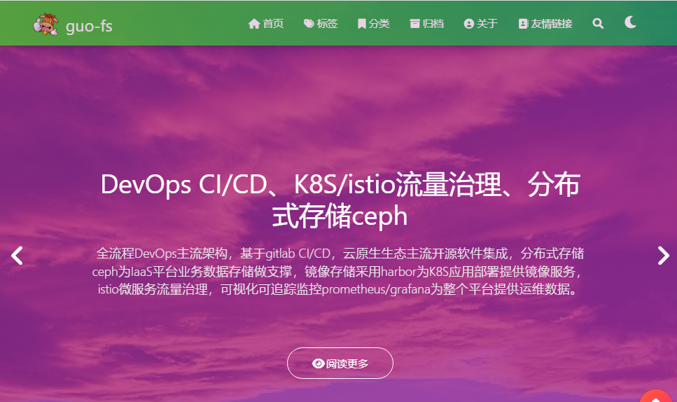

## 站点完整度💯

<progress value= "70" class= "mypro" max= "100">您的浏览器不支持progress元素</progress>框架：70%

<progress value= "5" class= "mypro" max= "100">您的浏览器不支持progress元素</progress>内容：5%

## 废话一篇
作为IT人，写技术分享文章是必不可少的，通常在CU、CN、知乎等主流 blog 平台上写一些技术分享文章，需遵循平台一些规则，若想在写作过程中更自由，可搭建个人 blog ，随着一些 PaaS 云计算公司推出免费 PageService ，静态网站搭建个人 blog 成为码农首选方案之一。我也正由cu、cn转移到个人 blog .

### 静态页面工具🧰
静态站点生成工具多如牛毛，不胜枚举，可查看
- csdn博主"恋喵大鲤鱼"的网贴[开源静态站点生成工具 Top40(全网最全)](https://blog.csdn.net/K346K346/article/details/129430253)
- Jamstack 收录了近乎所有的静态站点工具,请参阅[https://jamstack.org/generators/](https://jamstack.org/generators/)

不同的工具都有各自的优缺点，适用于不同的需求和技能水平，因此在选择时需要根据自己的情况进行考虑。
从诸多工具中选型出适合自己的，确实不是件容易的事，要花费较多时间。因为好奇和不知足，对于没测试过的总以为它会更好，对于已找到适合的总想着找更适合的，所以会花较多时间来测试他们。

:::caution

在流量经济思维的驱动下，用心打磨一款属于自己的个性化blog是有必要的，逐步打造个人IP。

:::

通过选型测试，我个人觉得如下几款挺不错。
- hexo，简单易用，有丰富的模板，作为入门级个人博客非常适用。我早期的blog采用 hexo + [matery](https://github.com/blinkfox/hexo-theme-matery),例如：
  
- hugo(雨果)，速度快是一亮点，有丰富的模板。其中docsy用作为工作和学习笔记是非常不错的，可以适应大量md文档，非常适合作为内部文档库。我个人的工作与学习笔记正在逐步转移至hugo+docsy。
  
- d8s(docusaurus)，简单易用，可以创建任何类型的网站（个人网站、产品、博客、营销登录页面等），适合对外提供服务的外部文档。使用React写page，则页面会更丰富。

### 站点架构
:::info
- d8s：当前主流静态网站生成器之一。
- github：静态网站代码私仓，供 vercel 访问。
- vercel：提供PageService，可绑定独立域名，并vercel提供免费SSL证书，与其它PS服务相比，它提供了CDN，访问速度更快更稳定。
- 站点中的部分模块来源于[kuizuo](https://kuizuo.cn)。
:::

### 写作工具✍️
在写 markdown 文章时，有很多工具，可以使用 vscode + mardown插件, vscode-v1.79.1已提供内置 markdown，满足写手基本需求。

## 版权申明
- 本站所有内容遵循<a href="https://creativecommons.org/licenses/by/4.0/deed.zh">CC BY-NC 4.0</a>开源协议，仅限非商业性使用，转载请注明出处。若与其他同步平台协议冲突，以本网站为准。
- 本站点部分图片和视频等素材来自互联网，若原创作者不同意，请联系我，我会及时删除。
